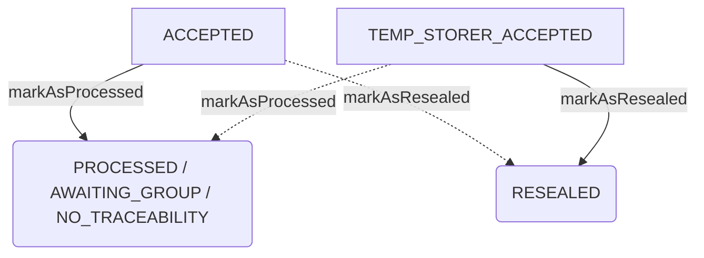

# Changelog

Les changements importants de Trackdéchets sont documentés dans ce fichier.

Le format est basé sur [Keep a Changelog](https://keepachangelog.com/en/1.0.0/),
et le projet suit un schéma de versionning inspiré de [Calendar Versioning](https://calver.org/).

# [2024.12.1] 17/12/2024

#### :rocket: Nouvelles fonctionnalités

- Permettre aux éco-organismes de réviser un BSDA [PR 3790](https://github.com/MTES-MCT/trackdechets/pull/3790)
- Permettre l'ajout de courtier, négociant et intermédiaires sur le BSVHU [PR 3795](https://github.com/MTES-MCT/trackdechets/pull/3795)

#### :nail_care: Améliorations

- Permettre au transporteur étranger d'avoir les mêmes droits qu'un transporteur FR concernant la révision sur une Annexe 1 [PR 3770](https://github.com/MTES-MCT/trackdechets/pull/3770)
- Remonter le VHU en situation irrégulière (sans émetteur TD) dans l'onglet À collecter du transporteur [PR 3792](https://github.com/MTES-MCT/trackdechets/pull/3792)
- Mise à jour des règles de validations pour le conditionnement et l'identifications des bsvhus [PR 3807](https://github.com/MTES-MCT/trackdechets/pull/3807)
- Rendre les BSFFs en brouillon inaccessibles aux entreprises dont l'auteur ne fait pas partie [PR 3793](https://github.com/MTES-MCT/trackdechets/pull/3793)
- Passage au DSFR de la modale de signature transporteur du BSVHU [PR 3809](https://github.com/MTES-MCT/trackdechets/pull/3809)

#### :rocket: Nouvelles fonctionnalités

- Ajout de l'export v2 des registres SSD [PR 3755](https://github.com/MTES-MCT/trackdechets/pull/3755)
- Permettre de faire une demande de révision BSDD lorsque le l'émetteur est un particulier ou un navire étranger [PR 3785](https://github.com/MTES-MCT/trackdechets/pull/3785)

#### :bug: Corrections de bugs

- Ne pas doubler les quantités restantes à regrouper lorsqu'on modifie un bordereau de groupement [PR 3760](https://github.com/MTES-MCT/trackdechets/pull/3760)
- Retirer la possibilité de réviser une Annexe 1 avant la signature de l'enlèvement pour tous les acteurs [PR 3784](https://github.com/MTES-MCT/trackdechets/pull/3784)
- Retirer les accès à la révision pour les profils Négociant, Courtier et Autre intermédiaire [PR 3784](https://github.com/MTES-MCT/trackdechets/pull/3784)
- Impossible de changer de destination finale sur un BSDD avec entreposage provisoire si la destination finale initialement renseignée a été mise en sommeil [PR 3804](https://github.com/MTES-MCT/trackdechets/pull/3804)
- Les intermédiaires n'apparaissent pas sur le récépissé PDF du BSDA [PR 3796](https://github.com/MTES-MCT/trackdechets/pull/3796)
- Corrige l'affichage des décimales sur le poids du PAOH [PR 3808](https://github.com/MTES-MCT/trackdechets/pull/3808)
- La vérification de l'avis de situation SIRENE ne fonctionne pas pour les établissements anonymes lorsque le SIRET du siège est différent du SIRET de l'établissement [PR 3794](https://github.com/MTES-MCT/trackdechets/pull/3794)
- Corrige la sélection d'un organisme de certification amiante dans la création d'un établissement [PR 3797](https://github.com/MTES-MCT/trackdechets/pull/3797)
- Corrige le sélecteur d'entreprise sur le dashboard n'affichant qu'un seul résultat [PR 3799](https://github.com/MTES-MCT/trackdechets/pull/3799)
- Amélioration d'affichange de la page Mes établissements [PR 3798](https://github.com/MTES-MCT/trackdechets/pull/3798)

# [2024.11.1] 19/11/2024

#### :rocket: Nouvelles fonctionnalités

- Permettre l'ajout d'un numéro libre sur le Bsvhu [PR 3718](https://github.com/MTES-MCT/trackdechets/pull/3718)
- Permettre à l'utilisateur de gérer les alertes de tous ses établissements [PR 3688](https://github.com/MTES-MCT/trackdechets/pull/3688)
- Afficher le nombre d'inscrits par type d'alertes au sein d'un établissement [PR 3688](https://github.com/MTES-MCT/trackdechets/pull/3688)
- Ajouter un lien "Gérer mes préférences e-mails" dans les e-mails transactionnels auquel l'utilisateur est en capacité de s'inscrire / désinscrire [PR 3738](https://github.com/MTES-MCT/trackdechets/pull/3738)

#### :nail_care: Améliorations

- La mention ADR a été séparée des mentions RID, ADNR, IMDG, et désormais un switch permet de préciser si elle est obligatoire pour un BSDD ou non (+ amélioration du PDF) [PR 3714](https://github.com/MTES-MCT/trackdechets/pull/3714) [PR 3717](https://github.com/MTES-MCT/trackdechets/pull/3717) [PR 3724](https://github.com/MTES-MCT/trackdechets/pull/3724)

#### :boom: Breaking changes

- Le champ "Numéro de notification" est obligatoire lorsque la destination ultérieure renseignée est étrangère [PR 3719](https://github.com/MTES-MCT/trackdechets/pull/3719)
- La présence d'une quantité reçue est requise pour passer du statut SENT à ACCEPTED via la mutation markAsReceived [PR 3720](https://github.com/MTES-MCT/trackdechets/pull/3720)
- Restriction des TTR et Installations de traitement à être visés sur un BSDD selon leur type de profil [PR 3725](https://github.com/MTES-MCT/trackdechets/pull/3725)

#### :bug: Corrections de bugs

- Corrige l'indexation des annexes 1 orphelines et draft [PR 3721](https://github.com/MTES-MCT/trackdechets/pull/3721)
- Dans l'onglet "A collecter", l'icône d'immatriculation est disponible pour tous les BSDs [PR 3715](https://github.com/MTES-MCT/trackdechets/pull/3715)
- Le profil "Autres traitements de déchets non dangereux (Rubriques 2791, 2781, 2782, 2780)" ne se coche plus automatiquement lorsqu'on sélectionne le profil TTR "Autre cas de déchets non dangereux (Rubrique 2731) et inversement [PR 3726](https://github.com/MTES-MCT/trackdechets/pull/3726)
- ETQ intermédiaire, je peux créer un BSDA sur lequel j'apparais [PR 3732](https://github.com/MTES-MCT/trackdechets/pull/3732)
- ETQ utilisateur je peux réviser un DASRI en attente d'un bordereau suite [PR 3734](https://github.com/MTES-MCT/trackdechets/pull/3734)
- ETQ transporteur je peux réviser une Annexe 1 [PR 3740](https://github.com/MTES-MCT/trackdechets/pull/3740)
- La mention ADR d'un BSDD n'est plus dupliquée [PR 3703](https://github.com/MTES-MCT/trackdechets/pull/3703)

#### :house: Interne

- Amélioration de l'interface d'admin [PR 3735](https://github.com/MTES-MCT/trackdechets/pull/3735)
- Modification de la query controlBsds et fermeture de la query bsds aux comptes gouvernementaux [PR 3270](https://github.com/MTES-MCT/trackdechets/pull/3270)

# [2024.10.1] 22/10/2024

#### :rocket: Nouvelles fonctionnalités

- Ajout d'Eco-organisme sur BSVHU [PR 3619](https://github.com/MTES-MCT/trackdechets/pull/3619)
- Ajout des profils Négociant et Courtier sur BSVHU [PR 3645](https://github.com/MTES-MCT/trackdechets/pull/3645)
- Ajout d'un moteur de recherche sur la documentation développeurs [PR 3622](https://github.com/MTES-MCT/trackdechets/pull/3622)
- Ajout d'un nouvel onglet "Retours" pour les transporteurs [PR 3669](https://github.com/MTES-MCT/trackdechets/pull/3669)

#### :nail_care: Améliorations

- Changer la référence du cerfa lors de l'ajout d'une fiche d'intervention [PR 3616](https://github.com/MTES-MCT/trackdechets/pull/3616)
- ETQ membre d'un établissement, je peux gérer mes préférences de notifications (demandes de rattachement, demandes de révisions, renouvellement code signature, etc) en lien avec cet établissement [PR 3634](https://github.com/MTES-MCT/trackdechets/pull/3634)
- Amélioration du contenu de l'e-mail transactionnel envoyé au contact d'un établissement visé sur un bordereau en tant qu'émetteur [PR 3635](https://github.com/MTES-MCT/trackdechets/pull/3635)
- Rendre les brouillons BSVHU non accessibles aux entreprises mentionnées sur le bordereau mais qui n'en sont pas les auteurs [PR 3677](https://github.com/MTES-MCT/trackdechets/pull/3677)
- Modification des valeurs de l'enum EmptyReturnADR [PR 3707](https://github.com/MTES-MCT/trackdechets/pull/3707)

#### :boom: Breaking changes

- La Raison Sociale, le SIRET et l'Adresse de la destination sont scellés à la signature émetteur, sauf pour l'émetteur qui doit pouvoir le modifier jusqu'à la prochaine signature [PR 3628](https://github.com/MTES-MCT/trackdechets/pull/3628)

- La complétion du champ identificationNumbers est obligatoire à la publication d'un VHU [PR 3628](https://github.com/MTES-MCT/trackdechets/pull/3628)

#### :bug: Corrections de bugs

- Documentation API Developers : Page Not Found, si on n'y accède pas via l'arborescence [PR 3621](https://github.com/MTES-MCT/trackdechets/pull/3621)
- Ne pas apporter automatiquement de modification sur la liste des contenants lorsque je procède à une modification transporteur et que le BSFF est au statut SENT [PR 3615](https://github.com/MTES-MCT/trackdechets/pull/3615)
- Correction du poids d'une annexe 1 après la révision du poids d'un BSD enfant [PR 3631](https://github.com/MTES-MCT/trackdechets/pull/3631)
- Retrait du bouton de revision dans l'UI sur les DASRI regroupés [PR 3657](https://github.com/MTES-MCT/trackdechets/pull/3657)

#### :house: Interne

- Migration vers le nouveau portail API de l'INSEE [PR 3602](https://github.com/MTES-MCT/trackdechets/pull/3602)
- Suppression du champ isRegistreNational [PR 3652](https://github.com/MTES-MCT/trackdechets/pull/3652)
- ETQ utilisateur je peux cloner un BSD [PR 3637](https://github.com/MTES-MCT/trackdechets/pull/3637)
- ETQ utilisateur je peux créer, révoquer et consulter mes demandes de délégation RNDTS [PR 3561](https://github.com/MTES-MCT/trackdechets/pull/3561) [PR 3588](https://github.com/MTES-MCT/trackdechets/pull/3588)
- Ajout de la query controlBsds dédiée à la fiche établissment [PR 3694](https://github.com/MTES-MCT/trackdechets/pull/3694)

# [2024.9.1] 24/09/2024

#### :rocket: Nouvelles fonctionnalités

- ETQ destinataire, je peux spécifier le statut de rinçage de la citerne pour son retour à vide (back) [PR 3546](https://github.com/MTES-MCT/trackdechets/pull/3546)
- ETQ destinataire, je peux indiquer que mon véhicule est rincé ou non pour son retour à vide (back) [PR 3548](https://github.com/MTES-MCT/trackdechets/pull/3548)
- Ajout d'intermédiaires sur les BSVHU [PR 3560](https://github.com/MTES-MCT/trackdechets/pull/3560)

#### :nail_care: Améliorations

- Ajouter deux sous-profils pour l'installation de traitement VHU [PR 3480](https://github.com/MTES-MCT/trackdechets/pull/3480)
- Rendre les chemins d'erreur Zod BSVHU/BSPAOH plus explicite en les subdivisant [PR 3547](https://github.com/MTES-MCT/trackdechets/pull/3547)
- Ajout d'un filtre par sous-type de bordereau [PR 3476](https://github.com/MTES-MCT/trackdechets/pull/3476)
- Amélioration des pages de connexion oauth / oidc avec leur passage au DSFR [PR 3550](https://github.com/MTES-MCT/trackdechets/pull/3550)
- Amélioration de la page Mes applications avec le passage au DSFR [PR 3562](https://github.com/MTES-MCT/trackdechets/pull/3562)
- ETQ destinataire, je peux indiquer que mon véhicule est rincé ou non pour son retour à vide [PR 3576](https://github.com/MTES-MCT/trackdechets/pull/3576)
- ETQ destinataire, je peux indiquer que la citerne est rincée pour son retour à vide [PR 3573](https://github.com/MTES-MCT/trackdechets/pull/3573)
- Ajout d'un encart réglementaire pour éviter un usage abusif de l'absence d'entreprise de travaux BSDA [PR 3609](https://github.com/MTES-MCT/trackdechets/pull/3609)

#### :boom: Breaking changes

- Rendre obligatoire le volume du contenant à la publication sur le BSFF [PR 3555](https://github.com/MTES-MCT/trackdechets/pull/3555)
- Le mode de transport est désormais obligatoire à la signature transporteur [PR 3551](https://github.com/MTES-MCT/trackdechets/pull/3551)

#### :bug: Corrections de bugs

- Correction du poids affiché sur le tableau de bord en cas de refus total pour les BSDD [PR 3536](https://github.com/MTES-MCT/trackdechets/pull/3536)

#### :house: Interne

- Permettre la mise à jour en masse des profils et sous-profils d'établissements via l'interface d'administration [PR 3565](https://github.com/MTES-MCT/trackdechets/pull/3565)

#### :house: Interne

- Ajout des colonnes de sous-type au script d'import en masse [PR 3568](https://github.com/MTES-MCT/trackdechets/pull/3568)

#### :house: Interne

- Génération de modèles de bsds vides [PR 3556](https://github.com/MTES-MCT/trackdechets/pull/3556)

# [2024.8.1] 27/08/2024

#### :rocket: Nouvelles fonctionnalités

- BSVHU: Permettre de viser un émetteur en situation irrégulière avec ou sans SIRET [PR 3517](https://github.com/MTES-MCT/trackdechets/pull/3517)

#### :bug: Corrections de bugs

- Résolution d'un problème de resolver BsdaRevisionRequest qui empêchait l'ouverture de la modale de révision [PR 3513](https://github.com/MTES-MCT/trackdechets/pull/3513)
- Une demande de rattachement est automatiquement acceptée si l'utilisateur est invité dans un établissement [PR 3526](https://github.com/MTES-MCT/trackdechets/pull/3526)

#### :house: Interne

- Modification des permissions pour la query Bsds et toutes les queries Pdf [PR 3519](https://github.com/MTES-MCT/trackdechets/pull/3519)

#### :nail_care: Améliorations

- Rendre BSDAs en brouillon inaccessibles pour les entreprises dont l'auteur ne fait pas partie [PR 3503](https://github.com/MTES-MCT/trackdechets/pull/3503)
- Ajout de la possibilité de réviser la quantité du destinataire d'un BSDD si un entreposage provisoire est présent [PR 3527](https://github.com/MTES-MCT/trackdechets/pull/3527)

#### :boom: Breaking changes

- Le champ volume de BsdasriReceptionInput est supprimé, BsdasriReception/volume étant calculé à partir des packagings [PR #3509](https://github.com/MTES-MCT/trackdechets/pull/3509)

# [2024.7.2] 30/07/2024

#### :rocket: Nouvelles fonctionnalités

- ETQ utilisateur, je peux faire du multi-modal sur le BSFF [PR #3421](https://github.com/MTES-MCT/trackdechets/pull/3421)

#### :house: Interne

- Refacto de la validation BSVHU [PR 3477](https://github.com/MTES-MCT/trackdechets/pull/3477)

#### :nail_care: Améliorations

- ETQ utilisateur, je peux préciser la quantité refusée lors de la réception d'un BSDD [PR 3252](https://github.com/MTES-MCT/trackdechets/pull/3252), [PR 3418](https://github.com/MTES-MCT/trackdechets/pull/3418)
- Ajout de la date et de l'heure d'édition dans les PDFs [PR 3452](https://github.com/MTES-MCT/trackdechets/pull/3452)
- Suppression de colonnes dépréciées dans les registres (champ libre transporteur, expéditeur & destination, date de cession & d'acquisition, producteurs initiaux codes postaux, producteur initial (regitres de transport & gestion), plaques d'immatriculations (tous les registres sauf transport & exhaustif)) [PR 3446](https://github.com/MTES-MCT/trackdechets/pull/3446)
- Ajout des noms usuels de l'expéditeur, des transporteurs ainsi que de la destination sur le registre exhaustif [PR 3464](https://github.com/MTES-MCT/trackdechets/pull/3464)
- Séparation des adresses des registres en 4 champs: Libellé, Code postal, Commune, Pays [PR 3456](https://github.com/MTES-MCT/trackdechets/pull/3456)

# [2024.7.1] 02/07/2024

#### :rocket: Nouvelles fonctionnalités

- Ajout de la possibilité de gérer les rôles des membres d'une entreprise depuis la liste des membres [PR 3384](https://github.com/MTES-MCT/trackdechets/pull/3384)
- Ajout d'une gestion des membres d'entreprises pour les admin Trackdéchets [PR 3384](https://github.com/MTES-MCT/trackdechets/pull/3384)
- Ajout du N°SIRET de la destination finale sur les registres sortants et exhaustifs [PR 3447](https://github.com/MTES-MCT/trackdechets/pull/3447)

#### :bug: Corrections de bugs

- Correctif de la mise à jour d'un paoh depuis la modale de publication [PR 3390](https://github.com/MTES-MCT/trackdechets/pull/3390)
- Appliquer le traitement d'Annexes 2 récursivement [PR 3402](https://github.com/MTES-MCT/trackdechets/pull/3402)
- Le champ allowBsdasriTakeOverWithoutSignature est désormais retourné par la requête companyInfos même pour des entreprises non-diffusibles [PR 3399](https://github.com/MTES-MCT/trackdechets/pull/3399)
- Le volume total d'un DASRI est désormais un Float, et déprécié [PR 3398](https://github.com/MTES-MCT/trackdechets/pull/3398)
- Une déchetterie (WASTE_CENTER) non vérifiée peut désormais créer un BSDA COLLECTION_2710 [PR 3436](https://github.com/MTES-MCT/trackdechets/pull/3436)
- Corriger les données remontées dans la colonne Quantité(s) liée(s) [PR 3447](https://github.com/MTES-MCT/trackdechets/pull/3447)

#### :boom: Breaking changes

- Le profil crématorium est déprécié au profit du sous-type crémation [PR 3468](https://github.com/MTES-MCT/trackdechets/pull/3468)
- Correction de la dénomination du code de traitement non final D12 par D13 [PR 3457](https://github.com/MTES-MCT/trackdechets/pull/3457)

#### :nail_care: Améliorations

- Amélioration du message d'erreur à l'ajout d'un Crématorium non inscrit / n'ayant pas le bon profil [PR 3401](https://github.com/MTES-MCT/trackdechets/pull/3401)
- Ajout d'informations relatives au transport sur l'ensemble des registres [PR 3409](https://github.com/MTES-MCT/trackdechets/pull/3409)
- Ajout d'informations relatives à la localisation des terres (parcelles) sur les registres Entrant, Sortant, Exhaustif et Gestion [PR 3410](https://github.com/MTES-MCT/trackdechets/pull/3410)
- Permettre la révision des DASRI de synthèse et de groupement [PR 3407](https://github.com/MTES-MCT/trackdechets/pull/3407)
- Ajout des informations relatives à l'installation de destination post-entreposage provisoire dans le registre sortant et exhaustif [PR 3349](https://github.com/MTES-MCT/trackdechets/pull/3349)
- Ajout des informations relatives à l'envoi à l'étranger sur les registres Entrant, Sortant, Exhaustif & Gestion, pour les BSDD & BSDA [PR 3372](https://github.com/MTES-MCT/trackdechets/pull/3372)
- Ajout du SIRET et de la Raison sociale des 3 intermédiaires sur le registre exhaustif [PR 3367](https://github.com/MTES-MCT/trackdechets/pull/3367)
- Ajout d'une colonne avec l'adresse email du destinataire, négociant & courtier dans tous les registres [PR 3392](https://github.com/MTES-MCT/trackdechets/pull/3392)

#### :house: Interne

- Refacto de la validation BSFF [PR 3397](https://github.com/MTES-MCT/trackdechets/pull/3397)

# [2024.6.1] 04/06/2024

#### :rocket: Nouvelles fonctionnalités

- Permettre un export .xls ou .csv de la liste des établissements avec les membres rattachés [PR 3329](https://github.com/MTES-MCT/trackdechets/pull/3329).
- Ajouter des profils et sous-types de profils (TTR et Installation de traitement) FRONT - T1 [PR 3350](https://github.com/MTES-MCT/trackdechets/pull/3350).
- Mise à niveau au DSFR de la partie "Membres" des établissements [PR 3345](https://github.com/MTES-MCT/trackdechets/pull/3345)
- Mise à niveau au DSFR de la partie "Signature" des établissements [PR 3354](https://github.com/MTES-MCT/trackdechets/pull/3354)
- Permettre la révision d'un DASRI initial[PR 3341](https://github.com/MTES-MCT/trackdechets/pull/3341).

#### :bug: Corrections de bugs

- Fix statut des annexes lorsque l'émetteur est un particulier [PR 3287](https://github.com/MTES-MCT/trackdechets/pull/3287)
- Fix de la redirection après signature d'un BSDASRI de groupement par l'émetteur [PR 3292](https://github.com/MTES-MCT/trackdechets/pull/3292)
- Cacher liens PDF sur Annexes/Suite si le bordereau est un brouillon [PR 3310](https://github.com/MTES-MCT/trackdechets/pull/3310)
- Au refus total d'un VHU, ne pas demander de compléter le code / mode de traitement [PR 3336](https://github.com/MTES-MCT/trackdechets/pull/3336)
- Retirer le fait que les champs des transporteurs soient requis à la signature de la réception même lorsqu'ils n'ont pas signé l'enlèvement sur un BSDA [PR 3331](https://github.com/MTES-MCT/trackdechets/pull/3331)
- Ne pas afficher les pastilles d'alertes pour le profil Lecteur [PR 3353](https://github.com/MTES-MCT/trackdechets/pull/3353)
- Correction d'une incohérence entre les dates affichées dans l'Aperçu et les dates affichées dans le registre [PR 3319](https://github.com/MTES-MCT/trackdechets/pull/3319)
- Correction de l'affichage de la parte "Mes établissements" [PRA 3328](https://github.com/MTES-MCT/trackdechets/pull/3328)
- Réinitialiser correctement emitterCompany lors du switch entre privateIndividual/foreignShip/company [PR 3344](https://github.com/MTES-MCT/trackdechets/pull/3344)
- Rendre possible l'update d'un BSDASRI de groupement en SIGNED_BY_PRODUCER [PR 3330](https://github.com/MTES-MCT/trackdechets/pull/3330)

#### :boom: Breaking changes

- Retrait de la possibilité de sélectionner un mode de traitement pour le code non final D9 [PR 3308](https://github.com/MTES-MCT/trackdechets/pull/3308)
- Le SIRET de destination ultérieure doit obligatoirement être inscrit sur Trackdéchets [PR 3355](https://github.com/MTES-MCT/trackdechets/pull/3355)
- Rendre obligatoire le champ "Numéro de notification" lorsque la destination ultérieure renseignée est étrangère [PR 3332](https://github.com/MTES-MCT/trackdechets/pull/3332)

#### :nail_care: Améliorations

- Ajout de la mise à jour de l'immatriculation dans la modale de signature du bordereau de synthèse BSDASRI [PR 3290](https://github.com/MTES-MCT/trackdechets/pull/3290)
- Renommer Regroupement par Annexe 2 (sous-type de BSDD) [PR 3352](https://github.com/MTES-MCT/trackdechets/pull/3352)
- Renommer Transit par Réexpédition (sous-type de BSDA) [PR 3351](https://github.com/MTES-MCT/trackdechets/pull/3351)
- Registre:
  - Inversion des options de téléchargement du registre .csv et .xls pour éviter les erreurs [PR 3311](https://github.com/MTES-MCT/trackdechets/pull/3311)
  - Retrait de la possibilité de filtrer le registre par code déchet via le sélecteur [PR 3312](https://github.com/MTES-MCT/trackdechets/pull/3312)
  - Incrémentation des registres Exhaustif, Sortant, Transport & Gestion dès la signature transporteur et le registre Entrant dès la signature de réception [PR 3306](https://github.com/MTES-MCT/trackdechets/pull/3306)
  - Ajout du producteur initial dans les bordereaux suite [PR 3337](https://github.com/MTES-MCT/trackdechets/pull/3337)
  - Ajout d'une colonne "sous-type de bordereau" dans tous les registres [PR 3339](https://github.com/MTES-MCT/trackdechets/pull/3339)
- Ajout du nom usuel de l'établissement dans l'email de demande de rattachement [PR 3343](https://github.com/MTES-MCT/trackdechets/pull/3343)
- Renommer Transit par Réexpédition (sous-type de BSDA) [PR 3351](https://github.com/MTES-MCT/trackdechets/pull/3351)
- Rendre les liens de FAQ cliquable dans l'ajout d'établissement [PR 3342](https://github.com/MTES-MCT/trackdechets/pull/3342)
- Faire remonter BSD dans dashboard à la création de demande de révision [PR 3315](https://github.com/MTES-MCT/trackdechets/pull/3315)
- Afficher infos du transporteur actuel sur BsdCard + permettre leur mise à jour [PR 3309](https://github.com/MTES-MCT/trackdechets/pull/3309)

#### :house: Interne

- Multi-modal BSFF : migrer les données transporteur dans une table à part (refacto interne du code) [PR 3340](https://github.com/MTES-MCT/trackdechets/pull/3340)

# [2024.5.1] 07/05/2024

#### :rocket: Nouvelles fonctionnalités

- Ajouter l'information du traitement final sur le registre sortant et exhaustif pour les BSD ayant un BSD suite [PR 3254](https://github.com/MTES-MCT/trackdechets/pull/3254)
- Interface utilisateur des PAOHs [PR 3274](https://github.com/MTES-MCT/trackdechets/pull/3274)
- Ajout de pastilles sur le dashboard indiquant le nombre d'actions en attente [PR 3275](https://github.com/MTES-MCT/trackdechets/pull/3275)

#### :bug: Corrections de bugs

- Modification de la validation de mot de passe sur page Invite [PR 3278](https://github.com/MTES-MCT/trackdechets/pull/3278)
- La date de prise en charge initiale des BSD initiaux sur le PDF de l'Annexe 2 est complétée avec la date d'enlèvement initiale et non la date de la signature [PR 3280](https://github.com/MTES-MCT/trackdechets/pull/3280)
- Correctif de l'extension '.pdf' qui était en double lors du téléchargement d'un PDF de BSDD [PR 3279](https://github.com/MTES-MCT/trackdechets/pull/3279)

#### :boom: Breaking changes

#### :nail_care: Améliorations

- Clarification du wording des boutons de création des établissements [PR 3259](https://github.com/MTES-MCT/trackdechets/pull/3259)

#### :house: Interne

- ETQ admin je peux télécharger le registre d'un utilisateur [PR 3267](https://github.com/MTES-MCT/trackdechets/pull/3267)
- Refacto des méthodes de suppressions d'objets liés à l'utilisateur pour pouvoir utiliser le script de suppression d'utilisateur en standalone
- Création automatique des entreprises anonymes (sans passer par la validation de l'admin) [PR 3223](https://github.com/MTES-MCT/trackdechets/pull/3223)

# [2024.4.1] 09/04/2024

#### :rocket: Nouvelles fonctionnalités

- ETQ utilisateur je peux faire du multi-modal sur le BSDA par API [PR 3108](https://github.com/MTES-MCT/trackdechets/pull/3108)
- ETQ utilisateur je peux faire du multi-modal sur le BSDA via l'interface Trackdéchets [PR 3205](https://github.com/MTES-MCT/trackdechets/pull/3205)

#### :nail_care: Améliorations

- Le siret de l'établissement est précisé dans les emails d'invitation [PR 3151](https://github.com/MTES-MCT/trackdechets/pull/3151)
- Renommage & correctif dans le cadre 1.1 du PDF d'un BSDD (entreprise française / étrangère) [PR 3181](https://github.com/MTES-MCT/trackdechets/pull/3181)
- Le titre d'un PDF de BSDD affiche clairement si le déchet est dangereux ou non [PR 3183](https://github.com/MTES-MCT/trackdechets/pull/3183)
- Amélioration du contenu du mail en cas d'attente de révision [PR 3141](https://github.com/MTES-MCT/trackdechets/pull/3141)
- Message d'erreur clair si l'utilisateur tente de créer un établissement avec un SIRET non diffusible fermé [PR 3148](https://github.com/MTES-MCT/trackdechets/pull/3148)
- Ajout de nouveaux types & sous-types d'entreprises [PR 3206](https://github.com/MTES-MCT/trackdechets/pull/3206)

#### :bug: Corrections de bugs

- Correction des registres éco-organisme et intermédiaires [PR 3196](https://github.com/MTES-MCT/trackdechets/pull/3196/)
- Correction des révisions avec un mode de traitement null [PR 3193](https://github.com/MTES-MCT/trackdechets/pull/3193)
- Correction de la gestion du poids lors de la création d'un Bsdasri de groupement [PR 3236](https://github.com/MTES-MCT/trackdechets/pull/3236)

#### :house: Interne

- Permettre au comptes de service de télécharger les registres csv and xls de tous les sirets P[R 3207](https://github.com/MTES-MCT/trackdechets/pull/3207)

# [2024.3.1] 12/03/2024

#### :rocket: Nouvelles fonctionnalités

- Ajouter la possibilité de Réviser le BSDD après signature du transporteur / Ajouter la possibilité de Supprimer le BSDD après signature de l'émetteur, pour le producteur [PR 3109](https://github.com/MTES-MCT/trackdechets/pull/3109) et [PR 3110](https://github.com/MTES-MCT/trackdechets/pull/3111)
- Nouveau statut STANDBY pour les entreprises qui n'ont pas pu être vérifiées [PR 3094](https://github.com/MTES-MCT/trackdechets/pull/3094)
- Afficher le statut avec rupture de traçabilité lorsque mentionné lors du traitement [PR 3120](https://github.com/MTES-MCT/trackdechets/pull/3120)
- Ajouter la possibilité de Supprimer le BSDASRI pour l'émetteur lorsqu'il est Signé par l'émetteur [PR 3115](https://github.com/MTES-MCT/trackdechets/pull/3115)
- Permettre au transporteur de modifier son champs libre / immatriculation après signature de l'entreposage provisoire depuis le tableau de bord [PR 3114](https://github.com/MTES-MCT/trackdechets/pull/3114)
- Nouveau composant de sélection d'entreprise sur le dashboard [PR 3134](https://github.com/MTES-MCT/trackdechets/pull/3134)

#### :nail_care: Améliorations

- Le filtre rapide "N° de BSD / contenant" a été renommé "N° libre / BSD / contenant" [PR 3092](https://github.com/MTES-MCT/trackdechets/pull/3092)
- Les utilisateurs peuvent désormais solliciter la création d'entreprise anonyme directement dans l'application en téléversant un avis de situation au répertoire SIRENE [PR 3096](https://github.com/MTES-MCT/trackdechets/pull/3096)
- Ajout de la possibilité des non-administrateurs de voir les autres memebres d'un établissement [PR 3093](https://github.com/MTES-MCT/trackdechets/pull/3093)
- Ajout d'une section d'aide dans un menu [PR 3105](https://github.com/MTES-MCT/trackdechets/pull/3105)
- Retirer le champ "numéro de notification" lorsque que l'entreprise est française [PR 3101](https://github.com/MTES-MCT/trackdechets/pull/3101)
- Revoir le format du champ 'Numéro de notification et de document' lors d'un envoi à l'étranger [PR 3107](https://github.com/MTES-MCT/trackdechets/pull/3107)
- Déplacer le champs en dessous de email, afficher le champ lorsqu'un vatNumber est saisi [PR 3121](https://github.com/MTES-MCT/trackdechets/pull/3121)
- Vider les champs Tél & Mail de l'émetteur lorsque je sélectionne Particulier sur un BSDD [PR 3116](https://github.com/MTES-MCT/trackdechets/pull/3116)
- Correction du wording dans les toasts admins de vérification d'entreprise & envoi de courrier [PR 3122](https://github.com/MTES-MCT/trackdechets/pull/3122)
- ETQ lecteur, je ne dois pas avoir accès aux boutons Signer de l'entreprise de travaux et du transport multimodal ainsi que ceux présents dans l'Aperçu [PR 3123](https://github.com/MTES-MCT/trackdechets/pull/3123)
- Remonter le numéro d'agrément démolisseur lors de la sélection de l'émetteur à la création d'un BSVHU [PR 3127](https://github.com/MTES-MCT/trackdechets/pull/3127)
- Afficher le conditionnement précisé dans la révision lorsque le conditionnement Autres est sélectionné [PR 3129](https://github.com/MTES-MCT/trackdechets/pull/3129)

#### :house: Interne

- Refacto & documentation validation BSDA [PR 3087](https://github.com/MTES-MCT/trackdechets/pull/3087)
- Améliorations diverses pour la vérification des entreprises côté admin [PR 3079](https://github.com/MTES-MCT/trackdechets/pull/3079)
- Les admins peuvent désormais mettre une demande de création d'établissement en stand by [PR 3094](https://github.com/MTES-MCT/trackdechets/pull/3094)
- Automatisation de l'envoi d'un courrier de vérification aux adresses mails génériques [PR 3080](https://github.com/MTES-MCT/trackdechets/pull/3080)
- Les transporteurs étrangers sont désormais automatiquement vérifiés [PR 3079](https://github.com/MTES-MCT/trackdechets/pull/3079)
- Augmentation time-out tests JEST [PR 3140](https://github.com/MTES-MCT/trackdechets/pull/3140)
- Ajout de vérifications de permissions sur la vue details [PR 3140](https://github.com/MTES-MCT/trackdechets/pull/3140/)
- Changement de requête par SIRET sur ElasticSearch "stocketablissement" dans `searchCompany` [PR 3118](https://github.com/MTES-MCT/trackdechets/pull/3118)

#### :bug: Corrections de bugs

- Corrections requête `bsdas` (transporters) [PR 3099](https://github.com/MTES-MCT/trackdechets/pull/3099)
- Correction UI bouton Annexe 1 [PR 3100](https://github.com/MTES-MCT/trackdechets/pull/3100)
- Correction `myCompanies` ne retournant pas tous les membres [PR 3102](https://github.com/MTES-MCT/trackdechets/pull/3102)
- Suppression bouton signature pour le producteur BSDA [PR 3110](https://github.com/MTES-MCT/trackdechets/pull/3140)
- Correction bouton supprimer uniquement pour producteur + bouton secondaire faire signer [PR 3126](https://github.com/MTES-MCT/trackdechets/pull/3126)
- Correction affichage code déchet "dangereux" ou non [PR 3131](https://github.com/MTES-MCT/trackdechets/pull/3131)

#### :boom: Breaking changes

# [2024.2.1] 13/02/2024

#### :rocket: Nouvelles fonctionnalités

- Ajout du code déchet 16 03 05\* sur les BSDA [PR 3061](https://github.com/MTES-MCT/trackdechets/pull/3061)
- Ajout de la possibilité de sélectionner un éco-organisme sur le BSDA [PR 3062](https://github.com/MTES-MCT/trackdechets/pull/3062)
- Nouvelle navigation sur Trackdéchets : la navigation principale et le menu latéral ont été mis en conformité avec le DSFR [PR 3066](https://github.com/MTES-MCT/trackdechets/pull/3066)
- La gestion des établissements devient désormais un onglet principal de Trackdéchets, à retrouver dans "Mes établissements" [PR 3066](https://github.com/MTES-MCT/trackdechets/pull/3066)
- Ajouter le numéro libre BSDD sur le tableau de bord "V2" [PR 3035](<[#](https://github.com/MTES-MCT/trackdechets/pull/)3050>)
- Implémenter les Révisions dans le Front "V2" [PR 3054](https://github.com/MTES-MCT/trackdechets/pull/3054)
- Suppression Dashboard "v1" [PR 3064](https://github.com/MTES-MCT/trackdechets/pull/3064)

#### :bug: Corrections de bugs

- Registre exhaustif du BSDD suite entreposage provisoire : les informations relatives à la destination finale et au 2e transporteur n'apparaissent pas + lignes en double [PR 3051](https://github.com/MTES-MCT/trackdechets/pull/3051)
- En cas de révision vers un code de traitement final, les données du BSD sont mises à jour correctement [PR 2986](https://github.com/MTES-MCT/trackdechets/pull/2986)
- Corriger l'auto-sélection du transporteur et la liste vide des transporteurs proposés [PR 3045](https://github.com/MTES-MCT/trackdechets/pull/3045)
- Le mode de transport d'un transporteur étranger disparait après sauvegarde d'une modification [PR 3045](https://github.com/MTES-MCT/trackdechets/pull/3045)
- Correction de la valeur "pays" et "entreprise étrangère" dans les PDFs BSD (entreprise étrangère + nom pays)[PR 3047](#3047)

#### :boom: Breaking changes

#### :nail_care: Améliorations

- Mise à jour des labels en cas de transport multimodal [PR 3046](https://github.com/MTES-MCT/trackdechets/pull/3046)
- Le mode de traitement "Elimination (incinération sans valorisation énergétique et stockage en décharge)" a été renommé "Elimination" [PR 3044](https://github.com/MTES-MCT/trackdechets/pull/3044)
- Flexibilisation de certaines règles de validation du BSDA pour pouvoir modifier les champs de contact plus longtemps [PR 3060](https://github.com/MTES-MCT/trackdechets/pull/3060)
- Retirer la possibilité de faire du multimodal pour le BSD de tournée dédiée [PR 3057](https://github.com/MTES-MCT/trackdechets/pull/3057)
- Signature eco-organisme plus stricte [PR 3074](https://github.com/MTES-MCT/trackdechets/pull/3074)
- Ajout de champs obligatoires sur l'annexe 1 [PR 3073](https://github.com/MTES-MCT/trackdechets/pull/3073)

#### :house: Interne

- [BSDA] Migrer les données transporteur dans une table à part (refacto interne du code) [PR 3055](https://github.com/MTES-MCT/trackdechets/pull/3055)
- Tests e2e: cahier de recette d'ajout des membres [PR 3053](https://github.com/MTES-MCT/trackdechets/pull/3053)
- Tests e2e: cahier de recette des filtres rapides [PR 3065](https://github.com/MTES-MCT/trackdechets/pull/3065)
- Améliorations de la réindexation des bordereaux dans la section Admin [PR 3075](https://github.com/MTES-MCT/trackdechets/pull/3075)
- Correction de la génération de SIRET de test [PR 3084](https://github.com/MTES-MCT/trackdechets/pull/3084)
- Ajout d'aide dans le CONTRIBUTING.md [PR 3043](https://github.com/MTES-MCT/trackdechets/pull/3043/files)
- DIVERS - Améliorations de performance [PR 3059](https://github.com/MTES-MCT/trackdechets/pull/3059)

# [2024.1.1] 16/01/2024

#### :rocket: Nouvelles fonctionnalités

- Implémentation de l'api BSPAOH (expérimentale) [PR 2948](https://github.com/MTES-MCT/trackdechets/pull/2948)
- ETQ TTR, je veux pouvoir viser une destination ultérieure à l'étranger hors Union Européenne [PR 2984](https://github.com/MTES-MCT/trackdechets/pull/2984)

#### :bug: Corrections de bugs

- ETQ installation de destination je ne peux pas signer l'opération/le traitement du BSFF [PR 3026](https://github.com/MTES-MCT/trackdechets/pull/3026)

#### :boom: Breaking changes

- Modifier les variables INSEE sur statutDiffusionEtablissement / Répercuter les changements INSEE dans notre API[PR 2973](https://github.com/MTES-MCT/trackdechets/pull/2973)

#### :nail_care: Améliorations

- Amélioration du workflow multi-modal front sur le BSDD [PR 2974](https://github.com/MTES-MCT/trackdechets/pull/2974)

#### :house: Interne

- Suppression de l'input GraphQL `InternationalCompanyInput` au profit de `CompanyInput` [PR 2984](https://github.com/MTES-MCT/trackdechets/pull/2984)

# [2023.12.1] 12/12/2023

#### :rocket: Nouvelles fonctionnalités

- Ajout d'un bouton de mise à jour automatique nom/adresse d'un établissement [PR 2910](https://github.com/MTES-MCT/trackdechets/pull/2910)

#### :bug: Corrections de bugs

- Complétion des informations légales lors de l'ajout d'un transporteur via `createFormTransporter` et `updateFormTransporter` [PR 2861](https://github.com/MTES-MCT/trackdechets/pull/2861)
- Mise à jour automatique informations d'un établissement dans les `Favorites` affichés dans le champ de recherhe `CompanySelector` [PR 2910](https://github.com/MTES-MCT/trackdechets/pull/2910)

#### :boom: Breaking changes

#### :nail_care: Améliorations

- Rendre accessibles les champs `takenOverAt` et `takenOverAt` via l'objet Transporter (BSDD). [PR 2865](https://github.com/MTES-MCT/trackdechets/pull/2865)
- Mise à jour du design de l'onglet transporteur du formulaire BSDD [PR 2877](https://github.com/MTES-MCT/trackdechets/pull/2877)

#### :house: Interne

# [2023.11.1] 21/11/2023

#### :rocket: Nouvelles fonctionnalités

- Ajout des filtres rapides au dashboard v2 [PR 2778](https://github.com/MTES-MCT/trackdechets/pull/2778)
- Oauth2: ajout d'un bouton de déconnexion [PR 2838](https://github.com/MTES-MCT/trackdechets/pull/2838)
- Le numéro d'échantillon devient disponible pour tous les BSDDs ayant un code déchet éligible [PR 2847](https://github.com/MTES-MCT/trackdechets/pull/2847)

#### :bug: Corrections de bugs

- Le mode de traitement n'est obligatoire qu'à l'étape de traitement pour tous les BSDs [PR 2848](https://github.com/MTES-MCT/trackdechets/pull/2848)
- Rendre impossible la suppression d'un transporteur BSDD via la mutation `deleteFormTransporter` si celui-ci a déjà signé le BSDD [PR 2836](https://github.com/MTES-MCT/trackdechets/pull/2836)
- Révisions BSDA & BSDD: le champ opération réalisée s'affichait à tort même lorsqu'il était vide [PR 2846](https://github.com/MTES-MCT/trackdechets/pull/2846)

#### :boom: Breaking changes

- Groupement BSDA: on ne permet de grouper que des BSDAs ayant le même code déchet et la même destination [PR 2844](https://github.com/MTES-MCT/trackdechets/pull/2844)

#### :nail_care: Améliorations

- Harmonisation des colonnes 'Code opération prévue', 'Mode de traitement réalisé' et 'Code opération réalisée', et ajout des infos transporteurs dans les différents registres [PR 2805](https://github.com/MTES-MCT/trackdechets/pull/2805)
- Wording: mise en conformité ADR2023 sur les quantités estimées [PR 2722](https://github.com/MTES-MCT/trackdechets/pull/2722)
- Révision BSDA: amélioration des contrôles de cohérence sur les données passées en révision [PR 2809](https://github.com/MTES-MCT/trackdechets/pull/2809)

#### :house: Interne

# [2023.10.2] 31/10/2023

#### :rocket: Nouvelles fonctionnalités

#### :bug: Corrections de bugs

- Query `favorites` : ignorer les items manquants dans l'index ElasticSearch `favorites`, évitant de renvoyer une erreur 500 à la place des 404.
- Correction d'un bug qui empêchait d'enlever tous les intermédiaires sur un BSDA [PR 2781](https://github.com/MTES-MCT/trackdechets/pull/2781)

#### :boom: Breaking changes

- Rendre authentifiée la requête api `searchCompanies` [PR 2781](https://github.com/MTES-MCT/trackdechets/pull/2781)
- Abaissement du nombre maximum d'éléments renvoyés par page à 100 pour la query `forms` [PR 2782](https://github.com/MTES-MCT/trackdechets/pull/2782)
- Le mode de traitement devient obligatoire pour l'étape de traitement de l'exutoire [PR 2765](https://github.com/MTES-MCT/trackdechets/pull/2765)
- Le profil VHU est obligatoire pour les exutoires de VHU [PR 2780](https://github.com/MTES-MCT/trackdechets/pull/2780)
- Les informations sur le conditionnement sont obligatoires lors de la signature producteur sur le BSDD [PR 2770](https://github.com/MTES-MCT/trackdechets/pull/2770)
- Dépréciation de la signature d'annexes 1 avec la mutation `signedByTransporter` [PR 2768](https://github.com/MTES-MCT/trackdechets/pull/2768)

#### :nail_care: Améliorations

- Amélioration des résultats renvoyés lors du filtre par SIRETs sur le tableau de bord [PR 2756](https://github.com/MTES-MCT/trackdechets/pull/2756)

#### :house: Interne

- Amélioration des règles de validation BSDA [PR 2789](https://github.com/MTES-MCT/trackdechets/pull/2789)
- Corrections diverses dans les sous-resolvers des bordereaux sur la query bsds [PR 2845](https://github.com/MTES-MCT/trackdechets/pull/2845)

# [2023.10.1] 10/10/2023

#### :rocket: Nouvelles fonctionnalités

#### :bug: Corrections de bugs

- Lorsqu'une demande de révision met à jour le code déchet, le champ `wasteDetailsIsDangerous` aussi se met à jour [PR 2708](https://github.com/MTES-MCT/trackdechets/pull/2708)
- En préparation du bordereau PAOH, le profil d'entreprise "crématorium" est disponible [PR 2743](https://github.com/MTES-MCT/trackdechets/pull/2743)
- Il n'est plus possible de corriger la quantité reçue avant réception par l'exutoire, et de dépasser 40T pour du transport routier [PR 2719](https://github.com/MTES-MCT/trackdechets/pull/2719)
- Dans les PDFs des BSDDs, les totaux des conditionnements ont été corrigés [PR 2725](https://github.com/MTES-MCT/trackdechets/pull/2725)
- Pour les BSDA avec destination finale, il est désormais possible d'éditer le code d'opération finale si celui-ci avait été oublié au moment de la signature du TTR [PR 2751](https://github.com/MTES-MCT/trackdechets/pull/2751)
- Le champ "date d'opération" est contraint dans le temps sur le BSDA. Il n'est plus possible de saisir une date dans le futur [PR 2750](https://github.com/MTES-MCT/trackdechets/pull/2750)

#### :boom: Breaking changes

#### :nail_care: Améliorations

- Dans les demandes de révision, la hiérarchie des modes de traitement est proposée à côté des codes d'opération [PR 2727](https://github.com/MTES-MCT/trackdechets/pull/2727)
- Ajout d'un colonne dans le registre avec une version lisible du statut des BSDs [PR 2707](https://github.com/MTES-MCT/trackdechets/pull/2707)
- Wording: mise en conformité ADR2023 sur les quantités estimées [PR 2722](https://github.com/MTES-MCT/trackdechets/pull/2722)
- Le CAP et le code d'opération portés par le bordereau chapeau sont désormais reportés sur les bordereaux d'annexe 1 [PR 2749](https://github.com/MTES-MCT/trackdechets/pull/2749)
- Réécriture de la requête `favorites` qui renvoie désormais le type `CompanySearchResult[]` (suppression du type interne `CompanyFavorite`) et améliorations de `searchCompanies`. Ajout d'un paramètre optionnel `allowForeignCompanies` pour filtrer les entreprises étrangères des requêtes. [PR 2475](https://github.com/MTES-MCT/trackdechets/pull/2475)
- Ajout d'un job asynchrone de pré-calcul des `favorites` par `orgId` et par `type` d'établissement. Le job se lance automatiquement à la suite d'un job `indexBsd` [PR 2475](https://github.com/MTES-MCT/trackdechets/pull/2475)

#### :house: Interne

- Optimisation appendixForms : pré-calcul de quantityGrouped [PR 2701](https://github.com/MTES-MCT/trackdechets/pull/2701)
- Suppression du script `npm run queue:obliterate` [PR 2475](https://github.com/MTES-MCT/trackdechets/pull/2475)

# [2023.9.1] 19/09/2023

#### :rocket: Nouvelles fonctionnalités

- Tous BSDs: l'exutoire peut désormais renseigner le mode de traitement. :warning: **Attention:** ce champ devra bientôt obligatoirement être renseigné à l'étape de traitement [PR 2673](https://github.com/MTES-MCT/trackdechets/pull/2673)
- ETQ transporteur, je veux pouvoir ajouter / modifier des récépissés transporteur par API [PR 2688](https://github.com/MTES-MCT/trackdechets/pull/2688)

#### :bug: Corrections de bugs

- BSDD: un éco-organisme ne peut plus être sélectionné en tant qu'émetteur des déchets [PR 2665](https://github.com/MTES-MCT/trackdechets/pull/2665)
- BSFF : ETQ émetteur je veux modifier mon BSD après l'avoir signé mais les modifications de contenant ne sont pas prises en compte [PR 2686](https://github.com/MTES-MCT/trackdechets/pull/2686)
- Les BSDD regroupés devraient basculer dans l'onglet Archives et avoir le statut "Traité" lorsque le BSDD suite à été traité [PR 2712](https://github.com/MTES-MCT/trackdechets/pull/2712)

#### :boom: Breaking changes

- BSVHU: le numéro d'agrément du destinataire est obligatoire à la publication [PR 2683](https://github.com/MTES-MCT/trackdechets/pull/2683)
- La plaque d'immatriculation est désormais obligatoire à la signature d'un transporteur multi-modal. Un champ `numberPlate` a été ajouté sur l'input `TakeOverInput` afin de pouvoir renseigner la valeur jusqu'au dernier moment [PR 2688](https://github.com/MTES-MCT/trackdechets/pull/2688).
-

#### :nail_care: Améliorations

#### :house: Interne

- Ajout de filtres à la query bsds pour filtrer sur les bordereaux ayant une demande de révision en cours ou passée [PR 2598](Ajout de filtres à la query bsds pour filtrer sur les bordereaux ayant une demande de révision en cours ou passée)

# [2023.8.3] 29/08/2023

#### :rocket: Nouvelles fonctionnalités

- ETQ utilisateur je peux faire du multi-modal (v2) sur le BSDD par API [PR 2474](https://github.com/MTES-MCT/trackdechets/pull/2474)

#### :bug: Corrections de bugs

- Une validation trop restrictive des emails à l'inscription empêchaient certains utilisateurs de s'inscrire. Il est désormais possible de s'inscrire avec toute adresse email valide. [PR 2650](https://github.com/MTES-MCT/trackdechets/pull/2650)
- ETQ utilisateur je peux charger plus de 50 contenants à regrouper lors de la création d'un BSFF de regroupement [PR 2654](https://github.com/MTES-MCT/trackdechets/pull/2654)
- Le transporteur après entreposage provisoire ne voit pas le bordereau dans l'onglet "À collecter". [PR 2661](https://github.com/MTES-MCT/trackdechets/pull/2661)

#### :boom: Breaking changes

#### :nail_care: Améliorations

- Amélioration de l'interface de groupement des dasris [PR 2638](https://github.com/MTES-MCT/trackdechets/pull/2638)
- Interdiction des codes de groupement sur les dasris de synthèse[PR 2639](https://github.com/MTES-MCT/trackdechets/pull/2639)

#### :house: Interne

- Ajout des infos négociant à l'indexation BSDD [PR 2657](https://github.com/MTES-MCT/trackdechets/pull/2657)

# [2023.8.2] 19/08/2023

#### :rocket: Nouvelles fonctionnalités

#### :bug: Corrections de bugs

#### :boom: Breaking changes

#### :nail_care: Améliorations

#### :house: Interne

- Mise à jour ElasticSearch vers 7.10 [PR 2423](https://github.com/MTES-MCT/trackdechets/pull/2423)

# [2023.8.1] 08/08/2023

#### :rocket: Nouvelles fonctionnalités

- Permettre aux transporteurs monégasques avec un numéro de TVA commençant aussi par 'FR' d'être reconnus comme transporteurs étrangers pouvant s'inscrire sur Trackdéchets. [PR 2591](https://github.com/MTES-MCT/trackdechets/pull/2591)
- Les brouillons des BSDD ne sont plus visibles par l'ensemble des acteurs du bordereau, mais uniquement par l'entreprise à l'origine de la création du bordereau. [PR 2600](https://github.com/MTES-MCT/trackdechets/pull/2600)

#### :bug: Corrections de bugs

- Correction d'un message d'erreur incompréhensible en l'absence des informations de contact entreprise sur le BSFF après avoir cliqué sur "Modifier" [PR 2601](https://github.com/MTES-MCT/trackdechets/pull/2601)
- Correction de 'limpossibilité d'enlever la présence de POP sur les BSDDs via la révision [PR 2596](https://github.com/MTES-MCT/trackdechets/pull/2596)

#### :boom: Breaking changes

#### :nail_care: Améliorations

#### :house: Interne

- Montée de version vers Apollo 4 [PR 2636](https://github.com/MTES-MCT/trackdechets/pull/2636)

# [2023.7.2] 25/07/2023

#### :house: Interne

- Introduction des comptes gouvernementaux pour remplacer le champ `isRegistreNational` [PR 2585](https://github.com/MTES-MCT/trackdechets/pull/2585)

# [2023.7.1] 18/07/2023

#### :rocket: Nouvelles fonctionnalités

- Une entreprise peut désormais transporter des déchets sans avoir le profil transporteur, à condition d'avoir l'exemption de récépissé [PR 2460](https://github.com/MTES-MCT/trackdechets/pull/2460)
- Tous BSD : api et web, le récépissé transporteur est automatiquement rempli à l'édition depuis le profil établissement du compte Trackdéchets du transporteur. Le transporteur peut le compléter jusqu'à la signature transporteur sans que ce soit bloquant, mais il ne pourra plus signer l'enlèvement s'il est manquant ET que l'exemption n'est pas cochée. L'obligation ne s'applique pas aux transporteurs étranger. [PR 2526](https://github.com/MTES-MCT/trackdechets/pull/2526)
- BSFF : harmonisation de l'interface GraphQL avec BSVHU, BSDA et BSDASRI, pour les récepissés transporteurs : `BsffTransporterRecepisse` et `BsffTransporterRecepisseInput` ont désormais un champ booléen `isExempted`. Ce booléen remplace l'implicite `bsff.transporter.recepisse === null` pour activer l'exemption [PR 2553](https://github.com/MTES-MCT/trackdechets/pull/2553)

#### :bug: Corrections de bugs

- Correction de la date de refus dans les mails de notification et PDFs [PR 2527](https://github.com/MTES-MCT/trackdechets/pull/2527)
- Il ne devrait pas être possible de s'inscrire avec une adresse e-mail mal formatée (caractères spéciaux) [PR 2532](https://github.com/MTES-MCT/trackdechets/pull/2532)
- BSDA : les champs de contact du particulier ne devraient pas s'auto-remplir avec les infos de mes établissements favoris [PR 2496](https://github.com/MTES-MCT/trackdechets/pull/2496)

#### :boom: Breaking changes

- La plaque d'immatriculation est désormais obligatoire à la signature du transporteur (BSDD, BSFF, BSDASRI, BSDA) [PR 2528](https://github.com/MTES-MCT/trackdechets/pull/2528)

#### :nail_care: Améliorations

- BSFF - API : permettre de filtrer les BSFFs (query `bsffs`) sur le numéro SIRET du détenteur initial et sur le numéro de fiche d'intervention. [PR 2531](https://github.com/MTES-MCT/trackdechets/pull/2531)
- BSDA - permettre de rajouter un intermédiaire d'entreposage après signature Entreprise Travaux et avant signature Transporteur [PR 2495](https://github.com/MTES-MCT/trackdechets/pull/2495)
- ETQ émetteur d'un BSDA, je suis alerté si une entreprise de travaux n'a pas le bon profil et n'a pas complété les infos SS3 SS4 [PR 2529](https://github.com/MTES-MCT/trackdechets/pull/2529)

#### :memo: Documentation

#### :house: Interne

- Ajout d'un parsing des variables d'environnement avec Zod [PR 2484](https://github.com/MTES-MCT/trackdechets/pull/2484)
- Meilleure gestion des feature flags [PR 2524](https://github.com/MTES-MCT/trackdechets/pull/2524)

# [2023.6.2] 27/06/2023

#### :rocket: Nouvelles fonctionnalités

- Ajout du caractère dangereux du déchet au registre (champ `wasteIsDangerous` sur les différents objets `IncomingWaste`, `OutgoingWaste`, etc). Cela se traduit par l'ajout d'une colonne "Déchet Dangereux" O/N dans les exports CSV et XLXS [PR 2467](https://github.com/MTES-MCT/trackdechets/pull/2467)
- Ajout d'un champ `userPermissions` sur l'objet `CompanyPrivate` qui permet de lister les permissions d'un utilisateur sur un établissement [PR 2554](https://github.com/MTES-MCT/trackdechets/pull/2454).
- Ajout d'un type Annexe 1 sur le PDF de bordereaux d'annexe [PR 2472](https://github.com/MTES-MCT/trackdechets/pull/2472)
- Après 3 jours, si une annexe 1 fait parti d'un bordereau chapeau qui a reçu des signatures, ces annexes 1 sont automatiquement supprimées [PR 2472](https://github.com/MTES-MCT/trackdechets/pull/2472)

#### :bug: Corrections de bugs

- Lorsqu'une révision est acceptée sur un bordereau chapeau d'annexe 1, les modifications sont répercutéres sur les annexes 1 [PR 2472](https://github.com/MTES-MCT/trackdechets/pull/2472)
- Le mode pipeline n'est plus proposé sur les annexes 1 [PR 2472](https://github.com/MTES-MCT/trackdechets/pull/2472)
- Correction d'un bug empêchant l'affichage des révisions BSDD lorsqu'une révision a eu lieu sur un BSDD entreposé provisoirement qui subit ensuite un traitement anticipé. [PR 2487](https://github.com/MTES-MCT/trackdechets/pull/2487)

#### :boom: Breaking changes

#### :nail_care: Améliorations

- Masque les noms et prénoms d'une utilisateur ajouté à un établissement peandant sept jours [PR 2471](https://github.com/MTES-MCT/trackdechets/pull/2471).
- Harmonisation des contraintes sur tous les champs de dates à toutes les étapes de signature [PR 2431](https://github.com/MTES-MCT/trackdechets/pull/2431)

#### :memo: Documentation

#### :house: Interne

- Refacto transporteurs BSDD : les données du premier transporteur sont migrées dans la table `BsddTransporter` (renommage de `TransportSegment`) [PR 2418](https://github.com/MTES-MCT/trackdechets/pull/2418)
- Amélioration du test `duplicateBsda.integration.ts` afin de vérifier la présence des champs dupliqués [PR 2453](https://github.com/MTES-MCT/trackdechets/pull/2453)

# [2023.6.1] 06/06/2023

#### :rocket: Nouvelles fonctionnalités

- Généralisation au BSDD et BSFF de la possibilité de publier et signer un bordereau (par l'émetteur) avant d'avoir renseigné un transporteur. Les informations du transporteur sont modifiables jusqu'au moment dernier moment par tous les acteurs du bordereau (et non plus par l'émetteur seulement). [PR 2385](https://github.com/MTES-MCT/trackdechets/pull/2385)

#### :bug: Corrections de bugs

- Correctifs BSDD Annexe 1 sur l'autocompletion des récépissés Transporteurs automatiquement sélectionné [PR 2437](https://github.com/MTES-MCT/trackdechets/pull/2437)
- Correctifs BSDD sur l'affichage et la sauvegarde des récépissés Transporteurs par défaut (Favorites) et lors d'une dé-sélection [PR 2437](https://github.com/MTES-MCT/trackdechets/pull/2437)

#### :boom: Breaking changes

- Le destinataire est obligatoire pour sceller un BSDASRI [PR 2267](https://github.com/MTES-MCT/trackdechets/pull/2267)

#### :nail_care: Améliorations

- Ajout d'un bouton de déconnexion sur la page d'autorisation OpenId Connect [PR 2386](https://github.com/MTES-MCT/trackdechets/pull/2386)
- Les informations sur les entreprises (récépissés, raison sociale, certification) sont mises à jour lors de la duplication d'un bordereau [PR 2355](https://github.com/MTES-MCT/trackdechets/pull/2355)
- Le producteur initial d'un DASRI a accès à la suite de la traçabilité en cas de groupement [PR 2391](https://github.com/MTES-MCT/trackdechets/pull/2391)
- Refonte de l'interface de création d'un établissement professionnel du déchet [PR 2204](https://github.com/MTES-MCT/trackdechets/pull/2204)

#### :memo: Documentation

#### :house: Interne

- Ajout des rôles "Chauffeur" et "Lecteur" en base de données. [PR 2328](https://github.com/MTES-MCT/trackdechets/pull/2328)
- Harmonisation du code de signature entre les différents bordereaux. [PR 2328](https://github.com/MTES-MCT/trackdechets/pull/2328)

# [2023.5.4] 23/05/202

#### :bug: Corrections de bugs

- Fix bug CompanySelector quand field.value est `null` [PR 2407](https://github.com/MTES-MCT/trackdechets/pull/2407)
- Changement adresses email de la DREAL 16-86 [PR 2409](https://github.com/MTES-MCT/trackdechets/pull/2409)

# [2023.5.3] 22/05/2023

#### :bug: Corrections de bugs

- Le tableau de bord des chauffeurs est tronqué [PR 2401](https://github.com/MTES-MCT/trackdechets/pull/2401)

# [2023.5.2] 17/05/2023

#### :bug: Corrections de bugs

- Lancer un erreur pour une migration ratée pour stopper le déploiement [PR 2398](https://github.com/MTES-MCT/trackdechets/pull/2398)
- Restaurer les champs GQL Form.nextTransporterSiret and Form.currentTransporterSiret [PR 2399](https://github.com/MTES-MCT/trackdechets/pull/2399)

# [2023.5.1] 16/05/2023

#### :rocket: Nouvelles fonctionnalités

- Support des transporteurs étrangers dans le multimodal des BSDD [PR 2058](https://github.com/MTES-MCT/trackdechets/pull/2058)

#### :bug: Corrections de bugs

- L'interface d'aperçu ne crash plus quand on regarde l'aperçu d'un BSDD sans destinataire [2359](https://github.com/MTES-MCT/trackdechets/pull/2359)
- L'adresse du pickupSite d'un DASRI apparaît dans le PDF, même si l'utilisateur ne renseigne pas de nom [PR 2360](https://github.com/MTES-MCT/trackdechets/pull/2360)
- Un utilisateur appartenant à plusieurs entreprises sur un BSDA n'accepte/refuse une révision qu'une seule fois [2343](https://github.com/MTES-MCT/trackdechets/pull/2343)
- Il est à nouveau possible d'éditer le nom ou le numéro de téléphone indépendamment sur la page de profil [PR 2367](https://github.com/MTES-MCT/trackdechets/pull/2367)
- Impossible de compléter le BSD de suite quand un brouillon de BSD suite contient un siret fermé depuis sa création [PR 2388}(https://github.com/MTES-MCT/trackdechets/pull/2388)

#### :boom: Breaking changes

#### :nail_care: Améliorations

- Les éco-organismes peuvent gérer les révisions du BSDD [PR 2356](https://github.com/MTES-MCT/trackdechets/pull/2356)

#### :memo: Documentation

#### :house: Interne

- Déplacemement trackdechets/search vers son propre dépôt git [PR 2363](https://github.com/MTES-MCT/trackdechets/pull/2363)

# [2023.4.2] 25/04/2023

#### :rocket: Nouvelles fonctionnalités

- Ajout de l'exemption de récépisse pour Bsdasri, Bsvhu et Bsda (UI seule) [PR 2337](https://github.com/MTES-MCT/trackdechets/pull/2337)
- Tous BSD - transport - Ne plus proposer de champs de récépissés modifiables mais automatiquement remplir celles enregistrées dans le compte Trackdéchets de l'établissement. Informer du récépissé dans les modales de signature transporteur [PR 2205](https://github.com/MTES-MCT/trackdechets/pull/2205).
- Le champ wasteDetails.name (appellation du déchet) devient obigatoire sur le Bsdd à partir de l'étape SEALED [PR 2317](https://github.com/MTES-MCT/trackdechets/pull/2317).
- Envoi d'un mail aux administrateurs d'une entreprise ayant ignoré une RevisionRequest pendant 5 jours (BSD + BSDA) [PR 2288](https://github.com/MTES-MCT/trackdechets/pull/2288)

#### :bug: Corrections de bugs

- Lorsque l'émetteur est un particulier, le champ `emittedBy` ne devrait pas se remplir automatiquement avec le nom de l'utilisateur appelant la mutation `markAsSealed`. Le champ se remplit désormais avec la valeur "Signature auto (particulier)". [PR 2316](https://github.com/MTES-MCT/trackdechets/pull/2316)
- Correction de l'affichage de la cartographie sur les fiches entreprises. [PR 2314](https://github.com/MTES-MCT/trackdechets/pull/2314)

#### :boom: Breaking changes

- Tous BSD - transport - Le récépissé transporteur du BSFF est obligatoire, sauf exemption à cocher [PR 2205](https://github.com/MTES-MCT/trackdechets/pull/2205).
- Interdiction des requêtes groupées de plus de 5 query gql parallèles [PR 2256](https://github.com/MTES-MCT/trackdechets/pull/2256)

#### :nail_care: Améliorations

- Améliorations performances back-end, sur les révisions Bsda, Bsdd et l'authentification (dataloaders et requêtes SQL) [PR 2350](https://github.com/MTES-MCT/trackdechets/pull/2350)
- Améliorations performances back-end, sur les révisions Bsda, Bsdd et l'authentification (dataloaders et requêtes SQL) [PR 2350](https://github.com/MTES-MCT/trackdechets/pull/2350)
- L'activation d'un nouvel utilisateur passe par une étape manuelle pour éviter les activations impromptues générées par les crwalers des webmails [PR 2271](https://github.com/MTES-MCT/trackdechets/pull/2271)
- Améliorations sur l'annexe 1 [PR 2274](https://github.com/MTES-MCT/trackdechets/pull/2274)

  - Ajout du code déchet 15 02 02\*
  - Ajout de la propriété `receivedSignatureAutomations` sur l'objet `CompanyPrivate` pour lister les entreprises qui ont activé la signature automatique
  - Correction de bugs sur le PDF d'un bordereau de tournée
  - Correction d'un bug à la signature des annexes 1 émises par des particuliers
  - Désactivation du bouton de création de révision sur les annexes 1: seul le borereau de tournée peut être révisé
  - Ajout des champs consistance du déchet et CAP sur le bordereau de tournée

- Ajout d'un filtre par numéro de bordereau sur les queries `formRevisionRequests` et `bsdaRevisionsRequests` [PR 2319](https://github.com/MTES-MCT/trackdechets/pull/2319)

- Modification des mails d'onboarding (modification du contenu et des triggers) [PR 2212](https://github.com/MTES-MCT/trackdechets/pull/2212):
  - Le premier mail d'onboarding est envoyé:
    - Producteurs: à la **création** de l'entreprise
    - Professionnels: à la **vérification** de l'entreprise
    - Transporteurs étrangers (nouveau): à la **vérification** de l'entreprise
  - Le deuxième mail d'onboarding est envoyé:
    - Producteurs: 2 jours après la **création** de l'entreprise, ou 2 jours après avoir rejoint une entreprise
    - Professionnels: 2 jours après la **vérification** de l'entreprise, ou 2 jours après avoir rejoint une entreprise

#### :memo: Documentation

#### :house: Interne

- Utilisation de dataloaders pour charger les évènements Psql & Mongo [PR 2107](https://github.com/MTES-MCT/trackdechets/pull/2107)
- Les permissions associées à chaque rôle (`ADMIN` ou `MEMBER`) sont désormais rendues explicites dans le code backend [PR 2229](https://github.com/MTES-MCT/trackdechets/pull/2229)

# [2023.4.1] 04/04/2023

#### :rocket: Nouvelles fonctionnalités

- ETQ utilisateur je peux annuler un BSDA (via le processus de révision) [PR 2200](https://github.com/MTES-MCT/trackdechets/pull/2200)
- ETQ destinataire d'un BSFF, je peux modifier le numéro de contenant lors de l'acceptation [PR 2208](https://github.com/MTES-MCT/trackdechets/pull/2208)
- Ajout du code R1 sur le BSFF [PR 2194](https://github.com/MTES-MCT/trackdechets/pull/2194)
- Ajout du champ "Notification" sur le BSDD lorsque la destination finale est à l'étranger [PR 2209](https://github.com/MTES-MCT/trackdechets/pull/2209)

#### :bug: Corrections de bugs

#### :boom: Breaking changes

#### :nail_care: Améliorations

- Les adresses et raisons sociales des établissements présents sur les bordereaux sont automatiquement complétées lorsqu'une correspondance est trouvée sur le n°SIRET dans la base SIRENE. [PR 2171](https://github.com/MTES-MCT/trackdechets/pull/2171)
- Le champ `name` de `CompanyPublic` et `CompanySearchResult` contient désormais le sigle commercial ou la dénomination usuelle de l'établissement. [PR 2171](https://github.com/MTES-MCT/trackdechets/pull/2171)
- Ajout de la possibilité de filter par le nom de l'adresse chantier / collecte dans l'interface Trackdéchets [PR 2171](https://github.com/MTES-MCT/trackdechets/pull/2171)
- Le volume des contenants est optionnel sur le BSFF [PR 2207](https://github.com/MTES-MCT/trackdechets/pull/2207)
- On ne peut plus renseigner une entreprise n'ayant pas le profil "Installation de traitement" dans la partie exutoire final du BSDA [PR 2211](https://github.com/MTES-MCT/trackdechets/pull/2211)
- Modification des libellés pour le type d'émetteur sur le PDF BSFF [PR 2210](https://github.com/MTES-MCT/trackdechets/pull/2210)

#### :memo: Documentation

#### :house: Interne

- Suppression de la route permettant de générer des snapshots mémoire au profit de l'utilisation des SIGNAL Unix [PR 2218](https://github.com/MTES-MCT/trackdechets/pull/2218)
- Préparation de la code base en vue de l'activation des "strictNullCheck" [PR 2189](https://github.com/MTES-MCT/trackdechets/pull/2218)
- Ajout d'une bannière pour mesurer la satisfaction des utilisateurs [PR 2221](https://github.com/MTES-MCT/trackdechets/pull/2221)
- Afficher une page de debug en localhost pour un crash front [PR 2131](https://github.com/MTES-MCT/trackdechets/pull/2131)
- Patch recherche SIRENE suite au déploiement des nouvelles modalités de diffusion [PR 2222](https://github.com/MTES-MCT/trackdechets/pull/2222)

# [2023.2.2] 07/03/2023

#### :rocket: Nouvelles fonctionnalités

- Envoi d'un email à inscription + 7 jours aux nouveaux inscrits qui n'ont pas encore créé de demande de rattachement [PR 2128](https://github.com/MTES-MCT/trackdechets/pull/2128)
- Envoi d'un email 14 jours après une demande de rattachement pour les utilisateurs n'ayant pas de réponse [PR 2160](https://github.com/MTES-MCT/trackdechets/pull/2160)

#### :bug: Corrections de bugs

- Le bouton "Adresse chantier" sur le BSDA ne devrait pas se ré-enclencher lors d'une modification lorsque je l'ai manuellement désactivé [PR 2168](https://github.com/MTES-MCT/trackdechets/pull/2168)

#### :boom: Breaking changes

- Implémentation de l'annexe 1 BSDD dématérialisée de bout en bout. Le comportement qui existait auparavant est déprécié, il n'y a plus besoin d'imprimer des annexes papier [PR 1986](https://github.com/MTES-MCT/trackdechets/pull/1986)

#### :nail_care: Améliorations

- Il est maintenant impossible d'annuler un BSDD qui a été réceptionné par le destinataire (ou à un statut ultérieur) [PR 2136](https://github.com/MTES-MCT/trackdechets/pull/2136)
- Si un BSDD de regroupement est annulé, les BSDD initiaux qui y étaient regroupés sont libérés [PR 2141](https://github.com/MTES-MCT/trackdechets/pull/2141)
- Mise en place de nouveaux filtres backend sur la query `bsds` utilisée pour afficher le tableau de bord [PR 2126](https://github.com/MTES-MCT/trackdechets/pull/2126)

#### :memo: Documentation

#### :house: Interne

- Ajout d'une liste blanche d'adresses IP pouvant être utilisées pour se connecter avec le compte de service du registre national [PR 2170](https://github.com/MTES-MCT/trackdechets/pull/2170)

# [2023.2.1] 21/02/2023

#### :rocket: Nouvelles fonctionnalités

- Ajout du code de traitement R5 sur le BSFF [PR 2100](https://github.com/MTES-MCT/trackdechets/pull/2100)

#### :bug: Corrections de bugs

- Message d'erreur lorsqu'on modifie un BSFF de reconditionnement en brouillon [PR 2155](https://github.com/MTES-MCT/trackdechets/pull/2155)

#### :boom: Breaking changes

#### :nail_care: Améliorations

- Ajout de champs au scope company sur le token openId connect [PR 2080](https://github.com/MTES-MCT/trackdechets/pull/2080)
- Limite la longueur des paramètres de la query getBsds [PR 2135](https://github.com/MTES-MCT/trackdechets/pull/2135)
- ETQ installation de transit BSFF, je ne peux regrouper que des contenants ayant le même code déchet [PR 2124](https://github.com/MTES-MCT/trackdechets/pull/2124)
- ETQ émetteur d'un bordereau je peux le supprimer ou le modifier tant que je suis le seul à avoir signé [PR 2103](https://github.com/MTES-MCT/trackdechets/pull/2103)
- Ajout d'un message d'info sur le poids cumulé des fiches d'intervention [PR 2101](https://github.com/MTES-MCT/trackdechets/pull/2101)

#### :memo: Documentation

- Ajoute les statuts Bsda à la documentation technique [PR 2129](https://github.com/MTES-MCT/trackdechets/pull/2129)

#### :house: Interne

- Dénormalisation du bsdasri [PR 2090](https://github.com/MTES-MCT/trackdechets/pull/2090)
- Dénormalisation du bsda [PR 2118](https://github.com/MTES-MCT/trackdechets/pull/2118)

# [2023.1.4] 31/01/2023

#### :rocket: Nouvelles fonctionnalités

- Les émetteurs & destinataires de déchets peuvent désormais annuler un BSDD via l'API [PR 2014](https://github.com/MTES-MCT/trackdechets/pull/2014)
- Les émetteurs & destinataires de déchets peuvent désormais annuler un BSDD via l'interface, via le processus de révision [PR 2044](https://github.com/MTES-MCT/trackdechets/pull/2044)
- Possibilité de chercher parmi ses établissements [PR 2057](https://github.com/MTES-MCT/trackdechets/pull/2057)

#### :bug: Corrections de bugs

- BSFF - Il ne devrait pas être possible de modifier les contenants après signature [PR 2076](https://github.com/MTES-MCT/trackdechets/pull/2076)
- BSFF - Le bouton d'ajout d'une FI laisse croire à tort qu'on peut ajouter une FI après signature du BSFF [PR 2076](https://github.com/MTES-MCT/trackdechets/pull/2076)

#### :nail_care: Améliorations

- Amélioration de la recherche par numéro de TVA et accélération requêtes pour les établissement déjà enregistrés [PR 1988](https://github.com/MTES-MCT/trackdechets/pull/1988)
- Les transporteurs peuvent désormais choisir manuellement la date de prise en charge pour les BSFF [PR 2073](https://github.com/MTES-MCT/trackdechets/pull/2073)
- Interdire la possibilité de créer un SIRET fermé selon l'INSEE, ni de valider ou re-valider (`markAsSealed` et `markAsResealed`) un BSDD avec un SIRET qui est fermé. Amélioration de l'affichage de la page publique `/company/1234` [PR 2003](https://github.com/MTES-MCT/trackdechets/pull/2003)
- Les champs relatifs à l'agrément SS4 amiante s'auto-complète dans l'interface Trackdéchets [PR 2064](https://github.com/MTES-MCT/trackdechets/pull/2064)
- Les noms des établissements dans le sélecteur d'établissements du registre sont ordonnés par ordre alphabétique [PR 2047](https://github.com/MTES-MCT/trackdechets/pull/2047)
- BSFF - Adapter le récepissé PDF à la gestion multi-contenants [PR 2035](https://github.com/MTES-MCT/trackdechets/pull/2035)
- Ne pas permettre de modifier les coordonées d'un transporteur étranger si on a bien récupéré les infos via le service VIES [PR 2040](https://github.com/MTES-MCT/trackdechets/pull/2040)
- L' émetteur d'un bordereau peut le supprimer / modifier tant qu'il est le seul à avoir signé [PR 2103](https://github.com/MTES-MCT/trackdechets/pull/2103)

#### :boom: Breaking changes

- ETQ émetteur d'un bordereau, je ne dois pas pouvoir ajouter un transporteur non inscrit sur Trackdéchets avec un profil "Transporteur" (BSDASRI et BSVHU) [PR 2054](https://github.com/MTES-MCT/trackdechets/pull/2054).
- ETQ émetteur d'un bordereau, je ne dois pas pouvoir ajouter un destinataire non inscrit sur Trackdéchets avec un profil
  "Installation de traitement", "Installation de Transit, regroupement ou tri de déchets" ou "Installation de traitement VHU" (BSDASRI et BSVHU) [PR 2054](https://github.com/MTES-MCT/trackdechets/pull/2054).

#### :memo: Documentation

#### :house: Interne

- BSFF - Mettre en place le pattern "repository" [PR 2041](https://github.com/MTES-MCT/trackdechets/pull/2041)
- BSFF - Indexer les bordereaux en asynchrone [PR 2041](https://github.com/MTES-MCT/trackdechets/pull/2041)
- BSFF - Logguer les événements [PR 2041](https://github.com/MTES-MCT/trackdechets/pull/2041)
- Ajout d'un lien en recette vers la V2 du dashboard pour les utilisateurs admin [PR 2049](https://github.com/MTES-MCT/trackdechets/pull/2049)

# [2023.1.3] 19/01/2023

#### :rocket: Nouvelles fonctionnalités

#### :bug: Corrections de bugs

- Correctif : Permettre de viser un SIRET factice [PR 2067](https://github.com/MTES-MCT/trackdechets/pull/2067)
- Correctif : Remet en place verifyCompanyByAdmin [PR 2066](https://github.com/MTES-MCT/trackdechets/pull/2066)

#### :boom: Breaking changes

#### :nail_care: Améliorations

#### :memo: Documentation

#### :house: Interne

# [2023.1.2] 16/01/2023

#### :rocket: Nouvelles fonctionnalités

#### :bug: Corrections de bugs

- Correction bug de suppression d'un BSDD de l'index ES [PR 2050](https://github.com/MTES-MCT/trackdechets/pull/2050)
- Correctifs validation de Destination ultérieure et correction des réponses du champ Form "company.country" [PR 2046](https://github.com/MTES-MCT/trackdechets/pull/2046)
- Correction de la validation SIRET pour le groupe La Poste
- Corrections affichage d'erreurs de validation sur company selector [PR 2052](https://github.com/MTES-MCT/trackdechets/pull/2052)

#### :boom: Breaking changes

#### :nail_care: Améliorations

#### :memo: Documentation

#### :house: Interne

# [2023.1.1] 10/01/2023

#### :rocket: Nouvelles fonctionnalités

- Vérification des numéros de SIRET en entrée pour tous les types de bordereaux [PR 1928](https://github.com/MTES-MCT/trackdechets/pull/1928)
- Vérification des numéros de TVA pour les transporteurs de tous les types de bordereaux (vérification si le format est valide et interdiction de tout numéro de TVA français) [PR 1947](https://github.com/MTES-MCT/trackdechets/pull/1947)
- Implémentation du protocole OpenID [PR 2007](https://github.com/MTES-MCT/trackdechets/pull/2007)

#### :bug: Corrections de bugs

- Lorsqu'on duplique un BSDD, la destination ultérieure prévue ne devrait pas être dupliquée [PR 1961](https://github.com/MTES-MCT/trackdechets/pull/1961)
- Le code de traitement en révision d'un BSDD avec entreposage provisoire doit s'appliquer sur le code de traitement final [PR 1977](https://github.com/MTES-MCT/trackdechets/pull/1977)

#### :boom: Breaking changes

#### :nail_care: Améliorations

- Les transporteurs peuvent désormais modifier la date de prise en charge pour les BSDD et BSVHU [PR 1962](https://github.com/MTES-MCT/trackdechets/pull/1962)
- Ajout de rate limit sur certaines mutations [PR 1948](https://github.com/MTES-MCT/trackdechets/pull/1948)
- Les destinataires des BSDD peuvent désormais choisir l'option R0 (réemploi/réutilisation) [PR 1971](https://github.com/MTES-MCT/trackdechets/pull/1971)
- Limite les valeurs de poids à 40 tonnes lorsque le transport se fait par route et à 50 000 T tout mode de transport confondu [PR 1995](https://github.com/MTES-MCT/trackdechets/pull/1995)
- Mise en place de captchas sur les opérations de connexion, renvoi d'email d'activation, réinitialisation de mot de passe[PR 1955](https://github.com/MTES-MCT/trackdechets/pull/1955)
- Ajout de la possibilité en cas de BSDD avec entreposage provisoire de réviser :
  - soit la quantité reçue sur l'installation d'entreposage provisoire, soit la quantité reçue sur l'installation de destination finale [PR 1977](https://github.com/MTES-MCT/trackdechets/pull/1977)
  - soit le CAP de l'installation d'entreposage provisoire, soit le CAP de l'installation de destination finale [PR 1977](https://github.com/MTES-MCT/trackdechets/pull/1977)

#### :memo: Documentation

#### :house: Interne

- Suppression des hashes d'activation [PR 1948](https://github.com/MTES-MCT/trackdechets/pull/1990)
- Utilisation d'un proxy Sentry pour que les rapports d'erreur ne soient pas bloqués par les Ad blockers [PR 1993](https://github.com/MTES-MCT/trackdechets/pull/1993)

# [2022.12.1] 13/12/2022

#### :rocket: Nouvelles fonctionnalités

- Ajout d'un formulaire réservé aux administrateurs pour désactiver un compte utilisateur et l'anonymiser définitivement [PR 1867](https://github.com/MTES-MCT/trackdechets/pull/1867)
- ETQ détenteur d'équipement, j'ai accès au suivi des BSFFs sur lesquelles je suis visé [PR 1918](https://github.com/MTES-MCT/trackdechets/pull/1918)
- ETQ opérateur fluide, je peux ajouter une fiche d'intervention sur laquelle le détenteur est un particulier [PR 1918](https://github.com/MTES-MCT/trackdechets/pull/1918)

#### :bug: Corrections de bugs

- Correctif d'un bug empêchant la signature d'un bsd avec entrposage provisoire[PR 1927](https://github.com/MTES-MCT/trackdechets/pull/1927)

#### :boom: Breaking changes

#### :nail_care: Améliorations

- Prévention des injections SSTI [PR 1924](https://github.com/MTES-MCT/trackdechets/pull/1924)
- Prévention d'injection XSS sur le champ website [PR 1934](https://github.com/MTES-MCT/trackdechets/pull/1934)
- BSFF - le type de contenant doit désormais être choisi dans une liste prédéfinie (bouteille, conteneur, citerne, autre). [PR 1893](https://github.com/MTES-MCT/trackdechets/pull/1893)
- Améliorations sur la gestion et le renouvellement des mots de passe [PR 1857](https://github.com/MTES-MCT/trackdechets/pull/1857)
- Le transporteur et le destinataire d'un BSFF doivent être inscrits sur Trackdéchets avec un profil idoine [PR 1861](https://github.com/MTES-MCT/trackdechets/pull/1861)

#### :memo: Documentation

#### :house: Interne

# [2022.11.1] 21/11/2022

#### :rocket: Nouvelles fonctionnalités

- BSFF - ETQ installation de destination, je peux gérer l'acceptation et le traitement par contenant [PR 1739](https://github.com/MTES-MCT/trackdechets/pull/1739)
- BSFF - ETQ installation de destination, je peux réceptionner et accepter en deux temps [PR 1739](https://github.com/MTES-MCT/trackdechets/pull/1739)
- BSFF - ETQ installation de destination, je peux préciser le code déchet et la description du déchet après analyse [PR 1739](https://github.com/MTES-MCT/trackdechets/pull/1739)
- BSFF - ETQ installation de destination,, je peux indiquer une rupture de traçabilité [PR 1739](https://github.com/MTES-MCT/trackdechets/pull/1739)
- BSFF - ETQ qu'installation de destination, je peux effectuer un refus partiel par contenant [PR 1739](https://github.com/MTES-MCT/trackdechets/pull/1739)
- BSFF - ETQ installation de TTR je peux indiquer une destination ultérieure prévue [PR 1739](https://github.com/MTES-MCT/trackdechets/pull/1739)
- BSFF - ajout du CAP [PR 1739](https://github.com/MTES-MCT/trackdechets/pull/1739)
- BSDA - support des intermédiaires [PR 1834](https://github.com/MTES-MCT/trackdechets/pull/1834)

#### :bug: Corrections de bugs

- Cacher l'édition des champs d'adresse d'un transporteur FR, et corriger l'initialisation du pays d'un transporteur dans CompanySelector, et l'affiche dans l'item sélectionné dans la liste [PR 1846](https://github.com/MTES-MCT/trackdechets/pull/1846)
- Résolution de l'erreur avec Bsdasri quand `transporterTransportMode` envoyé `None` [PR 1854](https://github.com/MTES-MCT/trackdechets/pull/1854)
- Destination ultérieure prévue : il n'est pas possible de ne choisir ni SIRET ni nº de TVA intracom [PR 1853](https://github.com/MTES-MCT/trackdechets/pull/1846)
- BSFF - Les BSFFs groupés / reconditionnés / réexpédiés ne passent pas en "traité" lorsqu'il y a eu plusieurs intermédiaires [PR 1739](https://github.com/MTES-MCT/trackdechets/pull/1739)
- BSDD - Correction de l'affichage de la modale de réception après un refus [PR 1865](https://github.com/MTES-MCT/trackdechets/pull/1865)

#### :boom: Breaking changes

- Breaking changes `BSFF` :
  - Modification des paramètres de la mutation `signBsff`.
  - Modification de l'input `BsffInput`
    - Suppression des champs `acceptation` et `operation` de l'input `BsffDestinationInput`
    - Les champs `forwarding`, `repackaging` et `grouping` font désormais référence à des identifiants de contenant.
  - Ajout d'une mutation `updateBsffPackaging` permettant de renseigner les informations d'acceptation et d'opération sur un contenant en particulier.
  - Ajout d'une query `bsffPackagings` permettant de lister les contenants présents sur les BSFFs de l'utilisateur connecté.

#### :nail_care: Améliorations

- Transporteurs étrangers : ne pas demander de remplir un récépissé transporteur dans les formulaires [PR 1844](https://github.com/MTES-MCT/trackdechets/pull/1844)
- Amélioration des messages d'erreurs du service de recherche d'entreprise européenne par numéro de TVA. Ajout dans l'api du code d'erreur `EXTERNAL_SERVICE_ERROR`: La requête GraphQL est valide mais un service tiers externe à Trackdéchets a renvoyé une erreur. [PR 1783](https://github.com/MTES-MCT/trackdechets/pull/1783/)
- Ne plus afficher l'information sur les comptes utilisateurs lors des procédure de renvoi d'email d'activation ou de réinitialisation de mot de passe [PR 1840](https://github.com/MTES-MCT/trackdechets/pull/1840)

#### :memo: Documentation

#### :house: Interne

- Utilisation de react pour la génération du pdf des bsvhus [PR1788](https://github.com/MTES-MCT/trackdechets/pull/1788).
- Utilisation du pattern repository pour le bsvhu, indexation asynchrone et écriture d'events [PR 1767](https://github.com/MTES-MCT/trackdechets/pull/1767).
- Migration du stockage des évènements vers une base de données externe [PR 1646](https://github.com/MTES-MCT/trackdechets/pull/1646).

# [2022.10.3] 31/10/2022

#### :rocket: Nouvelles fonctionnalités

#### :bug: Corrections de bugs

- Correction d'un problème d'affichage sur le dashboard quand on sélectionne une autre entreprise [PR 1820](https://github.com/MTES-MCT/trackdechets/pull/1820).
- Correction d'un bug qui pouvait créer des bordereaux "fantômes" sur le tableau de bord [PR 1798](https://github.com/MTES-MCT/trackdechets/pull/1798).
- Correction d'un bug sur les quantités lorsqu'on groupe des bordereaux ayant eu un entreposage provisoire [PR 1810](https://github.com/MTES-MCT/trackdechets/pull/1810).

#### :boom: Breaking changes

#### :nail_care: Améliorations

- Assouplissement des prérogatives des éco-organismes [PR 1786](https://github.com/MTES-MCT/trackdechets/pull/1786)
- Ajout d'un statut AWAITING_GROUP sur le BSDASRI [PR 1733](https://github.com/MTES-MCT/trackdechets/pull/1733).
- Ajout d'une bannière pour mieux prendre en communiquer sur les coupures de service Trackdéchets [PR 1778](https://github.com/MTES-MCT/trackdechets/pull/1778).
- Amélioration des performances sur tout ce qui touche aux annexes 2 [PR 1796](https://github.com/MTES-MCT/trackdechets/pull/1796).

#### :memo: Documentation

#### :house: Interne

# [2022.10.2] 17/10/2022

#### :rocket: Nouvelles fonctionnalités

#### :bug: Corrections de bugs

#### :boom: Breaking changes

#### :nail_care: Améliorations

#### :memo: Documentation

#### :house: Interne

- Meilleure gestion des ré-indexations de BSD sans interruption du service avec `npm run reindex-all-bsds-bulk` et parallélisation avec la job queue avec l'option `--useQueue` [PR1706](https://github.com/MTES-MCT/trackdechets/pull/1706).
- Création de nouveau jobs `indexAllInBulk` et `indexChunk` pour la queue d'indexation, création d'un groupe de workers de job spécifiques pour l'indexation `indexQueue` [PR1706](https://github.com/MTES-MCT/trackdechets/pull/1706).
- Refonte d'un script de reindexation partielle avec interruption du service `npm run reindex-partial-in-place` avec une demande de confirmation dans la console [PR1706](https://github.com/MTES-MCT/trackdechets/pull/1706).
- Création d'un nouveau script pour vider de force une queue par son nom `npm run queue:obliterate` [PR1706](https://github.com/MTES-MCT/trackdechets/pull/1706).
- Suppression du script `bin/indexElasticSearch.ts` au profit des scripts `reindex*.ts` [PR1706](https://github.com/MTES-MCT/trackdechets/pull/1706).
- Ajout d'option pour le logger avec les variables `LOG_TO_CONSOLE` et `LOG_TO_HTTP` [PR1706](https://github.com/MTES-MCT/trackdechets/pull/1706).
- Corrections au mappings de l'index bsds, notamment `rawBsd` et `intermediaries`

# [2022.10.1] 10/10/2022

#### :rocket: Nouvelles fonctionnalités

- Ajout d'un profil "Entreprise de travaux". Intégration des champs de certifications associés dans le BSDA [PR 1740](https://github.com/MTES-MCT/trackdechets/pull/1740).

#### :bug: Corrections de bugs

- Correction dans l'UI Trackdéchets d'un crash lorsqu'on essayait de modifier un BSFF avec des BSFFs initiaux (en cas de regroupement, reconditionnement ou réexpédition) [PR 1707](https://github.com/MTES-MCT/trackdechets/pull/1707).
- Correction d'un bug permettant à un transporteur étranger de s'inscrire sans renseigner de raison sociale ni d'adresse [PR 1686](https://github.com/MTES-MCT/trackdechets/pull/1686)
- Correction d'un bug qui ne changeait pas le statut d'un BSDA lors d'une révision d'un code de traitement vers un code de groupement ou de transit [PR 1719](https://github.com/MTES-MCT/trackdechets/pull/1719).

#### :boom: Breaking changes

#### :nail_care: Améliorations

- Amélioration du parcours de création d'un BSFF dans l'UI Trackdéchets [PR 1707](https://github.com/MTES-MCT/trackdechets/pull/1707).
- Ajout des codes 14 06 02*, 14 06 03*, 16 05 04* et 13 03 10* comme code déchet sur le BSFF [PR 1707](https://github.com/MTES-MCT/trackdechets/pull/1707).
- Restriction sur les codes déchets disponibles sur le BSDD et le BSDA [PR 1707](https://github.com/MTES-MCT/trackdechets/pull/1707) :
  - Seuls les codes suivants sont désormais disponibles sur le BSDA (UI & API): "06 07 01*", "06 13 04*", "10 13 09*", "16 01 11*", "16 02 12*", "17 06 01*", "17 06 05*", "08 01 17*", "08 04 09*", "12 01 16*", "15 01 11*", "15 02 02*", "16 02 13*", "16 03 03*", "17 01 06*", "17 02 04*", "17 03 01*", "17 04 09*", "17 04 10*", "17 05 03*", "17 05 05*", "17 05 07*", "17 06 03*", "17 08 01*", "17 09 03\*".
  - Les codes suivants ne sont plus disponibles sur le BSDD (UI & API): "14 06 01*", "06 07 01*", "06 13 04*", "10 13 09*", "16 01 11*", "16 02 12*", "17 06 01*", "17 06 05*", "18 01 03*", "18 02 02*"
- Dépréciation de la query `stats` qui n'est pas optimisée pour un grand nombre d'établissements et de bordereaux [PR 1736](https://github.com/MTES-MCT/trackdechets/pull/1736).

#### :memo: Documentation

#### :house: Interne

- Utilisation du pattern repository et indexation asynchrone sur le bsdasri [PR 1718](https://github.com/MTES-MCT/trackdechets/pull/1718)
- Amélioration des performances liées aux BSDD de regroupement avec de nombreux BSDDs initiaux en annexe 2 [PR 1715](https://github.com/MTES-MCT/trackdechets/pull/1715)

# [2022.09.1] 20/09/2022

#### :rocket: Nouvelles fonctionnalités

- Ajout des plaques d'immatriculation sur le BSFF [PR 1667](https://github.com/MTES-MCT/trackdechets/pull/1667)
- Ajout de la possibilité de dupliquer un BSFF [PR 1630](https://github.com/MTES-MCT/trackdechets/pull/1630)

#### :bug: Corrections de bugs

- Correction d'un bug ne prenant pas en compte le récépissé courtier renseigné lors du rattachement d'un établissement [PR 1673](https://github.com/MTES-MCT/trackdechets/pull/1673)
- Correction du contenu de l'email de refus en cas d'entreposage provisoire [PR 1638](https://github.com/MTES-MCT/trackdechets/pull/1638)
- Correction des règles d'affichage du bouton de contrôle routier [PR 1697](https://github.com/MTES-MCT/trackdechets/pull/1697)

#### :boom: Breaking changes

#### :nail_care: Améliorations

- Affichage des intermédiaires d'un BSDD dans l'aperçu et l'export PDF [PR 1668](https://github.com/MTES-MCT/trackdechets/pull/1668)
- L'email de renouvellement du code de signature mentionne désormais le numéro SIRET de l'établissement concerné [PR 1680](https://github.com/MTES-MCT/trackdechets/pull/1680)
- Remplacement des adresses emails hello@trackdechets.beta.gouv.fr par contact@trackdechets.beta.gouv.fr [PR 1666](https://github.com/MTES-MCT/trackdechets/pull/1666)
- Cache les cadres 13 à 19 sur le PDF BSDD lorsqu'il n'y a pas d'entreposage provisoire [PR 1665](https://github.com/MTES-MCT/trackdechets/pull/1665)

#### :memo: Documentation

#### :house: Interne

- Utilisation directe des résultats Elasticsearch pour les réponse aux requêtes dashboard [PR 1637](https://github.com/MTES-MCT/trackdechets/pull/1637)
- Amélioration de l'indexation des BSDAs pour éviter des problèmes de désynchronisation du statut [PR 1641](https://github.com/MTES-MCT/trackdechets/pull/1641)
- Ajout d'index manquant [PR 1648](https://github.com/MTES-MCT/trackdechets/pull/1648)
- Refacto pour permettre d'identifier les `Company` par `siret` ou `vatNumber` dans le cache par utilisateur (et les permissions) afin de ne pas causer de problèmes pour les entreprises identifiées uniquement pas VAT, usage de `Company.id` pour `updateCompany` et `getCompanyOrCompanyNotFound` [PR 1647](https://github.com/MTES-MCT/trackdechets/pull/1647)
- Amélioration de l'envoi des emails de refus [PR 1642](https://github.com/MTES-MCT/trackdechets/pull/1642)
- Améliorations performances du front : réduction de taille du build, réduction taille bundle CSS, utilisateur de `React.lazy()` pour `GenericStepList` [PR 1681](https://github.com/MTES-MCT/trackdechets/pull/1681)

# [2022.08.4] 29/08/2022

#### :rocket: Nouvelles fonctionnalités

#### :bug: Corrections de bugs

- Correction du filtre sur l'information libre transporteur pour les BSDASRI, BSDA et BSFF [PR 1623](https://github.com/MTES-MCT/trackdechets/pull/1623)
- Affichage du CAP sur le BSDA [PR 1625](https://github.com/MTES-MCT/trackdechets/pull/1625)
- Affichage d'un bouton manquant sur le BSDA avec émetteur particulier [PR 1626](https://github.com/MTES-MCT/trackdechets/pull/1626)
- Correction du ratelimit au login [PR 1613](https://github.com/MTES-MCT/trackdechets/pull/1613)

#### :boom: Breaking changes

#### :nail_care: Améliorations

- Utilisation des sirets en cache pour la query formsLifeCycle [PR 1609](https://github.com/MTES-MCT/trackdechets/pull/1609)
- Prise en compte de la colonne Company.contact lors de l'import en masse [PR 1606](https://github.com/MTES-MCT/trackdechets/pull/1606)
- Améliorations de l'UI Bsdasri [PR 1602](https://github.com/MTES-MCT/trackdechets/pull/1602)
- Possibilité de passer outre l'entreprise de travaux sur le BSDA [PR 1604](https://github.com/MTES-MCT/trackdechets/pull/1604)
- Amélioration des filtres dashboard [PR 1595](https://github.com/MTES-MCT/trackdechets/pull/1595)
- Permettre de spécifier exutoire final sur le BSDA sur le workflox déchetterie + entreposage [PR 1614](https://github.com/MTES-MCT/trackdechets/pull/1614)
- Amélioration de la sécurité à la connexion [PR 1612](https://github.com/MTES-MCT/trackdechets/pull/1612)
- Différenciation plus visible de la sandbox [PR 1617](https://github.com/MTES-MCT/trackdechets/pull/1617)

#### :memo: Documentation

#### :house: Interne

# [2022.08.3] 16/08/2022

#### :rocket: Nouvelles fonctionnalités

#### :bug: Corrections de bugs

- Correction d'un bug sur le dashboard qui faisait disparaitre les filtres saisis [PR 1592](https://github.com/MTES-MCT/trackdechets/pull/1598)

#### :boom: Breaking changes

- Ajout de restrictions sur le SIRET visé comme émetteur ou destinataire d'un BSDD. Si l'un de ces acteurs n'est pas inscrit sur Trackdéchets, la création du bordereau est désormais impossible [PR 1451](https://github.com/MTES-MCT/trackdechets/pull/1451)

#### :nail_care: Améliorations

- Ajout d'un bouton pour charger plus de bordereaux dans le composant de sélection des annexes BSDA [PR 1592](https://github.com/MTES-MCT/trackdechets/pull/1599)

#### :memo: Documentation

#### :house: Interne

# [2022.08.2] 14/08/2022

#### :rocket: Nouvelles fonctionnalités

#### :bug: Corrections de bugs

#### :boom: Breaking changes

#### :nail_care: Améliorations

#### :memo: Documentation

#### :house: Interne

- Ajout d'index db supplémentaires [PR 1592](https://github.com/MTES-MCT/trackdechets/pull/1592)

# [2022.08.1] ~08/08/2022

#### :rocket: Nouvelles fonctionnalités

- Ajout d'un onglet "BSDA suite" sur l'aperçu pour les BSDAs initiaux groupés ou faisant partie d'un bordereau de transit [PR 1577](https://github.com/MTES-MCT/trackdechets/pull/1577)
- Ajout de la possibilité pour l'émetteur d'un BSDA de supprimer le bordereau après qu'il ait signé, si aucun autre acteur n'a encore signé [PR 1571](https://github.com/MTES-MCT/trackdechets/pull/1571)
- Ajout du code 08 04 09\* pour les BSDA [PR 1570](https://github.com/MTES-MCT/trackdechets/pull/1570)

#### :bug: Corrections de bugs

- Correction d'un bug qui, dans le cas d'un BSDA avec un particulier, laissait trop longtemps possible la modification de certains champs [PR 1569](https://github.com/MTES-MCT/trackdechets/pull/1569)
- Corrections de bugs sur la révision BSDD & BSDA, dans le cas ou un SIRET avait plusieurs rôles de validation de cette révision. Si le créateur de la révision a l'ensemble des rôles d'approbation, la révision est désormais auto-approuvée [PR 1567](https://github.com/MTES-MCT/trackdechets/pull/1567)
- Correction d'un bug à l'enregistrement sur le formulaire BSDA si on saisissait un conditionnement sans saisir la quantité associée [PR 1557](https://github.com/MTES-MCT/trackdechets/pull/1557)
- Correction d'un bug qui entraînait l'envoi d'un email de refus incomplet [PR 1579](https://github.com/MTES-MCT/trackdechets/pull/1579)
- Correction dasri diverses [PR 1585](https://github.com/MTES-MCT/trackdechets/pull/1585)

#### :boom: Breaking changes

#### :nail_care: Améliorations

- Correction du fonctionnement de la validation des champs requis sur le BSFF [PR 1531](https://github.com/MTES-MCT/trackdechets/pull/1531)
- Ajout d'un "rate limit" sur le formulaire de connexion pour éviter les attaques par "brute force" [PR 1565](https://github.com/MTES-MCT/trackdechets/pull/1565)
- Multiples améliorations BSDA: inversion de la destination finale & initiale sur le formulaire UI, correction d'un bug sur l'aperçu qui indiquait un bordereau comme de réexpédition par erreur, amélioration de la visibilité du destinataire final lors d'un groupement, ajout de détails sur les BSDAs associés dans les onglets de signature, PDF et aperçu [PR 1551](https://github.com/MTES-MCT/trackdechets/pull/1551)
- Ajout d'un bouton pour charger les révisions non affichées [PR 1587](https://github.com/MTES-MCT/trackdechets/pull/1587)

#### :memo: Documentation

#### :house: Interne

# [2022.07.5] 25/07/2022

#### :rocket: Nouvelles fonctionnalités

#### :bug: Corrections de bugs

#### :boom: Breaking changes

#### :nail_care: Améliorations

#### :boom: Breaking changes

#### :nail_care: Améliorations

#### :house: Interne

- Import de sociétés anonymes - script [PR 1533](https://github.com/MTES-MCT/trackdechets/pull/1533)

# [2022.07.4] 21/07/2022

#### :rocket: Nouvelles fonctionnalités

#### :bug: Corrections de bugs

#### :boom: Breaking changes

#### :nail_care: Améliorations

#### :boom: Breaking changes

#### :nail_care: Améliorations

#### :house: Interne

- Import de sociétés anonymes - script [PR 1533](https://github.com/MTES-MCT/trackdechets/pull/1533)

# [2022.07.3] 20/07/2022

#### :rocket: Nouvelles fonctionnalités

#### :bug: Corrections de bugs

- Correction des liens du company selector [PR 1558](https://github.com/MTES-MCT/trackdechets/pull/1558)
- Correction des favoris transporteur [PR 1559](https://github.com/MTES-MCT/trackdechets/pull/1559)

#### :boom: Breaking changes

#### :nail_care: Améliorations

#### :boom: Breaking changes

#### :nail_care: Améliorations

#### :house: Interne

# [2022.07.2] 19/07/2022

#### :rocket: Nouvelles fonctionnalités

#### :bug: Corrections de bugs

- Refactor du company selector [PR 1553](https://github.com/MTES-MCT/trackdechets/pull/1553)

#### :boom: Breaking changes

#### :nail_care: Améliorations

#### :boom: Breaking changes

#### :nail_care: Améliorations

#### :house: Interne

# [2022.07.1] ~18/07/2022

#### :rocket: Nouvelles fonctionnalités

- Ajout du code 12 01 16\* pour les BSDAs [PR 1478](https://github.com/MTES-MCT/trackdechets/pull/1478)
- Ajout d'un filtre sur le type de BSDASRI dans la query `bsdasris` [PR 1479](https://github.com/MTES-MCT/trackdechets/pull/1479)
- Ajout de la possibilité de rechercher des BSFFs par leurs numéros de contenant (dans l'interface Trackdéchets et par API) [PR 1510](https://github.com/MTES-MCT/trackdechets/pull/1510)
- Interface d'ajout des intermédiaires sur BSDD [PR 1481](https://github.com/MTES-MCT/trackdechets/pull/1481)
- La requête `searchCompanies` qui interroge la base SIRENE (via [les données ouvertes de l'INSEE](https://files.data.gouv.fr/insee-sirene/)), reconnaît désormais si `clue` est un numéro de TVA et interroge la base VIES (via [le service la commission européenne](https://ec.europa.eu/taxation_customs/vies/)) pour vérifier son existence et indiquer si l'établissement est inscrit ou non sur Trackdéchets. [PR 1481](https://github.com/MTES-MCT/trackdechets/pull/1481)
- Ajout de `FormInput.intermediaries: [CompanyInput!]` [PR 1481](https://github.com/MTES-MCT/trackdechets/pull/1481)

#### :bug: Corrections de bugs

- Correction d'un bug ne permettant pas au destinataire finale de créer un BSDD avec entreposage provisoire [PR 1498](https://github.com/MTES-MCT/trackdechets/pull/1498)
- Correction de la navigation entre les onglets du tableau de bord lors de certaines actions [PR 1469](https://github.com/MTES-MCT/trackdechets/pull/1469)
- Correction d'un bug affichant une mauvaise adresse et raison sociale dans le module de recherche d'entreprise sur l'interface Trackdéchets [PR 1501](https://github.com/MTES-MCT/trackdechets/pull/1501)
- On visualise mieux quand la recherche par TVA donne des informations manquantes pour un numéro de TVA qui existe et on doit pouvoir éditer manuellement les coordonnées d'un établissement étranger aux coordonnées inconnues donc ouverture automatique du formulaire à la sélection du résultat inconnu [PR 1543](https://github.com/MTES-MCT/trackdechets/pull/1543)

#### :boom: Breaking changes

#### :nail_care: Améliorations

- Gestion des volumes représentés par des nombres décimaux sur les BSDASRIs [PR 1506](https://github.com/MTES-MCT/trackdechets/pull/1506)
- Interface de recherche d'établissements : améliorations de design général, et support des entreprises étrangères par recherche de TVA inclus directement dans le champs de recherche textuel des entreprises françaises. Suppression du sélecteur "Entreprise étrangère". [PR 1481](https://github.com/MTES-MCT/trackdechets/pull/1481) et suivantes : [PR 1539](https://github.com/MTES-MCT/trackdechets/pull/1539), [PR 1538](https://github.com/MTES-MCT/trackdechets/pull/1538), [PR 1528](https://github.com/MTES-MCT/trackdechets/pull/1528)
- Affichage des inscriptions sur Trackdéchets dans la liste des résultats de recherche [PR 1541](https://github.com/MTES-MCT/trackdechets/pull/1541)
- Meilleure validation des numéros de téléphone étrangers dans le compte utilisateur [PR 1544](https://github.com/MTES-MCT/trackdechets/pull/1544)

#### :boom: Breaking changes

#### :nail_care: Améliorations

#### :house: Interne

# [2022.06.3] ~29/06/2022

#### :rocket: Nouvelles fonctionnalités

#### :bug: Corrections de bugs

- Corrections d'édition d'un BSDD avec un transporteur étranger [PR 1491](https://github.com/MTES-MCT/trackdechets/pull/1491), [PR 1494](https://github.com/MTES-MCT/trackdechets/pull/1494) et [PR 1497](https://github.com/MTES-MCT/trackdechets/pull/1497)
- Corrections de textes divers [PR 1477](https://github.co+m/MTES-MCT/trackdechets/pull/1477) et [PR 1475](https://github.com/MTES-MCT/trackdechets/pull/1475)
- Correction "Select all" BSDD avec appendice 2, quantités groupées corrigées [PR 1493](https://github.com/MTES-MCT/trackdechets/pull/1493)

#### :boom: Breaking changes

#### :nail_care: Améliorations

#### :memo: Documentation

#### :house: Interne

# [2022.06.2] ~27/06/2022

#### :rocket: Nouvelles fonctionnalités

- Ajout de la révision BSDA, qui rend possible la modification de certains champs du bordereau même après la fin de son cycle de vie [PR 1443](https://github.com/MTES-MCT/trackdechets/pull/1443)
- Ajout de la possibilité d'ajouter un supprimer une étape d'entreposage provisoire sur le BSDD [PR 1449](https://github.com/MTES-MCT/trackdechets/pull/1449)



- Permettre aux forces de l'ordre d’accéder au pdf des bordereaux sur présentation d'un QR-code à durée de vie limitée [PR 1433](https://github.com/MTES-MCT/trackdechets/pull/1433)
- En tant que particulier ou navire étranger je peux être producteur d'un BSDD [PR 1452](https://github.com/MTES-MCT/trackdechets/pull/1452)

#### :bug: Corrections de bugs

- Correction du code déchet erroné pour les DASRI d'origine animale (18 01 02* => 18 02 02*) [PR 1460](https://github.com/MTES-MCT/trackdechets/pull/1460)
- Chercher un transporteur étranger ne rafraichit plus la page et sélectionne bien l'entreprise [PR 1468](https://github.com/MTES-MCT/trackdechets/pull/1468)

#### :boom: Breaking changes

#### :nail_care: Améliorations

- Affiche les adresses emails des administrateurs d'un établissement lors d'une demande de rattachement si l'email du requérant appartient au même nom de domaine [PR 1429](https://github.com/MTES-MCT/trackdechets/pull/1429)
- Ajout de suggestions lors de l'ajout d'un établissement fermé. [PR 1463](https://github.com/MTES-MCT/trackdechets/pull/1463)
- Ajout de la possibilité de filtrer par numéro SIRET de l'émetteur ou du destinataire dans le tableau de bord [PR 1456](https://github.com/MTES-MCT/trackdechets/pull/1456)
- Affichage d'un message d'erreur plus explicite à la création d'un BSDD de groupement [PR 1461](https://github.com/MTES-MCT/trackdechets/pull/1461)

#### :memo: Documentation

#### :house: Interne

- Passage à React V18. [PR 1385](https://github.com/MTES-MCT/trackdechets/pull/1385)
- Passage à Express pour servir le front de production, en remplacement de `serve` [PR 1472](https://github.com/MTES-MCT/trackdechets/pull/1472)

# [2022.06.1] ~06/06/2022

#### :rocket: Nouvelles fonctionnalités

- Ajout par l'API d'entreprises intermédiaires sur un bsdd via `Form.intermediaries` et `FormInput.intermediaries` dans l'API GraphQL. L'intermédiaire peut créer et mettre à jour un bordereau via l'API [PR 1331](https://github.com/MTES-MCT/trackdechets/pull/1331)
- Possibilité d'ajouter des numéros de parcelles et des références d'analyses sur le BSDD [PR 1417](https://github.com/MTES-MCT/trackdechets/pull/1417)

#### :bug: Corrections de bugs

#### :boom: Breaking changes

- Fractionnement d'un BSDD dans plusieurs annexes 2 :
  - Dépréciation des champs :
    - `Form.appendix2Forms: [Appendix2Form!]` : remplacé par `Form.grouping: [InitialFormFraction!]`
    - `CreateFormInput.appendix2Forms: [AppendixFormInput!]` : remplacé par `CreateFormInput.grouping: [InitialFormFractionInput!]`
    - `UpdateFormInput.appendix2Forms: [AppendixFormInput!]` : remplacé par `UpdateFormInput.grouping: [InitialFormFractionInput!]`
  - Modification du type de retour de `Form.groupedIn: Form` qui devient `Form.groupedIn: [FormFraction!]`
  - Ajout des types :
    - `InitialFormFraction`
    - `FormFraction`
    - `InitialFormFractionInput`
  - Suppression de `AppendixFormInput.readableId` qui était un champ déjà déprécié
- Les informations de contact et de récépissé des courtiers et négociants sont désormais obligatoires lorsqu'un courtier ou un négociant apparait sur un BSDD. [PR 1418](https://github.com/MTES-MCT/trackdechets/pull/1418/)

#### :nail_care: Améliorations

- Auto-remplissage du pays et du numéro TVA éventuel pour le PDF des BSDD (transporteurs identifiés par TVA) [PR 1399](https://github.com/MTES-MCT/trackdechets/pull/1399)
- Permettre d'éditer les champs Bsdd champ libre et plaques d'immatriculations pour le statut SIGNED_BY_PRODUCER [PR 1416](https://github.com/MTES-MCT/trackdechets/pull/1416)
- Restreindre les changements de type d'établissement à Transporteur seulement quand un établissement est identifié par un numéro de TVA. [PR 1390](https://github.com/MTES-MCT/trackdechets/pull/1390)
- Sélecteur d'établissement dans l'édition d'un BSD [PR 1424](https://github.com/MTES-MCT/trackdechets/pull/1424)
  - Auto-completion du pays en fonction du numéro TVA quand on sélectionne un transporteur étranger.
  - Dédoublonnage établissements dans la recherche
  - Exclusion des Établissements fermés dans les résultats de recherche
  - Empêcher de choisir manuellement FR quand un transporteur étranger est sélectionné
  - Icône indicatrice d'inscription sur Trackdéchets

#### :memo: Documentation

- Retrait du schema de Form dans la documentation Dasri [PR 1457](https://github.com/MTES-MCT/trackdechets/pull/1457)

#### :house: Interne

# [2022.05.1] ~16/05/2022

#### :rocket: Nouvelles fonctionnalités

- Ajout d'un code `D 9 F` qui peut être utilisé comme code de traitement final sans obligation d'indiquer une destination ultérieure [PR 1369](https://github.com/MTES-MCT/trackdechets/pull/1369)
- Gestion des éco-organismes sur les BSDASRI: [PR 1362](https://github.com/MTES-MCT/trackdechets/pull/1362)

#### :bug: Corrections de bugs

- Sandbox : permettre de créer et rechercher un établissment de test (siret commençant par "00000"). Améliorer la recherche d'établissements par `getCompanyInfos` en accélérant la recherche en cas d'entreprise de test, évitant de chercher les API de recherche interne ou tierces.
- Sandbox : Les établissements de test (siret commençant par "00000") ont `statutDiffusionEtablissement` à "O" pour ne pas apparaître comme des établissements non-diffusibles. [PR 1368](https://github.com/MTES-MCT/trackdechets/pull/1368)
- Désactive au moment de l'envoi le bouton du formulaire dans la modale permettant de mettre à jour la plaque d'immatriculation transporteur [PR 1371](https://github.com/MTES-MCT/trackdechets/pull/1371)
- La modale de publication du Bsdasri n'affiche pas toutes les informations [PR 1359](https://github.com/MTES-MCT/trackdechets/pull/1359)
- Indexation Sirene : correctifs [PR 1365](https://github.com/MTES-MCT/trackdechets/pull/1365) et [PR 1364](https://github.com/MTES-MCT/trackdechets/pull/1364)
- Corrige le message d'erreur affiché en cas de dépassement d'imbrication d'opérateurs sur les filtres de requêtes[PR 1374](https://github.com/MTES-MCT/trackdechets/pull/1374)
- Corrections de la gestion des dasri de groupement [1394](https://github.com/MTES-MCT/trackdechets/pull/1394)

#### :boom: Breaking changes

- Le mode de transport et la saisie d'une immatriculation (si transport route) sont désormais obligatoires sur le BSDA [PR 1379](https://github.com/MTES-MCT/trackdechets/pull/1379)
- Suppression du code D 13 au profit du code D 15 sur le BSDA [PR 1366](https://github.com/MTES-MCT/trackdechets/pull/1366)
- Suppression du code R 12 au profit du code R 13 sur le BSDA [PR 1366](https://github.com/MTES-MCT/trackdechets/pull/1366)

#### :nail_care: Améliorations

- Corrige l'affichage des formulaires de mise à jour des récepissés [PR 1351](https://github.com/MTES-MCT/trackdechets/pull/1351)
- Amélioration de l'affichage du CAP final pour le BSDA dans le cas de transit ou groupement [PR 1366](https://github.com/MTES-MCT/trackdechets/pull/1366)
- Codification des codes familles sur le BSDA [PR 1366](https://github.com/MTES-MCT/trackdechets/pull/1366)
- Ajout d'une description du code de traitement sur le BSDA (permet de spécifier si ISDD ou ISDND par exemple) [PR 1366](https://github.com/MTES-MCT/trackdechets/pull/1366)

#### :memo: Documentation

#### :house: Interne

# [2022.04.2] ~25/04/2022

#### :rocket: Nouvelles fonctionnalités

- Permettre au producteur initial de télécharger le PDF du BSDD de regroupement depuis le détail du BSDD initial [PR 1306](https://github.com/MTES-MCT/trackdechets/pull/1306)
- Ajout de filtres sur la query `bsdas`. Il est désormais possible de filtrer par `customInfo` pour le transporteur, émetteur et destinataire. Et de filtrer par plaque d'immatriculation [PR 1330](https://github.com/MTES-MCT/trackdechets/pull/1330)
- Gestion des dasri de synthèse [PR 1287](https://github.com/MTES-MCT/trackdechets/pull/1287)
- Destination ultérieure optionnelle en cas de rupture de traçabilité [PR 1302](https://github.com/MTES-MCT/trackdechets/pull/1302)

#### :bug: Corrections de bugs

- Il ne doit pas être possible de renseigner un champ `appendix2Forms` non vide lorsque `emitter { type }` est différent de `APPENDIX2` [PR 1306](https://github.com/MTES-MCT/trackdechets/pull/1306)
- Prise en compte de la quantité acceptée plutôt que la quantité estimée lors du calcul automatique de la quantité du bordereau de regroupement [PR 1306](https://github.com/MTES-MCT/trackdechets/pull/1306)
- Correction d'un bug d'affichage sur les révisions: lorsque plusieurs validations étaient nécessaires, les boutons d'action restaient affichés même après que la validation ait été acceptée [PR 1332](https://github.com/MTES-MCT/trackdechets/pull/1332)
- Ne pas afficher les établissements non-diffusibles et ajout des statuts de diffusion selon l'INSEE sur CompanyPublic [PR 1341](https://github.com/MTES-MCT/trackdechets/pull/1341)

#### :boom: Breaking changes

#### :nail_care: Améliorations

#### :memo: Documentation

#### :house: Interne

- Montée de version prisma@3.12.0 [PR 1303](https://github.com/MTES-MCT/trackdechets/pull/1303)

# [2022.04.1] ~04/04/2022

#### :rocket: Nouvelles fonctionnalités

- [Possibilité de rattacher à son compte des établissements hors-france par recherche à partir de leur numéro de TVA. Type d'établissements hors-France forcé à Transporteur. Amélioration de l'édition des bordereaux pour chercher par numéro de TVA les transporteurs inscrits sur Trackdéchets](https://github.com/MTES-MCT/trackdechets/pull/1240)
  - Migrations pour ajouter `Company.vatNumber` et index et ajouter dans les borderaux où manquait encore un `transporterCompanyVatNumber`
  - Ajout d'un client de recherche et validation de coordonnées sur numéro de TVA intra-communautaire (service http://ec.europa.eu/taxation_customs/vies/)
  - ajout de `transporterCompanyVatNumber` dans les différents PDF
  - ajout de la colonne `vatNumber` dans AnonymousCompany et mutations pour permettre d'ajouter quand même des établissements manuellement si le numéro de TVA n'est pas trouvé par le service VIES;
  - extension de CompanySelector.tsx pour valider un numéro TVA et remplir les infos Company (le nom et l'adresse) automatiquement.
  - extension d' AccountCompanyAdd.tsx pour supporter un numéro TVA et remplir les infos Company (le nom et l'adresse) automatiquement.
  - Refacto `companyInfos` pour déplacer toute la logique dans `company/search.ts` et capable de chercher à la fois par SIRET et par TVA.
  - Ajout de la possibilité de filtrer sur le champ `customId` (recherche exacte) sur le tableau de bord et dans la query `forms` [PR 1284](https://github.com/MTES-MCT/trackdechets/pull/1284)
  - Gestion des dasri de synthèse [PR 1287](https://github.com/MTES-MCT/trackdechets/pull/1287)

#### :bug: Corrections de bugs

- fix CSS du stepper pour éviter le chevauchement du texte en responsive dans Stepper.module.scss.
- Correction du refraichissement de l'interface après une création ou une suppression d'établissement [PR 1278](https://github.com/MTES-MCT/trackdechets/pull/1278)
- Correction de l'affichage du caractère dangereux Oui/Non sur le PDF [PR 1280](https://github.com/MTES-MCT/trackdechets/pull/1280)
- Correction de l'adresse de collecte incomplète pour le BSDA dans le registre [PR 1281](https://github.com/MTES-MCT/trackdechets/pull/1281)
- Correction des statuts `AWAITING_GROUP` et `NO_TRACEABILITY` en cas d'import d'un BSDD papier via la mutation `importPaperForm` [PR 1283](https://github.com/MTES-MCT/trackdechets/pull/1283)
- Affichage de l'adresse de collecte/chantier sur le détail d'une annexe 2 lorsque celle-ci est présente [PR 1286](https://github.com/MTES-MCT/trackdechets/pull/1286)
- Détachement des annexes 2 en cas de refus [PR 1282](https://github.com/MTES-MCT/trackdechets/pull/1282)
- Ajout d'un script de suppression des établissements orphelins et décodage des noms d'établissements contenant la chaîne de caractère \&amp; [PR 1288](https://github.com/MTES-MCT/trackdechets/pull/1288)

#### :boom: Breaking changes

- Flexibilisation de la signature producteur / transporteur et installation d'entreposage provisoire / transporteur [PR 1214](https://github.com/MTES-MCT/trackdechets/pull/1186)
  - Ajout du statut `SIGNED_BY_PRODUCER` qui arrive après `SEALED` et avant `SENT`.
  - Ajout du statut `SIGNED_BY_TEMP_STORER` qui arrive après `RESEALED` et avant `RESENT`.
  - Ajout de la mutation `signEmissionForm` qui permet de passer du statut `SEALED` à `SIGNED_BY_PRODUCER` ainsi que de `RESEALED` à `SIGNED_BY_TEMP_STORER`. Il est possible d'utiliser le code de signature d'un acteur pour signer en son nom sans qu'il soit authentifié.
  - Ajout de la mutation `signTransportForm` qui permet de passer du statut `SIGNED_BY_PRODUCER` à `SENT` ainsi que de `SIGNED_BY_TEMP_STORER` à `RESENT`. Il est possible d'utiliser le code de signature pour signer au nom du transporteur sans qu'il soit authentifié.
  - Ajout des champs :
    - `Form.emittedAt`, `Form.emittedBy`, `TemporaryStorageDetail.emittedAt`, `TemporaryStorageDetail.emittedBy` : date et nom de la personne signant pour le producteur, éco-organisme ou installation d'entreposage provisoire.
    - `Form.emittedByEcoOrganisme` : indique si c'est l'éco-organisme qui a signé ou pas.
    - `Form.takenOverAt`, `Form.takenOverBy`, `TemporaryStorageDetail.takenOverAt`, `TemporaryStorageDetail.takenOverBy` : date et nom de la personne signant pour le transporteur initial ou après entreposage provisoire.
  - Dépréciation des champs :
    - `Form.sentAt` : remplacé par `Form.takenOverAt`, qui peut différer de `Form.emittedAt`. Durant sa période de dépréciation le champ continue d'être remplit par la bonne valeur (`Form.takenOverAt`).
    - `Form.sentBy` : remplacé par `Form.emittedBy`. Durant sa période de dépréciation le champ continue d'être remplit par la bonne valeur (`Form.emittedBy`).
    - `TemporaryStorageDetail.signedAt` : remplacé par `TemporaryStorageDetail.takenOverAt`, qui peut différer de `TemporaryStorageDetail.emittedAt`. Durant sa période de dépréciation le champ continue d'être remplit par la bonne valeur (`TemporaryStorageDetail.takenOverAt`).
    - `TemporaryStorageDetail.signedBy` : remplacé par `TemporaryStorageDetail.takenOverBy`. Durant sa période de dépréciation le champ continue d'être remplit par la bonne valeur (`TemporaryStorageDetail.takenOverBy`).
  - Déprécation de la mutation `signedByTransporter`, remplacée par `signEmissionForm` et `signTransportForm` pour faire en deux temps ce qui se faisait avant en un temps. Elle permet toujours de faire passer un bordereau du statut `SEALED` à `SENT` et de `RESEALED` à `RESENT` tout en remplissant les nouveaux champs. En revanche, elle ne permet pas de gérer le statut `SIGNED_BY_PRODUCER` et `SIGNED_BY_TEMP_STORER`.

#### :nail_care: Améliorations

- Nombreuses améliorations sur le BSDA (plus de champs dans l'aperçu, meilleure validation des données, corrections de bugs sur le groupement, amélioration de wordings...) [PR 1271](https://github.com/MTES-MCT/trackdechets/pull/1271)
- Passage au client ElasticSearch TD interne pour le script add-address-lat-long.ts

#### :memo: Documentation

- Mise à jour de la documentation : Tutoriels > Démarrage Rapide > Obtenir un jeton d'accès [PR 1277](https://github.com/MTES-MCT/trackdechets/pull/1277)
- Mise à jour de la référence du champ `Dasri.allowDirectTakeOver` [PR 1277](https://github.com/MTES-MCT/trackdechets/pull/1277)
- Ajout de badges de tests sur le README.md et correction lien search
- Mis à jour fonctionnement de recherche Sirene
- Ajout d'un embed de la vidéo #14 "Introduction de Trackdéchets par API" au tutoriel de démarrage rapide [PR 1285](https://github.com/MTES-MCT/trackdechets/pull/1285)

#### :house: Interne

- Refactoring de `formRepository` [PR 1276](https://github.com/MTES-MCT/trackdechets/pull/1276)

# [2022.03.1] ~14/03/2022

#### :rocket: Nouvelles fonctionnalités

- Ajout d'un client primaire nommé trackdechets dans `companies/sirene` basé sur notre propre index ElasticSearch des données Sirene INSEE [PR 1214](https://github.com/MTES-MCT/trackdechets/pull/1214)
- Ajout du caractère dangereux pour des déchets dont le code ne comporte pas d'astérisque [PR 1177](https://github.com/MTES-MCT/trackdechets/pull/1177)

#### :bug: Corrections de bugs

- Correction de l'adresse chantier incomplète dans le registre [PR 1238](https://github.com/MTES-MCT/trackdechets/pull/1238)
- Correction de l'indexation des filtres d'onglet du tableau de bord [PR 1215](https://github.com/MTES-MCT/trackdechets/pull/1215)
- Correction d'un bug de corruption de la structure du payload renvoyé par l'API en présence des caractères spéciaux "<" et ">" [PR 1250](https://github.com/MTES-MCT/trackdechets/pull/1250)

#### :boom: Breaking changes

#### :nail_care: Améliorations

- Gestion du multi-modal dans l'export du registre [PR 1238](https://github.com/MTES-MCT/trackdechets/pull/1238)
- Ajout du poids à l'arrivée dans l'export du registre [PR 1238](https://github.com/MTES-MCT/trackdechets/pull/1238)
- Ajout de la possibilité de visualiser les bordereaux annexés à un bordereau de regroupement. [PR 1227](https://github.com/MTES-MCT/trackdechets/pull/1227)
- Ajout de la possibilité de visualiser le bordereau de regroupement d'un bordereau annexé. Par API, la lecture de cette information se fait avec le champ `Form.groupedIn`. [PR 1227](https://github.com/MTES-MCT/trackdechets/pull/1227)
- Calcul automatique du conditionnemnt lors de l'ajout d'annexes 2. [PR 1227](https://github.com/MTES-MCT/trackdechets/pull/1227)

#### :memo: Documentation

#### :house: Interne

- Ajout d'une commande de réindexation unitaire d'un bsd
- Ajout d'une section dans "Mon Compte" permettant de créer, modifier et supprimer une application OAuth2 [PR 1244](https://github.com/MTES-MCT/trackdechets/pull/1244)

# [2022.02.1] 21/02/2022

#### :rocket: Nouvelles fonctionnalités

- Ajout d'une section dans "Mon Compte" permettant de créer, modifier et supprimer une application OAuth2 [PR 1174](https://github.com/MTES-MCT/trackdechets/pull/1174)
- Ajout d'une section dans "Mon Compte" permettant de révoquer l'accès donné à des applications tierces [PR 1174](https://github.com/MTES-MCT/trackdechets/pull/1174)
- Ajout d'une section dans "Mon Compte" permettant de révoquer les tokens personnels générés [PR 1174](https://github.com/MTES-MCT/trackdechets/pull/1174)
- Ajout du mode de transport pour le premier transporteur et le transporteur après entreposage provisoire [PR 1176](https://github.com/MTES-MCT/trackdechets/pull/1176)
- Prise en compte du workflow déchetterie pour le bordereau amiante [PR 1180](https://github.com/MTES-MCT/trackdechets/pull/1180)

#### :bug: Corrections de bugs

- Correction de l'indexation des Bsda. [PR 1216](https://github.com/MTES-MCT/trackdechets/pull/1216)

#### :boom: Breaking changes

#### :nail_care: Améliorations

- Amélioration du processus de réinitialisation de mot de passe. [PR 1151](https://github.com/MTES-MCT/trackdechets/pull/1151)

#### :memo: Documentation

#### :house: Interne

# [2022.01.2] 31/01/2022

#### :rocket: Nouvelles fonctionnalités

#### :bug: Corrections de bugs

- Affichage d'un message d'erreur lorsque le statut d'acceptation d'un déchet dangereux n'est pas précisé lors de la signature de l'acceptation [PR 1152](https://github.com/MTES-MCT/trackdechets/pull/1152)
- Affichage d'un message d'erreur lorsque la validation du traitement d'un déchet dangereux n'aboutit pas lors de la signature du traitement [PR 1152](https://github.com/MTES-MCT/trackdechets/pull/1152)
- Corrections récépissé PDF [PR 1153](https://github.com/MTES-MCT/trackdechets/pull/1153) :
  - ajout du détail des contenants pour le packaging "Autre".
  - affichage de l'adresse chantier complète.
  - case exemption de récépissé.

#### :boom: Breaking changes

- Dépréciation du champ `waste { name }` sur le BSDA au profit champ `waste { materialName }`, aussi bien en lecture qu'en écriture. [PR 1118](https://github.com/MTES-MCT/trackdechets/pull/1118)
  - Ce changement n'aura pas d'impact pour cette release mais le champ déprécié disparaîtra avec la prochaine. Il est donc important de faire la migration dès que possible.

#### :nail_care: Améliorations

- La recherche d'établissements par n°SIRET ne retourne plus d'établissement fermé [PR 1140](https://github.com/MTES-MCT/trackdechets/pull/1140)
- Retrait du lien de création de bsdd apparaissant sur le dashboard brouillon vide [PR 1150](https://github.com/MTES-MCT/trackdechets/pull/1150)
- La recherche sur `customInfo` dans le tableau de bord transporteur se fait de façon exacte et non plus floue [PR 1144](https://github.com/MTES-MCT/trackdechets/pull/1144)
- Les champs adresse enlèvement ou chantier sont remplissables même si les adresses ne sont pas trouvées [PR 1159](https://github.com/MTES-MCT/trackdechets/pull/1159)
- Nombreuses améliorations apportées au BSDA autour du lexique utilisé, de la génération du récépissé PDF et affichage [PR 1118](https://github.com/MTES-MCT/trackdechets/pull/1118)

#### :memo: Documentation

#### :house: Interne

# [2022.01.1] 10/01/2022

#### :rocket: Nouvelles fonctionnalités

#### :bug: Corrections de bugs

- Correction d'un bug affectant la création de BSVHU. [PR 1130](https://github.com/MTES-MCT/trackdechets/pull/1130)
- Suppression de tous les objets liés à un établissement avant l'appel à `prisma.company.delete` [PR 1127](https://github.com/MTES-MCT/trackdechets/pull/1127)
- Correction d'un problème d'indexation lors des différentes étapes de préparation et prise en charge d'un segment multi-modal [PR 1127](https://github.com/MTES-MCT/trackdechets/pull/1127)
- Validation d'un segment multi-modal lors de l'appel à la mutation `markAsReadyToTakeOver` [PR 1127](https://github.com/MTES-MCT/trackdechets/pull/1127)

#### :boom: Breaking changes

- Dépréciation du champ `me { companies }` au profit de la query `myCompanies` (paginée). [PR 1113](https://github.com/MTES-MCT/trackdechets/pull/1113)

#### :nail_care: Améliorations

- Pagination des établissements dans Mon Compte > Établissements. [PR 1113](https://github.com/MTES-MCT/trackdechets/pull/1113)
- Possibilité pour le destinataire d'un BSDD de valider une réception même si un segment multi-modal a été crée par erreur [PR 1128](https://github.com/MTES-MCT/trackdechets/pull/1128)
- Affichage du courtier sur l'aperçu et le PDF des bordereaux amiante. [PR 1135](https://github.com/MTES-MCT/trackdechets/pull/1135)
- Mise en cache des sirets utilisateurs pour améliorer les performances des requêtes [PR 1123](https://github.com/MTES-MCT/trackdechets/pull/1123)

#### :memo: Documentation

#### :house: Interne

- Refactoring du code qui gère la pagination. [PR 1113](https://github.com/MTES-MCT/trackdechets/pull/1113)
- Retrait de l'envoi d'emails alertant d'un grand nombre d'établissements créés [PR 1123](https://github.com/MTES-MCT/trackdechets/pull/1123)
- Envoi des emails dans une file d'attente de taches asynchrone [PR 1097](https://github.com/MTES-MCT/trackdechets/pull/1097/)

# [2021.12.2] 27/12/2021

#### :rocket: Nouvelles fonctionnalités

- Gestion de l'export du registre pour tous les types de déchets en accord avec l'arrêté du 31 mai 2021 fixant le contenu du registre. Cet export est disponible :
  - soit en téléchargeant un fichier CSV ou XLSX via la `query` `wastesDownloadLink`
  - soit en paginant les données directement via les `queries` :
    - `incomingWastes` : registre déchets entrants
    - `outgoingWastes` : registre déchets sortants
    - `transportedWastes` : registre déchets collectés
    - `managedWastes` : registre déchets gérés

#### :bug: Corrections de bugs

- Correctif de l'affichage du type de quantité dans l'UI du BSDD [PR 1102](https://github.com/MTES-MCT/trackdechets/pull/1102)
- Correctif de la signature du traitement du Bsdasri dans l'UI [PR 1119](https://github.com/MTES-MCT/trackdechets/pull/1102)

#### :boom: Breaking changes

- Dépréciation de la query `formsRegister` au profit de la query `wastesDownloadLink`.

#### :nail_care: Améliorations

- Remplacement du CERFA BSDD par un récépissé reprenant l'ensemble des évolutions Trackdéchets [PR 1096](https://github.com/MTES-MCT/trackdechets/pull/1096)
- Ajout d'exemples de workflows pour la création de bordereaux amiante [PR 1098](https://github.com/MTES-MCT/trackdechets/pull/1098)

#### :memo: Documentation

#### :house: Interne

- Initialisation explicite des gestionnaires de téléchargement de fichier [PR 1092](https://github.com/MTES-MCT/trackdechets/pull/1092)

# [2021.12.1] 06/12/2021

#### :rocket: Nouvelles fonctionnalités

#### :bug: Corrections de bugs

- Ajout du courtier à la liste des acteurs pouvant lister ses bsdas [PR 1103](https://github.com/MTES-MCT/trackdechets/pull/1103)

#### :boom: Breaking changes

#### :nail_care: Améliorations

#### :memo: Documentation

#### :house: Interne

# [2021.12.1] 06/12/2021

#### :rocket: Nouvelles fonctionnalités

- Gestion des numéros d'identification des containers des Dasris [PR 1087](https://github.com/MTES-MCT/trackdechets/pull/1087)

#### :bug: Corrections de bugs

- Indexation Elasticsearch des bordereaux indexés via la mutation `importPaperForm` [PR 1081](https://github.com/MTES-MCT/trackdechets/pull/1081)
- Correction d'un bug empêchant la mise à jour partielle de champs imbriqués via la mutation `updateBsff` [PR 1065](https://github.com/MTES-MCT/trackdechets/pull/1065)
- Correction d'un bug empêchant la signature de l'entreprise de travaux sur le BSDA quand l'émetteur est un particulier [PR 1091](https://github.com/MTES-MCT/trackdechets/pull/1091)

#### :boom: Breaking changes

- Ajout d'une date de prise en charge du déchet par le transporteur sur le `Bsff` [PR 1065](https://github.com/MTES-MCT/trackdechets/pull/1065)
  - Ajout du champ `transporter.transport.takenOverAt` à l'objet `Bsff`
  - Ajout du champ optionnel `takenOverAt` à l'input `BsffTransporterTransportInput`.
  - Dans le cas où `takenOverAt` n'est pas renseigné, `bsff.transporter.transport.takenOverAt` renvoie la date de signature transport par défaut.

#### :nail_care: Améliorations

- Ajout d'index sur les champs siret des différents bordereaux [PR 1080](https://github.com/MTES-MCT/trackdechets/pull/1080)
- Ajout d'exemples pour le profil producteur lors de la création d'un établissement, et modification des liens du header [PR 1078](https://github.com/MTES-MCT/trackdechets/pull/1078)

#### :memo: Documentation

#### :house: Interne

# [2021.11.1] 15/11/2021

#### :rocket: Nouvelles fonctionnalités

- Ajout du code de traitement R3 à la liste des traitements possibles pour le BSFF [PR 1037](https://github.com/MTES-MCT/trackdechets/pull/1037)
- Ajout de la suppression d'un établissement depuis l'interface [PR 1053](https://github.com/MTES-MCT/trackdechets/pull/1053)
- Il est maintenant possible de lier une fiche d'intervention à plusieurs BSFFs [PR 1033](https://github.com/MTES-MCT/trackdechets/pull/1033)
- Ajout de la demande de révision d'un bordereau (API seulement). Rend possible la modification de certains champs du bordereau après la fin de son cycle de vie [PR 1055](https://github.com/MTES-MCT/trackdechets/pull/1055)

#### :boom: Breaking changes

- Harmonisation du statut d'acceptation du déchet [PR 1040](https://github.com/MTES-MCT/trackdechets/pull/1040)
  - Remplacement de `BsdaAcceptationStatus`, `BsffAcceptationStatus` et `BsvhuAcceptationStatus` par `WasteAcceptationStatus`
  - Remplacement de l'input `WasteAcceptationStatusInput` par l'enum `WasteAcceptationStatus`
  - Les champs `Form.wasteAcceptationStatus`, `TemporaryStorer.wasteAcceptationStatus` et `BsdasriWasteAcceptation.status` ne sont plus du type `String` mais `WasteAcceptationStatus`

#### :bug: Corrections de bugs

- Correction d'une rare erreur d'affichage du rôle utilisateur sur la page "Mon compte -> Etablissements -> Membres" [PR 1061](https://github.com/MTES-MCT/trackdechets/pull/1061)
- Correction d'erreurs sur le bsdasri liées à l'harmmonisation et la gestion des plaques d'immatriculation [PR 1071](https://github.com/MTES-MCT/trackdechets/pull/1071)

#### :nail_care: Améliorations

- Le nombre maximum de plaques d'immatriculations est limité à 2 sur les bsdasri et bsda [PR 1054](https://github.com/MTES-MCT/trackdechets/pull/1054)
- Amélioration du PDF du bordereau amiante [PR 1050](https://github.com/MTES-MCT/trackdechets/pull/1050)

#### :memo: Documentation

#### :house: Interne

- Rend le rate limit configurable [PR 1056](https://github.com/MTES-MCT/trackdechets/pull/1056)
- Le champ installation de CompanyPrivate est dans son propre resolver [PR 1059](https://github.com/MTES-MCT/trackdechets/pull/1059)
- Mise à jour de l'utilitaire de restauration [PR 1060](https://github.com/MTES-MCT/trackdechets/pull/1060)
- Ajout de la création d'une entreprise anonyme via le panneau d'administration [PR 1057](https://github.com/MTES-MCT/trackdechets/pull/1057)

# [2021.10.2] 25/10/2021

#### :rocket: Nouvelles fonctionnalités

#### :boom: Breaking changes

- Harmonisation et stabilisation de l'api des bordereaux dasri [PR 992](https://github.com/MTES-MCT/trackdechets/pull/992)
- Harmonisation et stabilisation de l'api des bordereaux BSFF [PR 991](https://github.com/MTES-MCT/trackdechets/pull/991)
- Le champ `id` de l'input `AppendixFormInput` devient obligatoire [PR 1028](https://github.com/MTES-MCT/trackdechets/pull/1028)
- Harmonisation du fonctionnement des filtres sur les queries bsdasris, bsdas, bsvhus and bsffs [PR 1005](https://github.com/MTES-MCT/trackdechets/pull/1005)

#### :bug: Corrections de bugs

- Correction de la validation des contenants lors de la signature transporteur sur le BSDD [PR 1012](https://github.com/MTES-MCT/trackdechets/pull/1012)
- Correction de la recherche entreprise qui retournait des établissements fermés [PR 1046](https://github.com/MTES-MCT/trackdechets/pull/1046)
- Correction du code APE renvoyé par `companyInfos` qui était celui du siège et non celui de l'établissement [PR 1046](https://github.com/MTES-MCT/trackdechets/pull/1046)
- Correction d'un bug empêchant le courtier de créer un BSDA [PR 1008](https://github.com/MTES-MCT/trackdechets/pull/1008)

#### :nail_care: Améliorations

- Ajout d'un contrôle de cohérence centre émetteur vs destination initiale lors du regroupement de BSDD [PR 1028](https://github.com/MTES-MCT/trackdechets/pull/1028)
- La suppression d'un BSDD de regroupement dissocie désormais les annexes 2 [PR 1028](https://github.com/MTES-MCT/trackdechets/pull/1028)
- Correction d'un bug de l'interface qui ne reprenait pas les informations liées au courtier lors de la modification d'un BSDA [PR 1015](https://github.com/MTES-MCT/trackdechets/pull/1015)
- À la création d'une entreprise, le réglage "j'autorise l'emport direct de dasris" est proposé [PR 1006](https://github.com/MTES-MCT/trackdechets/pull/1006)
- Ajout d'un message d'erreur lorsque l'on requête un établissement non diffusable [PR 1009](https://github.com/MTES-MCT/trackdechets/pull/1009)
- Suppression de la bannière d'avertissement DASRI, amiante, FF [PR 1016](https://github.com/MTES-MCT/trackdechets/pull/1016)
- Ajout de la possibilité de mettre à jour un BSDD à l'état `RESEALED` en appelant plusieurs fois la mutation `markAsResealed`. Cette fonctionnalité n'est disponible que par API. [PR 1014](https://github.com/MTES-MCT/trackdechets/pull/1014)
- Multiples améliorations sur les formulaires de création et de signature VHU et amiante [PR 1036](https://github.com/MTES-MCT/trackdechets/pull/1036)
- Gestion des plaques d'immatriculation des dasris [PR 1041](https://github.com/MTES-MCT/trackdechets/pull/1041)

#### :memo: Documentation

#### :house: Interne

- Amélioration de la query { me } pour éviter de reqêter inutilement la base sirene [PR 1010](https://github.com/MTES-MCT/trackdechets/pull/1010)

# [2021.10.1] 04/10/2021

#### :rocket: Nouvelles fonctionnalités

#### :boom: Breaking changes

#### :bug: Corrections de bugs

- Correction d'un bug d'affichage dans la préparation d'un transfert multi-modal [PR 997](https://github.com/MTES-MCT/trackdechets/pull/997)

#### :nail_care: Améliorations

- Rafraichissement automatique de la liste des bordereaux dans l'UI Trackdéchets [PR 985](https://github.com/MTES-MCT/trackdechets/pull/985)
- Ajout d'un filtre sur les champs "Plaque d'immatriculation" et "Champ libre" dans le tableau de bord transporteur [PR 998](https://github.com/MTES-MCT/trackdechets/pull/998)

#### :memo: Documentation

#### :house: Interne

# [2021.09.1] 17/09/2021

#### :rocket: Nouvelles fonctionnalités

- La signature du producteur dasri avec code secret est disponible dans l'UI [PR 987](https://github.com/MTES-MCT/trackdechets/pull/987)

#### :boom: Breaking changes

- La validation de la mutation `createBsff` a été renforcée, certains champs sont maintenant requis (cf la documentation pour plus de détails). Il est possible d'utiliser la mutation `createDraftBsff` pour conserver l'ancien comportement [PR 971](https://github.com/MTES-MCT/trackdechets/pull/971).

#### :bug: Corrections de bugs

- Correctifs divers sur la version PDF du BSFF [PR 971](https://github.com/MTES-MCT/trackdechets/pull/971).
- Le client SIRENE ne prenait pas en compte les indices de répétition (bis, ter, ...) ni les compléments (Bat G, Escalier H, ...) [PR 993](https://github.com/MTES-MCT/trackdechets/pull/993)

#### :nail_care: Améliorations

- L'emport direct de dasris (sans signature producteur) est limité aux bordereaux simples (hors regroupement) [972](https://github.com/MTES-MCT/trackdechets/pull/972)
- Sur l'interface Trackdéchets, les champs se pré-remplissent désormais lors d'un groupement, réexpédition ou reconditionnement d'un BSFF [PR 971](https://github.com/MTES-MCT/trackdechets/pull/971).
- La validation du groupement, réexpédition et reconditionnement d'un BSFF a été renforcée [PR 971](https://github.com/MTES-MCT/trackdechets/pull/97
- Améliorations des filtres sur les champs "Numéro de BSD" et "Déchet" dans le tableau de bord de l'interface Trackdéchets [PR 983](https://github.com/MTES-MCT/trackdechets/pull/983)

#### :memo: Documentation

#### :house: Interne

# [2021.08.2] 24/08/2021

#### :rocket: Nouvelles fonctionnalités

- Nouveaux éléments d'interface pour les BSFFs [PR 955](https://github.com/MTES-MCT/trackdechets/pull/955).
  - Ajout de la gestion des fiches d'intervention.
  - Ajout des écrans de réception par l'installation de destination et de signature du traitement final.
  - Ajout de la possibilité de grouper, reconditionner et réexpédier.
  - Ajout du champ "volume" pour les contenants.
  - Ajout de la case à cocher d'exemption du récépissé pour les transporteurs.
- Nouveaux éléments d'API pour les BSFFs [PR 955](https://github.com/MTES-MCT/trackdechets/pull/955).
  - Ajout du champ `Bsff.type` et `BsffInput.type` qui sont un enum `BsffType` permettant de différencier entre groupement, reconditionnement, réexpédition, collecte de petites quantités ou suivi d'un fluide.
  - Ajout de `INTERMEDIATELY_PROCESSED` à l'enum `BsffStatus`, qui indique qu'un déchet est en attente d'un groupement, reconditionnement ou d'une réexpédition. Le BSFF passe au statut `PROCESSED` lorsque le déchet a reçu son traitement final.
  - Ajout des valeurs `R13` et `D15` à l'enum `BsffOperationCode` qui sont les codes correspondants à une réexpédition.
  - Ajout du filtre `BsffWhere.status` qui permet de retrouver les BSFFs avec un statut particulier.
  - Ajout du filtre `BsffWhereOperation.code_in` qui permet de retrouver les BSFFs ayant subit un traitement faisant partie d'une liste de codes donnée.
  - Ajout du champ `BsffInput.ficheInterventions` permettant de lier des fiches d'intervention.
  - Ajout de la mutation `createDraftBsff` qui permet de créer un BSFF incomplet et de le compléter au fur et à mesure.
  - Ajout de la mutation `publishBsff` qui permet de passer d'un BSFF en brouillon à un BSFF publié.
  - Ajout du champ `Bsff.isDraft` qui permet de distinguer entre un BSFF en brouillon et publié.

#### :boom: Breaking changes

#### :bug: Corrections de bugs

- Correction de bugs de validation et de l'interface des bordereaux dasri [PR 960](https://github.com/MTES-MCT/trackdechets/pull/960)

#### :nail_care: Améliorations

- Nombreuses améliorations et corrections de bugs sur les formulaires de création de bordereaux VHU et BSDA [PR 1058](https://github.com/MTES-MCT/trackdechets/pull/1058)

#### :memo: Documentation

#### :house: Interne

# [2021.08.1] 03/08/2021

#### :rocket: Nouvelles fonctionnalités

- Ajout du BSFF à l'interface [PR 940](https://github.com/MTES-MCT/trackdechets/pull/940)
  - Formulaire de création et d'édition
  - Écrans de signature de l'émetteur et du transporteur
  - Aperçu détaillé
- Évolutions de l'API BSFF [PR 940](https://github.com/MTES-MCT/trackdechets/pull/940)
  - Renommage de la propriété `bsffs` en `previousBsffs`.
  - Ajout de la propriété `nextBsff` et `nextBsffs`.
  - Ajout de la propriété `volume` à `BsffPackaging`.
  - Remplacement de la propriété `type` de `BsffPackaging` par un champ libre `name`.
- Ajout de la possibilité de générer un n°SIRET factice pour la création d'établissements de test [PR 945](https://github.com/MTES-MCT/trackdechets/pull/945)

#### :boom: Breaking changes

#### :bug: Corrections de bugs

- Corrections de bugs sur l'annexe 2: il n'est plus possible d'ajouter un même bordereau sur plusieurs annexes, et la modification des annexe via `updateForm` est désormais correctement prise en compte [PR958](https://github.com/MTES-MCT/trackdechets/pull/958)

#### :nail_care: Améliorations

- Création et édition de bordereaux Dasri de groupement [PR934](https://github.com/MTES-MCT/trackdechets/pull/934)
- Emport direct de bordereaux Dasris quand le producteur l'a autorisé [935](https://github.com/MTES-MCT/trackdechets/pull/935)
- Ajout de champs sur le BSDA: courtier, mode de transport, immatriculations, exemption de récépissé transporteur et destination ultérieure prévue [PR 938](https://github.com/MTES-MCT/trackdechets/pull/938)

#### :memo: Documentation

#### :house: Interne

- Mise à jour de l'intégration continue [PR 937](https://github.com/MTES-MCT/trackdechets/pull/937)
- Stabilisation de la génération des PDFs via Gotenberg [PR944](https://github.com/MTES-MCT/trackdechets/pull/944)

# [2021.07.1] 12/07/2021

#### :rocket: Nouvelles fonctionnalités

- Ajout d'un bouton pour choisir le type de bordereau à créer [PR 899](https://github.com/MTES-MCT/trackdechets/pull/899)
- Les producteurs peuvent autoriser l'emport de dasri sans leur signature depuis l'UI[PR 904](https://github.com/MTES-MCT/trackdechets/pull/904)
- Ajout des BSFFs au tableau de bord [PR 909](https://github.com/MTES-MCT/trackdechets/pull/909)
- Évolutions de l'API BSFF suite aux retours de nos partenaires [PR 909][https://github.com/mtes-mct/trackdechets/pull/909]
  - Refonte de la gestion des fiches d'intervention : modification du modèle et des mutations
  - Suppression des champs `BsffOperation.qualification` et `BsffPlannedOperation.qualification`
  - Renommage du champ `BsffPackaging.litres` en `BsffPackaging.kilos`
  - Renommage du champ `BsffWaste.description` en `BsffWaste.nature`
  - Ajout du champ `Bsff.status`
- Le champ `allowBsdasriTakeOverWithoutSignature` est disponible sur companyPublic [PR 928][https://github.com/mtes-mct/trackdechets/pull/928]

#### :boom: Breaking changes

- Sur le bsdasri, nouvelles règles pour la gestion des quantités [PR 910](https://github.com/MTES-MCT/trackdechets/pull/910):
  - les champs quantity et quantityType deviennent quantity { value type }
  - la pesée finale est transférée de reception à operation
  - les quantity sont facultatives pour le producteur et le transporteur
  - si la quantité (value) est renseignée, le type doit l'être également
  - la quantity est obligatoire pour le destinataire si le code correspond à un traitement final

#### :bug: Corrections de bugs

#### :nail_care: Améliorations

- Les codes R12 et D12 autorisés uniquement si le destinataire est TTR [PR 914](https://github.com/MTES-MCT/trackdechets/pull/914)
- Les champs emails du bordereau dasri sont facultatifs [PR 916](https://github.com/MTES-MCT/trackdechets/pull/916)
- Les différentes quantités (masses) du Bsdasri deviennent des flottants, le champ `onBehalfOfEcoorganisme` n'est plus réservé au Bsdasri de groupement [PR 928](https://github.com/MTES-MCT/trackdechets/pull/928)

#### :memo: Documentation

- Re-structuration de la documentation et ajout d'exemples de bout en bout [PR 905](https://github.com/MTES-MCT/trackdechets/pull/905)

#### :house: Interne

- Indexation des BSFF dans Elastic Search [PR 909](https://github.com/MTES-MCT/trackdechets/pull/909)
- Intégration des jobs CRON dans le code grâce à node-cron [PR 896](https://github.com/MTES-MCT/trackdechets/pull/896)

# [2021.06.2] 28/06/2021

#### :rocket: Nouvelles fonctionnalités

- Affiche le détail d'un bordereau dasri [PR 876](https://github.com/MTES-MCT/trackdechets/pull/876)
- Edition de bordereaux dasri [PR 886](https://github.com/MTES-MCT/trackdechets/pull/886)
- Publication de bordereaux dasri [PR 888](https://github.com/MTES-MCT/trackdechets/pull/888)
- Signature de bordereaux dasri [PR 891](https://github.com/MTES-MCT/trackdechets/pull/891)
- Duplication de bordereaux dasri [PR 892](https://github.com/MTES-MCT/trackdechets/pull/892)
- Suppression de bordereaux dasri [PR 893](https://github.com/MTES-MCT/trackdechets/pull/893)
- Gnération du pdf de bordereaux dasri [PR 898](https://github.com/MTES-MCT/trackdechets/pull/898)
- Ajout du groupement, de la génération du PDF à l'API BSDA, intégration de ces bordereaux à la query Elastic Search, et ajout de la mutation de suppression [882](https://github.com/MTES-MCT/trackdechets/pull/882)
- Ajout du groupement, reconditionnement, de la réexpédition, de l'envoi à l'étranger et de la génération du PDF à l'API BSFF [875](https://github.com/MTES-MCT/trackdechets/pull/875)
- Ajout d'éléments UI pour les VHU: actions depuis le dashboard et aperçu du bordereau [PR 917](https://github.com/MTES-MCT/trackdechets/pull/917)

#### :boom: Breaking changes

- Les établissements apparaissant sur le bordereau de regroupement mais pas sur le bordereau annexé (ex: l'exutoire finale) n'ont plus accès à toutes les informations du bordereau annexé pour préserver les infos commerciales de l'établissement effectuant le regroupement [PR 872](https://github.com/MTES-MCT/trackdechets/pull/872).

#### :bug: Corrections de bugs

- Correction du typage de `ResealedFormInput.wasteDetails` [PR 889](https://github.com/MTES-MCT/trackdechets/pull/889)

#### :nail_care: Améliorations

- Suppression du statut de vérification de l'établissement dans Mon Compte en sandbox [PR 895](https://github.com/MTES-MCT/trackdechets/pull/895)
- Limite la rupture de traçabilité aux opérations correspondant à un regroupement [PR 878](https://github.com/MTES-MCT/trackdechets/pull/878)
- Amélioration de l'UI de signature DASRI avec pré-validation des champs, renvoi vers l'onglet concerné du formulaire avec mise en valeur des champs à mettre à jour [PR 924](https://github.com/MTES-MCT/trackdechets/pull/924).

#### :memo: Documentation

- Amélioration de la référence de l'API [PR 885](https://github.com/MTES-MCT/trackdechets/pull/885)
- Documentation des validations effectuées dans la référence de l'API [PR 894](https://github.com/MTES-MCT/trackdechets/pull/894)

#### :house: Interne

- Seul les erreurs non gérées sont capturées par Sentry [PR 874](https://github.com/MTES-MCT/trackdechets/pull/874)
- Passage à Docusaurus 2 [PR 885](https://github.com/MTES-MCT/trackdechets/pull/885)

# [2021.06.1] 02/06/2021

#### :rocket: Nouvelles fonctionnalités

- Intégration des bordereaux dasris au moteur de recherche multi bordereaux (api)[PR 850](https://github.com/MTES-MCT/trackdechets/pull/850)
- Intégration des bordereaux vhus au moteur de recherche multi bordereaux (api)[PR 863](https://github.com/MTES-MCT/trackdechets/pull/863)
- Ajout du bordereau de fluides frigorigènes à l'API [PR 853](https://github.com/MTES-MCT/trackdechets/pull/853)
- Ajout du bordereau de suivi des déchets amiante à l'API [PR 873](https://github.com/MTES-MCT/trackdechets/pull/873)

#### :boom: Breaking changes

- Suppression du champ `Form`.`actualQuantity` qui n'était pas implémenté. [PR 879](https://github.com/MTES-MCT/trackdechets/pull/879)

#### :bug: Corrections de bugs

- Correction du rendu pdf des dasris et vhus [PR 866](https://github.com/MTES-MCT/trackdechets/pull/866) et [PR 871](https://github.com/MTES-MCT/trackdechets/pull/871)

#### :nail_care: Améliorations

- Masquage des informations liées à l'émetteur initial d'une annexe 2 dans le PDF d'un bordereau de regroupement lorsqu'il est téléchargé par un autre acteur que l'installation effectuant le regroupement [PR 865](https://github.com/MTES-MCT/trackdechets/pull/865)
- Ajout d'un mécanisme permettant de renvoyer un email d'activation [PR 874](https://github.com/MTES-MCT/trackdechets/pull/874)

#### :memo: Documentation

#### :house: Interne

# [2021.05.1] 04/05/2021

#### :rocket: Nouvelles fonctionnalités

- Ajout de la mutation de duplication bordereaux dasri [PR 848](https://github.com/MTES-MCT/trackdechets/pull/848)
- Ajout d'une mutation de suppression de bordereau dasri [PR 852](https://github.com/MTES-MCT/trackdechets/pull/852)

#### :boom: Breaking changes

- Le numéro de CAP devient obligatoire pour les déchets dangereux [PR 840](https://github.com/MTES-MCT/trackdechets/pull/840)

#### :bug: Corrections de bugs

#### :nail_care: Améliorations

- Correction de l'indexation des bsdds afin qu'ils soient listés dans tous les onglets appropriés pour une même entreprise [PR 858](https://github.com/MTES-MCT/trackdechets/pull/858)
- Augmentation de la limite des conditionnements "benne" et "citerne" à 2 (au lieu de 1) [PR 864](https://github.com/MTES-MCT/trackdechets/pull/864)

#### :memo: Documentation

#### :house: Interne

# [2021.05.1] 04/05/2021

#### :rocket: Nouvelles fonctionnalités

- Ajout de différents filtres dans les tableaux [PR 810](https://github.com/MTES-MCT/trackdechets/pull/810)
- Ajout d'un sélecteur de type de bordereaux dans les tableaux, en vue des prochains bordereaux [PR 810](https://github.com/MTES-MCT/trackdechets/pull/810)
- Ajout de la possibilité de créer des bordereaux DASRI via l'API [PR 787](https://github.com/MTES-MCT/trackdechets/pull/787)

#### :boom: Breaking changes

#### :bug: Corrections de bugs

#### :nail_care: Améliorations

- Réécriture de l'email d'information envoyé à l'adresse de contact émetteur lorsque l'établissement renseigné sur le BSD n'est pas inscrit sur Trackdéchets. On s'assure par ailleurs que cet email n'est envoyé qu'une fois à une même adresse [PR 839](https://github.com/MTES-MCT/trackdechets/pull/839)
- Suppression de l'email envoyé à l'émetteur du bordereau lors d'une rupture de traçabilité [PR 837](https://github.com/MTES-MCT/trackdechets/pull/837)
- Corrections et renommage de certains champs de l'API VHU [PR 838](https://github.com/MTES-MCT/trackdechets/pull/838)

#### :memo: Documentation

- Mise à jour du schéma d'architecture afin d'inclure Elastic Search [PR 810](https://github.com/MTES-MCT/trackdechets/pull/810)

#### :house: Interne

- Refactoring du système de template d'email [PR 839](https://github.com/MTES-MCT/trackdechets/pull/839)
- Ajout d'une base de donnée Elastic Search pour faciliter la recherche multi bordereaux. [PR 810](https://github.com/MTES-MCT/trackdechets/pull/810)

# [2021.04.1] 12/04/2021

#### :rocket: Nouvelles fonctionnalités

- Ajout d'un mécanisme de vérification par envoi de courrier pour les établissements considérés comme professionnels du déchet (traiteur, TTR, transporteur, négociant, courtier, éco-organisme, VHU) permettant de s'assurer que l'administrateur a bien les droits de créer l'établissement dans Trackdéchets. Dans l'attente de cette vérification, le premier administrateur ne peut pas inviter de nouveaux membres et l'établissement ne peut pas être visé en tant qu'installation de destination d'un BSD. [PR 807](https://github.com/MTES-MCT/trackdechets/pull/807)
- Ajout de la possibilité de créer des bordereaux de suivi de véhicules hors d'usage (VHU) via l'API [PR 748](https://github.com/MTES-MCT/trackdechets/pull/748)

#### :boom: Breaking changes

#### :bug: Corrections de bugs

- Correction d'un bug dans l'interface Trackdéchets lorsque sur mobile on souhaitait accéder à son compte. Le bouton n'apparaissait pas car on ne pouvait pas scroller [PR 828](https://github.com/MTES-MCT/trackdechets/pull/828)
- Correction d'un bug dans l'interface lors de la saisie des conditionnements. Si on avait sélectionné "Autre" en précisant la description et qu'on changeait ensuite le type de conditionnement, un message d'erreur apparaissait [PR 828](https://github.com/MTES-MCT/trackdechets/pull/828)
- Correction d'un bug dans l'interface dans la modale de détail d'un bordereau. Le conditionnement ne donnait pas le détail des "Autre", et n'affichait pas le bon conditionnement dans le cas d'un entreposage provisoire [PR 828](https://github.com/MTES-MCT/trackdechets/pull/828)

#### :nail_care: Améliorations

#### :memo: Documentation

#### :house: Interne

- Ajout d'une interface d'admin permettant aux agents de l'administration de vérifier manuellement que l'utilisateur ayant rattaché un établissement a bien le droit de le faire [PR 832](https://github.com/MTES-MCT/trackdechets/pull/832)

# [2021.03.2] 23/03/2021

#### :bug: Corrections de bugs

- Correction d'un bug dans l'interface Trackdéchets empêchant la destination finale après entreposage provisoire de valider le traitement du déchet [PR 824](https://github.com/MTES-MCT/trackdechets/pull/824)
- Correction d'un crash de l'interface Trackdéchets lorsque l'on clique sur le switch de l'entreposage provisoire [PR 822](https://github.com/MTES-MCT/trackdechets/pull/822)
- Correction d'un bug de l'interface Trackdéchets empêchant de valider la réception d'un déchet dans la foulée de son enlèvement
- Correction du passage de variable d'environnement sélectionnant un template d'email inadapté.

# [2021.03.1] 16/03/2021

#### :rocket: Nouvelles fonctionnalités

- Ajout du rôle _courtier_ afin de suivre le cadre légal à venir. [PR 786](https://github.com/MTES-MCT/trackdechets/pull/786)

- Ajout du champ `companyTypes` au type `CompanyPublic` retourné par la query `companyInfos` permettant de connaitre le profil d'un établissement inscrit sur Trackdéchets. Cette information apparait désormais également sur les fiches entreprise de l'interface Trackdéchets [PR 784](https://github.com/MTES-MCT/trackdechets/pull/784)
- L'affichage sous forme de cartes est maintenant disponible pour l'ensemble des tableaux [PR 809](https://github.com/MTES-MCT/trackdechets/pull/809)

#### :boom: Breaking changes

- Seuls les établissements inscrits sur Trackdéchets en tant qu'installation de traitement ou de tri, transit, regoupement peuvent être visés en case 2 ou 14 [PR 784](https://github.com/MTES-MCT/trackdechets/pull/784)
- Validation exhaustive des champs pour les brouillons. Il était jusqu'à présent possible de saisir des valeurs invalides tant qu'un BSD était en brouillon. Les mêmes règles de validation que pour les bordereaux scéllés sont désormais appliquées [PR 764](https://github.com/MTES-MCT/trackdechets/pull/764)

#### :bug: Corrections de bugs

- Correction du support optionnel du champ "appendix2Forms" [PR 792](https://github.com/MTES-MCT/trackdechets/pull/792)
- Correction de l'affichage des bordereaux à collecter après un entreposage provisoire [PR 811](https://github.com/MTES-MCT/trackdechets/pull/811)
- Affichage du bouton de signature de l'enlèvement sur la vue détaillée d'un BSD [PR 809](https://github.com/MTES-MCT/trackdechets/pull/809)
- Correction d'un bug lié à l'édition d'un segment du multimodal [PR 809](https://github.com/MTES-MCT/trackdechets/pull/809)
- Correction de l'affichage du formulaire d'export du registre [PR 821](https://github.com/MTES-MCT/trackdechets/pull/821)

#### :nail_care: Améliorations

- Affichage de l'avertissement concernant les limites de Trackdéchets sur toutes les pages du dashboard [PR 809](https://github.com/MTES-MCT/trackdechets/pull/809)
- Correction de divers problèmes d'accessibilité [PR 809](https://github.com/MTES-MCT/trackdechets/pull/809)
- L'URL est mis à jour à l'ouverture de la modale d'aperçu d'un BSD [PR 809](https://github.com/MTES-MCT/trackdechets/pull/809)
- L'affichage détaillée du multimodal, ainsi que l'édition d'un segment, se fait dorénavant depuis la fiche détaillée d'un BSD [PR 809](https://github.com/MTES-MCT/trackdechets/pull/809)

#### :memo: Documentation

#### :house: Interne

- Prise en compte de la date d'activation pour les emails d'onboarding (au lieu de la date d'inscription) [PR 817](https://github.com/MTES-MCT/trackdechets/pull/817)
- Segmentation des emails d'embarquement en fonction du profil utilisateur [PR 803](https://github.com/MTES-MCT/trackdechets/pull/803)
- Utilisation d'un resolver GraphQL pour le scalaire DateTime [PR 802](https://github.com/MTES-MCT/trackdechets/pull/802)
- Conversion du champ `processedAt` en champ date [PR 802](https://github.com/MTES-MCT/trackdechets/pull/802)
- Les URLs de l'application ont évolués en vue de l'ajout future d'autres types de bordereaux, des redirections ont été mises en place [PR 809](https://github.com/MTES-MCT/trackdechets/pull/809)

# [2021.02.2] 10/02/2021

- Correction d'un bug empêchant l'utilisation de certains formats de date dans les mutations `markAsAccepted`, `markAsTempStorerAccepted` et `markAsSent` [PR 798](https://github.com/MTES-MCT/trackdechets/pull/798)

# [2021.02.1] 03/02/2021

#### :rocket: Nouvelles fonctionnalités

#### :boom: Breaking changes

- Utilisation du format `BSD-{yyyyMMdd}-{XXXXXXXXX}` pour le champ `readableId` de l'objet `Form` en remplacement de l'ancien format `TD-{yy}-{XXXXXXXX}` [PR 759](https://github.com/MTES-MCT/trackdechets/pull/759)

#### :bug: Corrections de bugs

- Correction du formulaire de réception [PR 769](https://github.com/MTES-MCT/trackdechets/pull/769)
- Correction d'un bug de saisie de date sur Safari [PR 774](https://github.com/MTES-MCT/trackdechets/pull/774)
- Correction d'un bug d'affichage des champs de saisie des récépissés transporteur et négociant [PR 783](https://github.com/MTES-MCT/trackdechets/pull/783)

#### :nail_care: Améliorations

- Amélioration du rafraichissement automatique de la liste des bordereaux entre les différents onglets du tableau de bord [PR 746](https://github.com/MTES-MCT/trackdechets/pull/746)
- Refonte des slides d'embarquement des nouveaux utilisateurs, [PR 742](https://github.com/MTES-MCT/trackdechets/pull/742)
- Le nom, l'adresse et le code naf ne sont plus modifiables lors du rattachement d'un établissement et suppression de l'ajout de justificatifs [PR 766](https://github.com/MTES-MCT/trackdechets/pull/766)
- Auto-complétion du récépissé transporteur lors de la complétion du BSD suite [PR 770](https://github.com/MTES-MCT/trackdechets/pull/770)

#### :memo: Documentation

#### :house: Interne

- Migration de Prisma 1 vers Prisma 2 (ORM utilisé côté backend) [PR 733](https://github.com/MTES-MCT/trackdechets/pull/733)
- Enregistrement et géocodage des adresses des établissements lors du rattachement [PR 766](https://github.com/MTES-MCT/trackdechets/pull/766)
- Affichage de la dialogue de feedback Sentry en cas d'erreur dans l'application front [PR 774](https://github.com/MTES-MCT/trackdechets/pull/774)
- Déploiement de la documentation avec Github Pages [PR 772](https://github.com/MTES-MCT/trackdechets/pull/772)
- Ajustements de config pour permettre un développement en local sans docker [PR 777](https://github.com/MTES-MCT/trackdechets/pull/777)

# [2021.01.2] 11/01/2021

#### :rocket: Nouvelles fonctionnalités

- Nouveaux éléments d'interface pour le BSDA (forumulaire de création & signatures) [947](https://github.com/MTES-MCT/trackdechets/pull/947)

#### :boom: Breaking changes

#### :bug: Corrections de bugs

- Correction d'un bug empêchant l'affichage du bouton "Télécharger le PDF" pour les bordereaux en attente de collecte (statut `SEALED`) [PR 757](https://github.com/MTES-MCT/trackdechets/pull/757)
- Correction d'un bug rendant le champ `wasteAcceptationStatus` obligatoire lors de la réception d'un déchet à l'installation d'entreposage provisoire ou reconditionnement [PR 758](https://github.com/MTES-MCT/trackdechets/pull/758)

#### :nail_care: Améliorations

#### :memo: Documentation

#### :house: Interne

- Mise à jour du template de PR Github [PR 756](https://github.com/MTES-MCT/trackdechets/pull/756)

# [2021.01.1] 07/01/2021

#### :rocket: Nouvelles fonctionnalités

- Ajout des mutations `markAsAccepted` et `markAsTempStorerAccepted` qui permettent de séparer la réception d'un déchet de son acceptation. [PR 684](https://github.com/MTES-MCT/trackdechets/pull/684)
- Ajout de l'attribut "POP" (Polluants Organiques Persistants) aux déchets, [PR 736](https://github.com/MTES-MCT/trackdechets/pull/736)
- Ajout de la possibilité de supprimer ou modifier un bordereau tant qu'aucune signature (transporteur ou producteur) n'a été apposée (statut `DRAFT` ou `SEALED`). [PR 720](https://github.com/MTES-MCT/trackdechets/pull/720)

#### :boom: Breaking changes

- Afin de pouvoir passer au statut `PROCESSED` un BSD doit désormais être `ACCEPTED` et non plus `RECEIVED`. Idem pour passer à `RESEALED`, il doit être `TEMP_STORER_ACCEPTED`. Si vous utilisez les mutations `markAsReceived` et `markAsTempStored` comme précédemment, cela se fera automatiquement.

#### :bug: Corrections de bugs

- Correction d'un bug de langue dans l'application front, pouvant provoquer une traduction erronée par le navigateur. [PR 737](https://github.com/MTES-MCT/trackdechets/pull/737)

#### :nail_care: Améliorations

- Validation de la date de réception d'un déchet dans l'application front, afin d'éviter les incohérences. [PR 739](https://github.com/MTES-MCT/trackdechets/pull/739)
- Amélioration de l'expérience utilisateur de la signature éco-organisme, [PR 693](https://github.com/MTES-MCT/trackdechets/pull/693)
- Intégration des établissements de la gendarmerie nationale dans une table interne destinée aux entreprises "non diffusables" de la base SIRENE. Il est donc désormais possible de créer ces établissements ou de les viser sur un BSDD à partir de la recherche par N°Siret dans l'interface Trackdéchets. [PR 718](https://github.com/MTES-MCT/trackdechets/pull/718)

#### :memo: Documentation

#### :house: Interne

- Amélioration de la collecte des erreurs par Sentry, [PR 605](https://github.com/MTES-MCT/trackdechets/pull/605)
- Désactivation de Matomo en dehors de l'environnement de production, [PR 736](https://github.com/MTES-MCT/trackdechets/pull/736)
- Ajout d'un hook prettier dans graphql-codegen [PR 744](https://github.com/MTES-MCT/trackdechets/pull/744)

# [2020.11.2] 30/11/2020

#### :rocket: Nouvelles fonctionnalités

- Ajout d'un nouveau champ `packagingInfos` qui viendra remplacer `packagings`, `numberOfPackages` et `otherPackaging`. Ces champs sont encore supportés pour quelques temps mais marqué comme dépréciés. Nous vous invitons à migrer aussi vite que possible. [PR 600](https://github.com/MTES-MCT/trackdechets/pull/600)

#### :boom: Breaking changes

- Suppression de la possibilité pour l'émetteur du bordereau de valider un enlèvement sans signature transporteur dans l'interface Trackdéchets. Cette fonctionnalité utilisait les mutations `markAsSent` et `markAsResent` de l'API qui sont dépréciées. [PR 704](https://github.com/MTES-MCT/trackdechets/pull/704)

#### :bug: Corrections de bugs

- Correction de la mutation `duplicateForm` pour dupliquer l'entreposage provisoire, [PR 700](https://github.com/)
- Correction d'un bug affichant une erreur serveur à la place d'une erreur de validation graphQL lorsque le typage des variables graphQL est erronée [PR 711](https://github.com/MTES-MCT/trackdechets/pull/711)
- Correction d'un bug empêchant de paginer les bordereaux "en arrière" dans la query `forms` lorsque `cursorBefore` n'est pas précisé et amélioration de la validation des paramètres de pagination [PR 699](https://github.com/MTES-MCT/trackdechets/pull/699)
- Correction de l'affichage de l'aperçu du bordereau avec entreposage provisoire, [PR 715](https://github.com/MTES-MCT/trackdechets/pull/715)
- Correction d'un bug dans les entreprises proposées lors de la sélection d'une entreprise au moment de créer un BSD, [PR 713](https://github.com/MTES-MCT/trackdechets/pull/713)
- Correction d'un bug permettant de modifier un BSD qui n'est pas en brouillon [PR 726](https://github.com/MTES-MCT/trackdechets/pull/726)

#### :nail_care: Améliorations

- Amélioration des suggestions d'entreprise lors de la création d'un BSD depuis l'interface, [PR 673](https://github.com/MTES-MCT/trackdechets/pull/673)
- Légende du QR Code dans l'UI [PR 709](https://github.com/MTES-MCT/trackdechets/pull/709)

#### :memo: Documentation

#### :house: Interne

- Migration du service td-etl dans un projet Github à part [PR 683](https://github.com/MTES-MCT/trackdechets/pull/683)
- Intégration du service de génération de pdf en tant que module interne au backend [PR 172](https://github.com/MTES-MCT/trackdechets/pull/712)
- Ajout du type d'authentification utilisé dans les logs de statut [PR 702](https://github.com/MTES-MCT/trackdechets/pull/702)
- Réintégration du service mail au backend et implémentation de l'envoi d'emails via différents prestataires (https://github.com/MTES-MCT/trackdechets/pull/703)

# [2020.11.1] 03/11/2020

**Breaking changes**

- Le champ `Form.ecoOrganisme` n'est plus du type `EcoOrganisme` mais du nouveau type `FormEcoOrganisme`.
  Concrètement, le nouveau type ne contient plus les champs `id` et `address`.
  Vous n'êtes pas affecté si vous ne requêtiez pas ces champs ou l'objet `ecoOrganisme`.
- Le type `EcoOrganismeInput` a évolué suite aux changements du champ `Form.ecoOrganisme` :
  ```diff
    input EcoOrganismeInput {
  -   id: ID!
  +   name: String!
  +   siret: String!
    }
  ```
  Vous n'êtes pas affecté si vous ne renseigniez pas l'éco-organisme via les mutations `createForm` ou `updateForm`.

**Changes**

- Refonte de l'interface utilisateur. [PR 469](https://github.com/MTES-MCT/trackdechets/pull/469)
- Ajout du champ `customInfo` à `TransporterInput`, ce qui permet de renseigner cette information via les mutations `createForm`, `updateForm`, `markAsResent`, `markAsResealed`, [PR 417](https://github.com/MTES-MCT/trackdechets/pull/417)
- Suppression du service metabase suite au basculement vers une instance metabase dédiée [PR 453](https://github.com/MTES-MCT/trackdechets/pull/453)
- Ajout du profil d'entreprise "éco-organisme". Ce type d'entreprise peut renseigner ses agréments et signer un BSD à la place du détenteur lorsqu'il est responsable des déchets. [PR 400](https://github.com/MTES-MCT/trackdechets/pull/400)
- Dépréciation des arguments `first` et `skip` sur la query `forms`. A la place, pour paginer utiliser `cursorAfter` et `first` ou `cursorBefore` et `last`. Côté filtres, ajout des arguments `updatedAfter` et `sentAfter` sur la query `forms` pour filtrer par date, `wasteCode` pour filtrer par code déchet, et de `siretPresentOnForm` pour sélectionner des bordereaux ou le SIRET passé apparait [PR 455](https://github.com/MTES-MCT/trackdechets/pull/455)
- Ajout d'un mécanisme de demande de rattachement à un établissement [PR 418](https://github.com/MTES-MCT/trackdechets/pull/418)
- Mise à jour des liens Géorisques cassés [PR 645](https://github.com/MTES-MCT/trackdechets/pull/645)
- Correction d'un bug empêchant l'affichage du dashboard lorsqu'un BSD n'avait pas d'émetteur [PR 644](https://github.com/MTES-MCT/trackdechets/pull/644)
- Correction d'un bug affichant une invitation en attente même quand celle-ci a déjà été acceptée [PR 671](https://github.com/MTES-MCT/trackdechets/pull/671)
- Correction du lien présent dans l'email d'invitation suite à l'action "Renvoyer l'invitation" [PR 648](https://github.com/MTES-MCT/trackdechets/pull/648)
- Champs requis dans le formulaire d'inscription suite à un lien d'invitation [PR 670](https://github.com/MTES-MCT/trackdechets/pull/670)
- Affichage des bordereaux au statut `GROUPED` dans l'onglet "Suivi" du dashboard et corrections de la mutation `markAsSent` sur un BSD de regroupement [PR 672](https://github.com/MTES-MCT/trackdechets/pull/672)
- Correction d'un bug permettant de sceller des bordereaux avec des informations sur le détail du déchet (cadre 3,4,5,6) erronnées ce qui causait des erreurs de validation ultérieures [PR 681](https://github.com/MTES-MCT/trackdechets/pull/681)
- Correction d'un bug empêchant la complétion du BSD suite depuis l'interface [PR 662](https://github.com/MTES-MCT/trackdechets/pull/662)
- Correction d'un bug lors de l'appel à la mutation `markAsTempStored` sans passer le paramètre optionnel `signedAt` [PR 602](https://github.com/MTES-MCT/trackdechets/pull/602)

# [2020.10.1] 05/10/2020

- Ajout d'une limitation de 1000 requêtes possible par une même adresse IP dans une fenêtre de 1 minute, [PR 407](https://github.com/MTES-MCT/trackdechets/pull/407)
- Amélioration de la machine à état permettant de calculer les états possibles du BSD [PR 411](https://github.com/MTES-MCT/trackdechets/pull/411)
- Ajout de la possibilité de pouvoir importer un BSD papier signé, [PR 404](https://github.com/MTES-MCT/trackdechets/pull/404)
- Préservation de la sélection d'entreprise après la création d'un BSD, [PR 410](https://github.com/MTES-MCT/trackdechets/pull/410)

# [2020.09.1] 28/09/2020

- Changements autour du code ONU : il est requis pour les déchets dangereux mais pas pour les non-dangereux, [PR 393](https://github.com/MTES-MCT/trackdechets/pull/393)
- Possibilité de renseigner une entreprise à l'étranger en case 12, [PR 377](https://github.com/MTES-MCT/trackdechets/pull/377)
- Correction d'un bug lors d'invitations successives d'un utilisateur à plusieurs établissements, [PR 406](https://github.com/MTES-MCT/trackdechets/pull/406)
- Amélioration de la couche de permissions et de validation, [PR 384](https://github.com/MTES-MCT/trackdechets/pull/384)
- Amélioration de la validation des données du BSD, [PR 401](https://github.com/MTES-MCT/trackdechets/pull/401)

# [2020.08.1] 25/08/2020

- Redesign de la landing page (trackdechets.beta.gouv.fr) et changement de domaine pour l'application (app.trackdechets.beta.gouv.fr), [PR 369](https://github.com/MTES-MCT/trackdechets/pull/369)

# [2020.08.1] 19/08/2020

- Dépréciation des mutations "markAsSent" et "markAsResent", [PR 372](https://github.com/MTES-MCT/trackdechets/pull/372)
- Autocomplétion de la description de l'opération de traitement lorsque non-fournie dans l'API, [PR 353](https://github.com/MTES-MCT/trackdechets/pull/353) [PR 375](https://github.com/MTES-MCT/trackdechets/pull/375)
- Amélioration de l'export registre, [PR 328](https://github.com/MTES-MCT/trackdechets/pull/328)
- Amélioration de l'expérience d'utilisation de l'interface, [PR 333](https://github.com/MTES-MCT/trackdechets/pull/333)
- Stabilisation de l'API SIRENE, [PR 360](https://github.com/MTES-MCT/trackdechets/pull/360)
- Correction de la validation du code déchet dans le bordereau, [PR 370](https://github.com/MTES-MCT/trackdechets/pull/370)
- Mise à jour de la documentation du cycle de vie du BSD, [PR 372](https://github.com/MTES-MCT/trackdechets/pull/372)
- Masquage des queries / mutations à usage interne, [PR 368](https://github.com/MTES-MCT/trackdechets/pull/368)
- Suppression du paramètre "type" dans la query forms, [PR 374](https://github.com/MTES-MCT/trackdechets/pull/374)
- Ajout du paramètre "readableId" dans la query form, [PR 364](https://github.com/MTES-MCT/trackdechets/pull/364)
- Correction du destinataire lors d'un entreposage provisoire sur le pdf, [PR 326](https://github.com/MTES-MCT/trackdechets/pull/326)
- Report des informations déchets sur l'interface lors d'un entreposage provisoire, [PR 327](https://github.com/MTES-MCT/trackdechets/pull/327)
- Correction du lien vers la liste des installations classées, [PR 379](https://github.com/MTES-MCT/trackdechets/pull/379)
- Correction de la query "stateSummary" dans certains cas, [PR 378](https://github.com/MTES-MCT/trackdechets/pull/378)
- Correction de la normalisation des adresses emails, [PR 334](https://github.com/MTES-MCT/trackdechets/pull/334)
- Correction de la génération du PDF dans le cas d'un entreposage provisoire, [PR 376](https://github.com/MTES-MCT/trackdechets/pull/376)

# [2020.07.1] 15/07/2020

- Multimodal [PR 317](https://github.com/MTES-MCT/trackdechets/pull/317), [PR 337](https://github.com/MTES-MCT/trackdechets/pull/337), [PR 339](https://github.com/MTES-MCT/trackdechets/pull/339), [PR 356](https://github.com/MTES-MCT/trackdechets/pull/356)
- Pop up lors de la finalisation d'un BSD [PR 323](https://github.com/MTES-MCT/trackdechets/pull/323)
- Mise à jour du README [PR 330](https://github.com/MTES-MCT/trackdechets/pull/330)
- Ajout du logo Marianne [PR 347](https://github.com/MTES-MCT/trackdechets/pull/347)
- Modification du wording "Operation de traitement" [PR 315](https://github.com/MTES-MCT/trackdechets/pull/315)
- Correction d'une erreur d'affichage du dashboard suite à changement d'URL [PR 351](https://github.com/MTES-MCT/trackdechets/pull/351)
- Correction d'une erreur d'affichage des rôles dans le tableau de gestion des membres [PR 336](https://github.com/MTES-MCT/trackdechets/pull/336)
- Correction du label "Date de traitement" au moment de la signature destinataire [PR 332](https://github.com/MTES-MCT/trackdechets/pull/332)
- Documentation de la query `companyInfos` [PR 335](https://github.com/MTES-MCT/trackdechets/pull/335)

# [2020.06.2] 05/06/2020

- Bugfixes [PR 319](https://github.com/MTES-MCT/trackdechets/pull/319), [PR 318](https://github.com/MTES-MCT/trackdechets/pull/318), [PR 314](https://github.com/MTES-MCT/trackdechets/pull/314), [PR 313](https://github.com/MTES-MCT/trackdechets/pull/313)

# [2020.06.1] 03/06/2020

- Ajout logos partenaires [PR 294](https://github.com/MTES-MCT/trackdechets/pull/294)
- Evolution de la requête forms [PR 297](https://github.com/MTES-MCT/trackdechets/pull/297)
- Corrections de bugs [PR 291](https://github.com/MTES-MCT/trackdechets/pull/291), [PR 295](https://github.com/MTES-MCT/trackdechets/pull/295), [PR 300](https://github.com/MTES-MCT/trackdechets/pull/300), [PR 301](https://github.com/MTES-MCT/trackdechets/pull/301), [PR 307](https://github.com/MTES-MCT/trackdechets/pull/307),[PR 292](https://github.com/MTES-MCT/trackdechets/pull/292)
- Tests et améliorations techniques [PR 295](https://github.com/MTES-MCT/trackdechets/pull/295) , [PR 296](https://github.com/MTES-MCT/trackdechets/pull/296), [PR 308](https://github.com/MTES-MCT/trackdechets/pull/308), [PR 309](https://github.com/MTES-MCT/trackdechets/pull/309), [PR 299](https://github.com/MTES-MCT/trackdechets/pull/299), [PR 293](https://github.com/MTES-MCT/trackdechets/pull/293), [PR 284](https://github.com/MTES-MCT/trackdechets/pull/284), [PR 286](https://github.com/MTES-MCT/trackdechets/pull/286)
- Permissions écoorganismes [PR 287](https://github.com/MTES-MCT/trackdechets/pull/287), [PR 288](https://github.com/MTES-MCT/trackdechets/pull/288)

# [2020.05.1] 07/05/2020

- Ajout logos partenaires [PR 277](https://github.com/MTES-MCT/trackdechets/pull/277)
- Amélioration délivrabilité des emails [PR 260](https://github.com/MTES-MCT/trackdechets/pull/260)
- Correction eco-organismes [PR 266](https://github.com/MTES-MCT/trackdechets/pull/266) & [PR 280](https://github.com/MTES-MCT/trackdechets/pull/280)
- Correction validation des dates [PR 267](https://github.com/MTES-MCT/trackdechets/pull/267)
- BSD suite - pdf [PR 263](https://github.com/MTES-MCT/trackdechets/pull/260), corrections [271](https://github.com/MTES-MCT/trackdechets/pull/271), [282](https://github.com/MTES-MCT/trackdechets/pull/282), [285](https://github.com/MTES-MCT/trackdechets/pull/285)
- Corrections annexe2 [276](https://github.com/MTES-MCT/trackdechets/pull/276)
- Améliorations techniques [283](https://github.com/MTES-MCT/trackdechets/pull/283), [279](https://github.com/MTES-MCT/trackdechets/pull/279), [275](https://github.com/MTES-MCT/trackdechets/pull/275), [272](https://github.com/MTES-MCT/trackdechets/pull/272), [281](https://github.com/MTES-MCT/trackdechets/pull/281), [264](https://github.com/MTES-MCT/trackdechets/pull/264), [265](https://github.com/MTES-MCT/trackdechets/pull/265)

# [2020.04.1] 2/04/2020

- Mise en place espace développeurs [PR 225](https://github.com/MTES-MCT/trackdechets/pull/225)
- Amélioration page transporteur [PR 242](https://github.com/MTES-MCT/trackdechets/pull/242)
- Mise à jour page partenaires [PR 249](https://github.com/MTES-MCT/trackdechets/pull/249)
- Correction réception des bordereaux avec annexes 2 [PR 248](https://github.com/MTES-MCT/trackdechets/pull/248)
- Corrections pdf [PR 241](https://github.com/MTES-MCT/trackdechets/pull/241)

# [2020.03.5] 26/03/2020

- Mise à jour de la documentation [PR 224](https://github.com/MTES-MCT/trackdechets/pull/224)
- Intégration des éco-organismes [PR 212](https://github.com/MTES-MCT/trackdechets/pull/212)
- Génération pdf annexe 2 [PR 220](https://github.com/MTES-MCT/trackdechets/pull/220)
- Bugfixes et correctifs

# [2020.03.4] 12/03/2020

- Correction - Génération des messages d'erreurs sur la mutation markAsSealed

# [2020.03.3] 11/03/2020

- Correction - Ajout de la variable SESSION_NAME permettant de définir le nom du cookie de session

# [2020.03.2] 10/03/2020

- Affichage d'un filigrane sur les pdf de test [PR 211](https://github.com/MTES-MCT/trackdechets/pull/211)
- Correction de la génération des cookies de sessions [PR 213](https://github.com/MTES-MCT/trackdechets/pull/213)
- Correction du label de la recherche d'adresse du site de chantier [PR 214](https://github.com/MTES-MCT/trackdechets/pull/214)
- Mise à jour de la documentation de l'API suite aux changements de l'adresse chantier [PR 209](https://github.com/MTES-MCT/trackdechets/pull/209)

# [2020.03.1] 03/03/2020

- Implémentation du protocole OAuth2 permettant la récupération de jeton d'accès par des applications tierces sans exposer le mot de passe de l'utilisateur [PR #169](https://github.com/MTES-MCT/trackdechets/pull/169)
- Ajout d'une requête GraphQL `formsLifeCycle` permettant d'accéder au flux de modifications de BSD's [PR #170](https://github.com/MTES-MCT/trackdechets/pull/170)
- Corrections du moteur pdf [PR # 194](https://github.com/MTES-MCT/trackdechets/pull/194)
  - affichage et formatage des champs `sentBy` et `processedAt`
- Améliorations de la documentaion de l'api dans le playground [PR 187](https://github.com/MTES-MCT/trackdechets/pull/187)
- Renommage des colonnes du tableau de bord et des onglets du formulaire de création de bordereau pour d'avantage de clarté [PR #195](https://github.com/MTES-MCT/trackdechets/pull/195)
- Refonte des colonnes d'actions du dashboard et de leurs icones [PR 198](https://github.com/MTES-MCT/trackdechets/pull/198)
- Corrections des permissions de la mutation markAsSealed [PR 192](https://github.com/MTES-MCT/trackdechets/pull/192)
- Corrections et amélioration de la gestion des erreurs et de leur affichage [PR 197](https://github.com/MTES-MCT/trackdechets/pull/197)

# [2020.02.1] 18/02/2020

- Amélioration du refus du déchet pour gérer le refus partiel et les motifs de refus éventuels [PR #155](https://github.com/MTES-MCT/trackdechets/pull/155)
  - L'amélioration s'accompagne d'un changement pour la mutation `markAsReceived`. Celle ci nécessitait jusque là les champs : `isAccepted` , `receivedBy`, `receivedAt`, `quantityReceived`
  - Le champ booléen isAccepted n'est plus utilisé, il est remplacé par le champ `wasteAcceptationStatus` de type enum qui peut prendre les valeurs (`ACCEPTED`, `REFUSED`, `PARTIALLY_REFUSED`)
  - Les valeurs `true`/`false` ont été migrées en ACCEPTED/REFUSED
- Modification du traitement du déchet [PR #162](https://github.com/MTES-MCT/trackdechets/pull/162)
  - Tous les champs du cadre 12 du BSD sont désormais renseignables
  - Les champs `nextDestinationDetails` & `nextDestinationProcessingOperation` disparaissent
  - Ils sont remplacés par `nextDestination`, constitué de `processingOperation` et `company`
- Amélioration de la gestion des actions sur les bordereaux depuis l'interface Trackdéchets: on ne peut faire des actions que pour le SIRET actif dans le sélecteur. [PR #164](https://github.com/MTES-MCT/trackdechets/pull/164)
- Modification du mode de téléchargement des fichiers (bsd pdf et registre): les routes `/pdf` et `/export` sont remplacées respectivement par les requêtes GraphQL suivantes: `Query { formPdf }` et `Query { formsRegister }`. Chaque endpoint renvoie un jeton de téléchargement qui permet ensuite de faire une requête sur `/download?token=...`. Le token a une durée de vie de 10s. [PR #144](https://github.com/MTES-MCT/trackdechets/pull/144)
- Refonte de l'authentification. Les tokens générés pour s'authentifier à l'API sont stockés en base et deviennent révocables par l'utilisateur. Ils ont désormais une longueur de 40 caractères alphanumériques (les anciens tokens avaient une longueur de 155 caractères et pouvaient contenir des caractères de ponctuation). Les anciens tokens restent cependant valides. L'UI Trackdéchets utilise désormais un stockage en session. [PR #151](https://github.com/MTES-MCT/trackdechets/pull/151)
- Modification du format des numéros de téléphone dans Mon Compte. Il est désormais possible d'ajouter des numéros en 09 xx xx xx xx [PR #74](https://github.com/MTES-MCT/trackdechets/pull/174).

# [2020.01.4] 30/01/2020

- Scission inscription utilisateur et création de l'entreprise rattachée [PR #139](https://github.com/MTES-MCT/trackdechets/pull/139)
- Mise à jour logos partenaires [PR #153](https://github.com/MTES-MCT/trackdechets/pull/153)
- Correctifs de stabilité [PR #152](https://github.com/MTES-MCT/trackdechets/pull/152), [PR #150](https://github.com/MTES-MCT/trackdechets/pull/150), [PR #157](https://github.com/MTES-MCT/trackdechets/pull/157)
- Lien vers faq externe [PR #158](https://github.com/MTES-MCT/trackdechets/pull/158)

# [2020.01.3] 26/01/2020

- Ajout de la possibilité de déclarer une rupture de tracabilité au traitement d'un déchet [PR #129](https://github.com/MTES-MCT/trackdechets/pull/129)
- Ajout de liens dans le footer: statistiques, boite à outils communication ,forum technique, statut des applications
- Notification email à tous les membres d'un établissement lors du renouvellement du code de signature
- Renvoi et suppression d'invitations en attente [PR #132](https://github.com/MTES-MCT/trackdechets/pull/132) et [PR #137](https://github.com/MTES-MCT/trackdechets/pull/137)
- Corrections de rendu pdf [PR #135](https://github.com/MTES-MCT/trackdechets/pull/135)

## [2020.01.2] 10/01/2020

- Ajout d'un logo partenaire
- Amélioration graphique des infobulles
- Activation du playground en production

## [2020.01.1] 08/01/2020

- Mise en page de healthchecks compatibles avec une page de statut [PR #111](https://github.com/MTES-MCT/trackdechets/pull/111)

- Ajout d'un nom usuel pour les établissements [PR #112](https://github.com/MTES-MCT/trackdechets/pull/112)

- Évolution du compte client [PR #106](https://github.com/MTES-MCT/trackdechets/pull/106)
  - Amélioration de l'UX
  - Possibilité d'éditer l'identifiant GEREP d'un établissement
  - Possibilité pour un admin de renouveller le code de signature d'un établissement
  - Possibilité d'éditer les informations de contact de la fiche entreprise
  - Correction d'un bug permettant d'inviter plusieurs fois le même utilisateur

## [2019.12.1] 18/12/2019

- Corrections d'UI [PR #99](https://github.com/MTES-MCT/trackdechets/pull/99)
- Renforcement des contrôles d'accès et permissions [PR #95](https://github.com/MTES-MCT/trackdechets/pull/95) et [PR #92](https://github.com/MTES-MCT/trackdechets/pull/92)
- Affichage des sirets dans les mails d'invitation [PR #96](https://github.com/MTES-MCT/trackdechets/pull/95) et [PR #92](https://github.com/MTES-MCT/trackdechets/pull/96)

## [2019.11.3] 28/11/2019

- Ajout d'un numéro de bordereau libre

## [2019.11.2] 21/11/2019

- Mise à jour du service de génération de pdf pour se rapprocher du Cerfa officiel
- Relooking de la barre de navigation. Déplacement de "Mon Compte" au même niveau que "Mon espace".
- Ajout du SIRET en plus du nom dans le sélecteur d'entreprise [PR #80](https://github.com/MTES-MCT/trackdechets/pull/80)

## [2019.11.1] 06/11/2019

- Rattachment du profil TD à l'entreprise (https://github.com/MTES-MCT/trackdechets/pull/57)
- Amélioration de la documentation (https://github.com/MTES-MCT/trackdechets/pull/58)
- Notification des DREALs en cas de refus de déchets (https://github.com/MTES-MCT/trackdechets/pull/56)
- Gestion de l'exemption de récépissé (https://github.com/MTES-MCT/trackdechets/pull/41)
- Amélioration de l'affichage des statistiques (https://github.com/MTES-MCT/trackdechets/pull/38)
- Amélioration de la page d'inscription (https://github.com/MTES-MCT/trackdechets/pull/52)
- Affichage d'erreurs plus explicites (https://github.com/MTES-MCT/trackdechets/pull/50)
- Automatisation d'envoi d'emails d'onboarding (https://github.com/MTES-MCT/trackdechets/pull/48)
