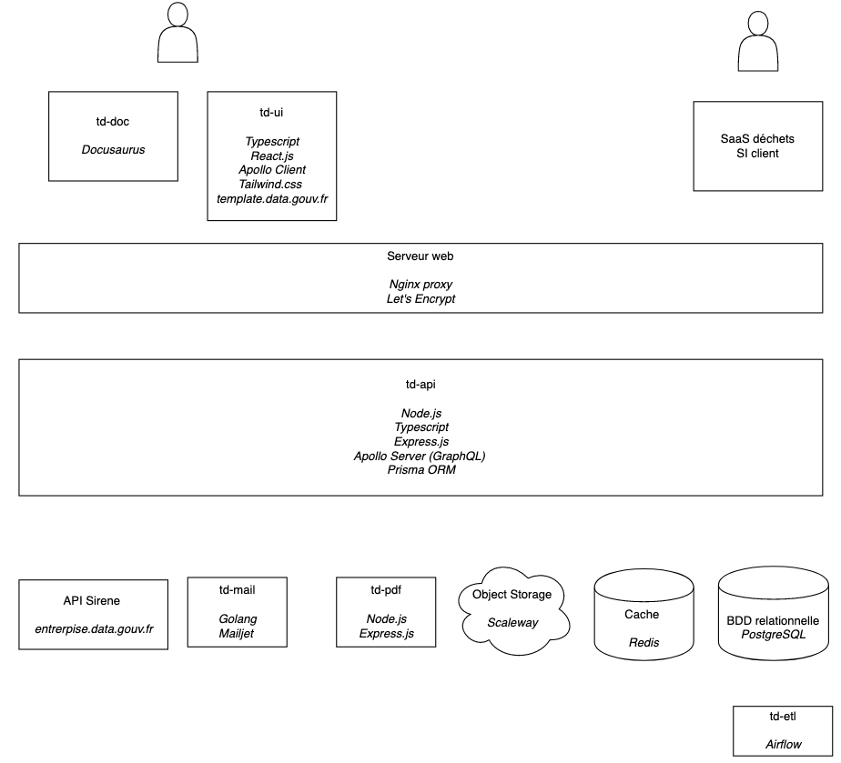

# Trackdéchets

**Gérer la traçabilité des déchets en toute sécurité**

</img>
</img>

Dépôt de code de la startup d'état **Trackdéchets** incubée à la Fabrique Numérique du Ministère de la Transition Écologique et Solidaire.

Ce `README` s'adresse aux intervenant·es techniques sur le projet. Pour plus d'infos en tant qu'utilisateur.ice du produit ou de l'API, vous pouvez consulter les liens suivants:

- [Site web](https://trackdechets.beta.gouv.fr)
- [FAQ](https://faq.trackdechets.fr/)
- [Documentation technique de l'API](https://developers.trackdechets.beta.gouv.fr)
- [Forum technique](https://forum.trackdechets.beta.gouv.fr)

## Architecture logicielle

Le projet utilise `docker-compose` avec les différents services suivants:

- `td-api` (`./back`) Serveur Express.js avec une API GraphQL (Node.js)
- `td-ui` (`./front`) Single Page App pour la page d'accueil et le dashboard (React.js)
- `td-pdf` (`./pdf`) Service interne de génération de BSD au format PDF (Node.js)
- `td-mail` (`./mail`) Service interne d'envoi de courriels via Mailjet (Golang)
- `td-etl` (`./etl`) Service interne de préparation des données de la base des ICPE (Python, Airflow)
- `td-doc` (`./doc`) Documentation technique du projet (Docusaurus)

La config `nginx` pour chaque container exposé est créee de façon automatique grâce à [jwilder/nginx-proxy](https://github.com/nginx-proxy/nginx-proxy)

## Environnements

Plusieurs environnements sont configurés via les différents fichiers compose.

- **dev** pour le développement en local
- **test** pour faire tourner les tests, en local ou sur CircleCI
- **recette**: environnement de validation fonctionnelle, synchronisé avec la branche `dev`.
- **sandbox**: environnement "bac à sable" pour les personnes souhaitant s'interfacer avec l'API Trackdéchets, synchronisé avec la branche `master`
- **prod**: environnement de production, synchronisé avec la branche `master`

## Infrastructure

Les différentes instances sont hébérgées chez OVH et Scaleway. Le détail est disponible dans la carte correspondante sur [Trello](https://trello.com/c/zZJskt5m)

## Outillage

- [CircleCI](https://circleci.com/) pour l'intégration continue et le déploiement
- [Sentry](https://sentry.io) pour le reporting des erreurs
- [Graylog](https://www.graylog.org/) pour l'indexation des logs
- [Metabase](https://www.metabase.com/) pour l'analyse et la visualisation des données Trackdéchets
- [Matomo](https://fr.matomo.org/) pour l'analyse du traffic web
- [Updown](https://updown.io/) pour la page de statuts et les alertes
- [graphql-codegen](https://graphql-code-generator.com/) pour générer la référence de l'API et le typage Typescript à partir des fichiers de définition GraphQL.

## Monitoring

Deux pages de monitoring sont accessibles:
- [Statuts API GraphQL](https://status.trackdechets.beta.gouv.fr)
- [Statuts service d'envoi d'email](https://updown.io/jgo1)

## Compatibilité navigateur

Le support des navigateurs est configuré dans le fichier [`./front/.browserslistrc`](./front/.browserslistrc). La liste des navigateurs correspondant à cette config est [la suivante](https://browserl.ist/?q=%3E+0.1%25%2C+not+dead%2C+not+op_mini+all%2C+ie+11)

## Contribuer

Voir les conventions et bonnes pratiques sur [CONTRIBUTING.md](./CONTRIBUTING.md)

## L'équipe

La liste des contributeurs au projet est disponible sur [AUTHORS.md](./AUTHORS.md)

## Licence

[GNU Affero General Public License v3.0 ou plus récent](https://spdx.org/licenses/AGPL-3.0-or-later.html)
