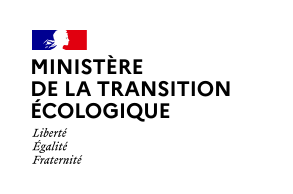
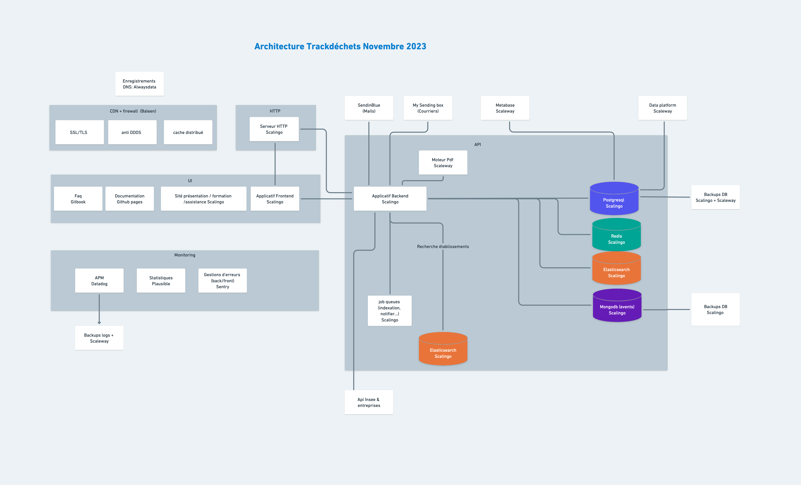

# Trackdéchets

**Gérer la traçabilité des déchets en toute sécurité**

</img>
</img>

Dépôt de code du projet **Trackdéchets** incubé à la Fabrique Numérique du Ministère de la Transition Écologique.

Ce `README` s'adresse aux intervenant·es techniques sur le projet. Pour plus d'infos en tant qu'utilisateur.ice du produit ou de l'API, vous pouvez consulter les liens suivants:

- [Site web](https://trackdechets.beta.gouv.fr)
- [FAQ](https://faq.trackdechets.fr/)
- [Documentation technique de l'API](https://developers.trackdechets.beta.gouv.fr)
- [Forum technique](https://forum.trackdechets.beta.gouv.fr)

[](https://github.com/MTES-MCT/trackdechets/actions/workflows/integration-tests.yml)

[](https://github.com/MTES-MCT/trackdechets/actions/workflows/build-and-test.yml)

## Architecture logicielle

Le projet est constitué de trois briques logicielles principales :

|              | back                                                                                                                | front                                         | doc                     |
| :----------- | :------------------------------------------------------------------------------------------------------------------ | :-------------------------------------------- | :---------------------- |
| Description  | API Trackdéchets                                                                                                    | Interface graphique (SPA)                     | Documentation technique |
| Technologies | Node.js <br/> Typescript <br/> Express.js <br/> Apollo Server <br/> Prisma ORM <br/> PostgreSQL </br> Elasticsearch | React.js <br/> Typescript <br/> Apollo Client | Docusaurus              |

## Dépôts de code connexes

- [trackdechets-website](https://github.com/MTES-MCT/trackdechets-website) (site web statique https://trackdechets.beta.gouv.fr/)
- [trackdechets-backups ](https://github.com/MTES-MCT/trackdechets-backups) (jobs cron permettant de réaliser des backups des bases de données sur une autre infra)
- [trackdechets-metabase](https://github.com/MTES-MCT/trackdechets-metabase) (guide d'administration de metabase permettant de visualiser les données)
- [trackdechets-etl](https://github.com/MTES-MCT/trackdechets-etl) (script d'import des données ICPE)
- [trackdechets-sirene-search](https://github.com/MTES-MCT/trackdechets-sirene-search) (import des données INSEE Sirene dans notre base ElasticSearch pour la recherche entreprises de Trackdecehts)

## Services externes

l'API Trackdéchets fait appel à plusieurs services externes :

- Sendinblue pour l'envoi d'e-mails transactionnels.
- MySendingBox pour l'envoi de courrier papier.
- Serveur Gotenberg (auto-hébergé) pour le rendu des PDFs
- Serveur Metabase (auto-hebergé) pour les analytics
- Application distincte (auto-hebergée) pour les stats publiques

## Infrastructure

L'applicatif et les bases de données sont hebergés en mode PaaS chez Scalingo.



## Outillage

- [Github Actions](https://github.com/features/actions) pour l'intégration continue et le déploiement
- [Sentry](https://sentry.io) pour le reporting des erreurs
- [Datadog](https://www.datadoghq.eu) pour le monitoring
- [Metabase](https://www.metabase.com/) pour l'analyse et la visualisation des données Trackdéchets
- [Matomo](https://fr.matomo.org/) pour l'analyse du trafic web
- [Updown](https://updown.io/) pour la page de statuts et les alertes
- [graphql-codegen](https://graphql-code-generator.com/) pour générer la référence de l'API et le typage Typescript à partir des fichiers de définition GraphQL.

## Environnements

Trois environnements sont déployés en parallèle :

- Recette (usage interne pour les tests de l'équipe)
  - back : https://api.trackdechets.fr
  - front : https://recette.trackdechets.fr
- Sandbox (environnement "bac à sable" pour les intégrateurs)
  - back : https://api.sandbox.trackdechets.beta.gouv.fr
  - front : https://sandbox.trackdechets.beta.gouv.fr
- Production
  - back : https://api.trackdechets.beta.gouv.fr
  - front : https://app.trackdechets.beta.gouv.fr

## Monitoring

Deux pages de monitoring sont accessibles:

- [Statut API GraphQL Production](https://status.trackdechets.beta.gouv.fr)
- [Statut API GraphQL Sandbox](https://status.sandbox.trackdechets.beta.gouv.fr)

## Compatibilité navigateur

Le support des navigateurs est configuré dans le fichier [`./front/.browserslistrc`](./front/.browserslistrc). La liste des navigateurs correspondant à cette config est disponible avec la commande suivante: `npx browserslist ">0.1% not dead not op_mini all ie 11"`
À l'heure de la mise à jour de ce README.md, la liste est la suivante :

```
and_chr 98
and_ff 96
and_qq 10.4
and_uc 12.12
android 4.4.3-4.4.4
chrome 98
chrome 97
chrome 96
chrome 94
chrome 93
chrome 91
chrome 87
chrome 83
chrome 79
edge 98
edge 97
firefox 97
firefox 96
ie 11
ios_saf 15.2-15.3
ios_saf 15.0-15.1
ios_saf 14.5-14.8
ios_saf 14.0-14.4
ios_saf 13.4-13.7
ios_saf 12.2-12.5
ios_saf 6.0-6.1
opera 83
opera 82
safari 15.2-15.3
safari 15.1
safari 15
safari 14.1
safari 14
safari 13.1
samsung 16.0
samsung 15.0
samsung 14.0
samsung 13.0
```

## Contribuer

Voir les conventions et bonnes pratiques sur [CONTRIBUTING.md](./CONTRIBUTING.md)

## L'équipe

La liste des contributeurs au projet est disponible sur [AUTHORS.md](./AUTHORS.md)

## Licence

[GNU Affero General Public License v3.0 ou plus récent](https://spdx.org/licenses/AGPL-3.0-or-later.html)
