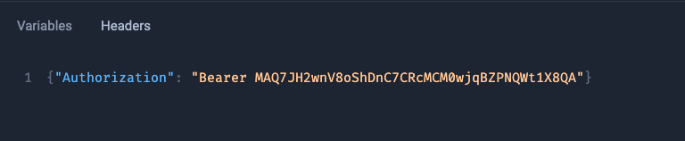
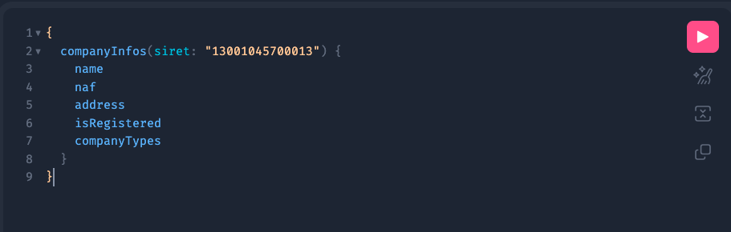
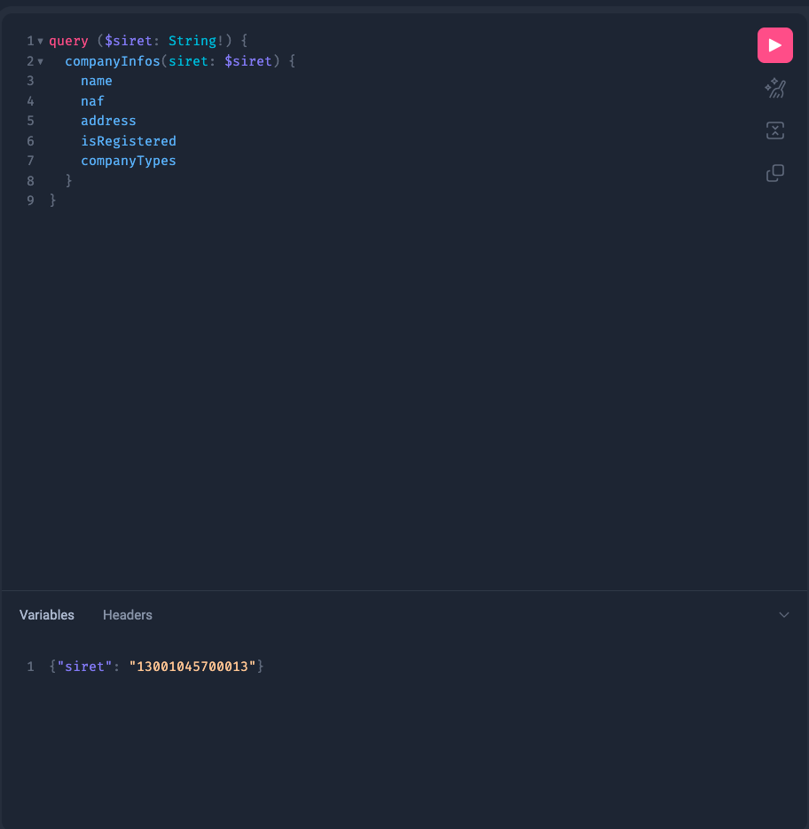
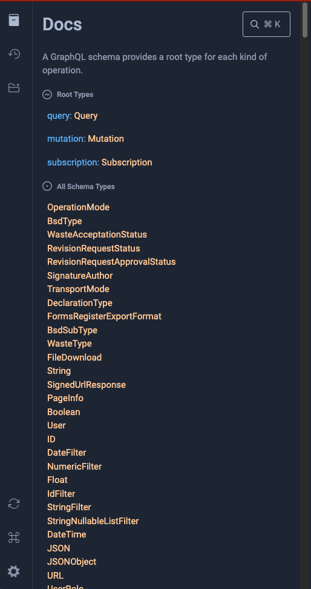

Le playground GraphQL est un environnement de développement intégré au navigateur web qui permet de facilement tester des requêtes à l'API Trackdéchets.
Il s'affiche par défaut lors d'une connexion à la racine de l'API via un navigateur. Pour rappel :

| Environnement | URL de l'API |
|-------------| -----|
| Sandbox | https://api.sandbox.trackdechets.beta.gouv.fr  |
| Production | https://api.trackdechets.beta.gouv.fr |
## Présentation du playground

Le playground GraphQL est composé de différentes zones :
- une zone de texte éditable permettant d'écrire des queries et des mutations GraphQL. Vous pouvez utiliser les fonctionnalités d'auto-complétion et le boutton "Prettify" pour formatter les requêtes.
- une zone de texte pour visualiser les réponses à vos requêtes
- un panneau latéral permettant d'accéder à la documentation des champs de l'API et au schéma GraphQL
- un onglet permettant de spécifier des variables à injecter dans vos *queries* ou *mutations*
- un onglet "HTTP Headers" permettant d'ajouter l'en-tête d'authentification

## Renseigner son token

Le token (voir [Authentification](../reference/authentification)) doit être renseigné dans l'onglet "HTTP Headers" de la façon suivante :

## Exécuter une requête GraphQL

Vous pouvez écrire des requêtes GraphQL dans la zone de texte à gauche. Exemple avec la requête `companyInfos` permettant d'obtenir des informations sur un établissement partenaire :

:::tip
Utiliser le bouton "Prettify" pour valider et formatter vos requêtes
:::

## Utiliser les variables

Vous pouvez également utiliser l'onglet "Variables" pour injecter les variables dans votre requête de la façon suivante :

## Parcourir la documentation de l'API

L'onglet de droite "Docs" vous permet de parcourir la référence de l'API. Vous y retrouverez les différentes Query et Mutation disponibles ainsi que les variables et les types de retours. La référence de l'API est également disponible dans la section [Référence API](../reference/api-reference/bsdd/queries)

## Télécharger le schéma

Vous pouvez télécharger le schéma GraphQL en cliquant sur le panneau latéral "Schema", puis "DOWNLOAD". Le schéma permet notamment de construire des clients grâce à des librairies dans le langage de votre choix. Voir la liste complète des librairies GraphQL sur le site [graphql.org](https://graphql.org/code/).
