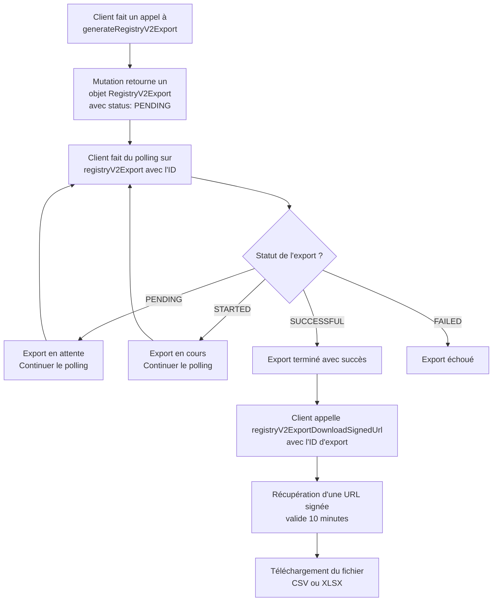
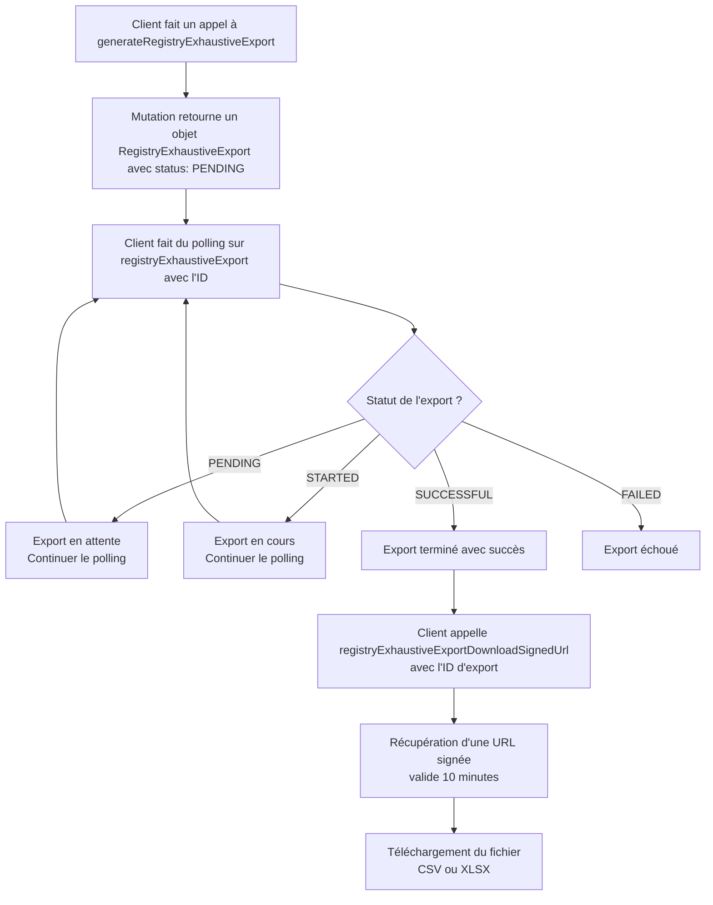

L'[arrêté du 31 mai 2021](https://www.legifrance.gouv.fr/jorf/id/JORFTEXT000043884563) fixe le contenu des registres déchets, terres excavées et sédiments mentionnés aux articles R. 541-43 et R. 541-43-1 du code de l'environnement. Trackdéchets permet d'exporter facilement les données des bordereaux de suivi de déchets dangereux et des entrées de registre RNDTS au format registre. Cette fonctionnalité permet également au registre électronique national de récupérer les données relatives à la traçabilité des déchets dangereux directement.

## Export du registre réglementaire

Le processus d'export de registre réglementaire s'effectue en 3 étapes via l'API GraphQL :

1. **Génération de l'export** : Utilisation de la mutation `generateRegistryV2Export`
2. **Suivi du statut** : Polling de la query `registryV2Export` 
3. **Téléchargement** : Récupération de l'URL signée via `registryV2ExportDownloadSignedUrl`

### Flux d'export



### Mutation generateRegistryV2Export

Cette mutation permet de déclencher la génération d'un export de registre réglementaire.

**Paramètres obligatoires :**
- `registryType` : Type de registre (`OUTGOING`, `INCOMING`, `TRANSPORTED`, `MANAGED`, `SSD`)
- `format` : Format de sortie (`CSV` ou `XLSX`)
- `dateRange` : Plage de dates à exporter (date de début obligatoire)

**Paramètres optionnels :**
- `siret` : SIRET de l'établissement pour lequel faire l'export. Si il n'est pas spécifié, tous les établissements auxquel l'utilisateur (lié au token d'auth) a accès seront inclus
- `delegateSiret` : SIRET de l'établissement délégataire, en cas de délégation
- `where` : Filtres additionnels (type de déchet, code déchet, etc.)

**Exemple de requête :**

```graphql
mutation {
  generateRegistryV2Export(
    registryType: OUTGOING
    format: CSV
    siret: "53070853600038"
    dateRange: {
      _gte: "2023-01-01T00:00:00Z"
      _lte: "2023-12-31T23:59:59Z"
    }
    where: {
      wasteType: { _eq: DD }
      wasteCode: { _eq: "06 01 01*" }
    }
  ) {
    id
    status
    createdAt
    registryType
    format
    startDate
    endDate
    sirets
    companies {
      name
      siret
    }
  }
}
```

L'objet `RegistryV2Export` retourné contient :
- `id` : Identifiant unique de l'export
- `status` : Statut actuel (`PENDING`, `STARTED`, `SUCCESSFUL`, `FAILED`, `CANCELED`)
- `registryType` : Type de registre exporté
- `format` : Format du fichier généré
- `sirets` : Liste des SIRETs concernés (en cas d'export sur tous les établissements, contient initialement tous les sirets auxquel l'utilisateur a accès, la liste est ensuite affinée à la fin de l'export avce les établissements donc des bordereaux apparaissent dans l'export)
- `companies` : Informations sur les établissements (même chose que sirets dans le cas d'export pour tous les établissements)
- `startDate` / `endDate` : Période d'export
- `createdAt` / `updatedAt` : Horodatage

### Suivi du statut avec registryV2Export

Une fois l'export lancé, il faut surveiller son statut en interrogeant régulièrement la query `registryV2Export` :

```graphql
query {
  registryV2Export(id: "export-id") {
    id
    status
  }
}
```

Les statuts possibles sont :
- `PENDING` : Export en attente de traitement
- `STARTED` : Export en cours de génération
- `SUCCESSFUL` : Export terminé avec succès
- `FAILED` : Export échoué
- `CANCELED` : Export annulé

⚠️ Veuillez ne pas spammer cette query, une requête toute les 5 secondes est suffisante.

### Téléchargement avec registryV2ExportDownloadSignedUrl

Lorsque le statut est `SUCCESSFUL`, vous pouvez récupérer l'URL de téléchargement :

```graphql
query {
  registryV2ExportDownloadSignedUrl(exportId: "export-id") {
    downloadLink
  }
}
```

Cette query retourne une URL signée valide pendant **10 minutes** que vous pouvez utiliser pour télécharger le fichier généré via une requête HTTP GET classique.

## Export du registre exhaustif

Le registre exhaustif permet d'exporter l'ensemble des données de bordereaux et registres pour un ou plusieurs établissements, équivalent à l'ancien endpoint `allWastes`. Le processus est similaire au registre réglementaire.

ℹ️ Les bordereaux sont inclus dans ce registre à partir du moment où ils sont publiés.

### Flux d'export



### Mutation generateRegistryExhaustiveExport

Cette mutation permet de générer un export exhaustif de toutes les données.

**Paramètres obligatoires :**
- `format` : Format de sortie (`CSV` ou `XLSX`)
- `dateRange` : Plage de dates à exporter (date de début obligatoire)

**Paramètres optionnels :**
- `siret` : SIRET de l'établissement pour lequel faire l'export

**Exemple de requête :**

```graphql
mutation {
  generateRegistryExhaustiveExport(
    format: XLSX
    siret: "53070853600038"
    dateRange: {
      _gte: "2023-01-01T00:00:00Z"
      _lte: "2023-12-31T23:59:59Z"
    }
  ) {
    id
    status
    createdAt
    format
    startDate
    endDate
    sirets
    companies {
      name
      siret
    }
  }
}
```

L'objet `RegistryExhaustiveExport` retourné contient les mêmes informations que `RegistryV2Export`, mais sans le champ `registryType` puisqu'il s'agit d'un export global, ni les différents filtres d'export qui ne sont pas disponibles ici.

### Suivi du statut avec registryExhaustiveExport

Le suivi du statut s'effectue de manière similaire :

```graphql
query {
  registryExhaustiveExport(id: "export-id") {
    id
    status
  }
}
```

### Téléchargement avec registryExhaustiveExportDownloadSignedUrl

Une fois l'export terminé avec succès :

```graphql
query {
  registryExhaustiveExportDownloadSignedUrl(exportId: "export-id") {
    downloadLink
  }
}
```

Cette query fonctionne de manière identique à celle du registre réglementaire, avec une URL signée valide 10 minutes.

## Filtres avancés

### DateFilter

Le paramètre `dateRange` utilise un objet `DateFilter` permettant de spécifier des plages de dates précises :

```graphql
dateRange: {
  _gte: "2023-01-01T00:00:00Z"  # Supérieur ou égal
  _lte: "2023-12-31T23:59:59Z"  # Inférieur ou égal
  _gt: "2023-01-01T00:00:00Z"   # Strictement supérieur
  _lt: "2023-12-31T23:59:59Z"   # Strictement inférieur
  _eq: "2023-06-15T12:00:00Z"   # Égal exactement
}
```

### RegistryV2ExportWhere

Pour les exports de registre réglementaire, des filtres additionnels peuvent être appliqués :

```graphql
where: {
  wasteType: { 
    _eq: DD        # Déchets dangereux uniquement
    _in: [DD, DND] # Déchets dangereux et non dangereux
  }
  wasteCode: { 
    _eq: "06 01 01*"              # Code déchet exact
    _in: ["06 01 01*", "06 01 02*"] # Liste de codes
  }
  declarationType: { 
    _eq: BSD  # Uniquement les bordereaux (ou REGISTRY pour les déclarations registre)
  }
}
```

### Types de déchets disponibles

- `DD` : Déchets dangereux
- `DND` : Déchets non dangereux  
- `TEXS` : Terres excavées et sédiments

### Types de registre disponibles

- `OUTGOING` : Registre sortant
- `INCOMING` : Registre entrant
- `TRANSPORTED` : Registre de transport
- `MANAGED` : Registre de gestion (courtage/négoce)
- `SSD` : Sortie de statut de déchet