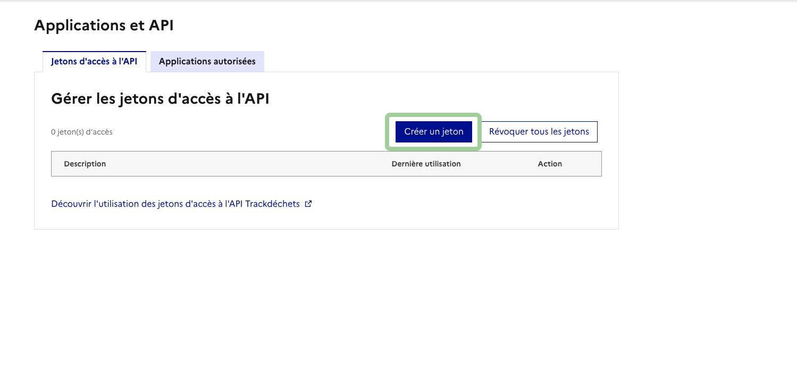
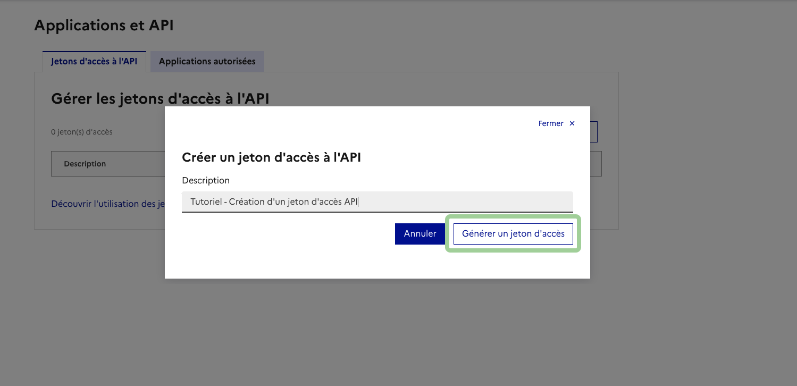
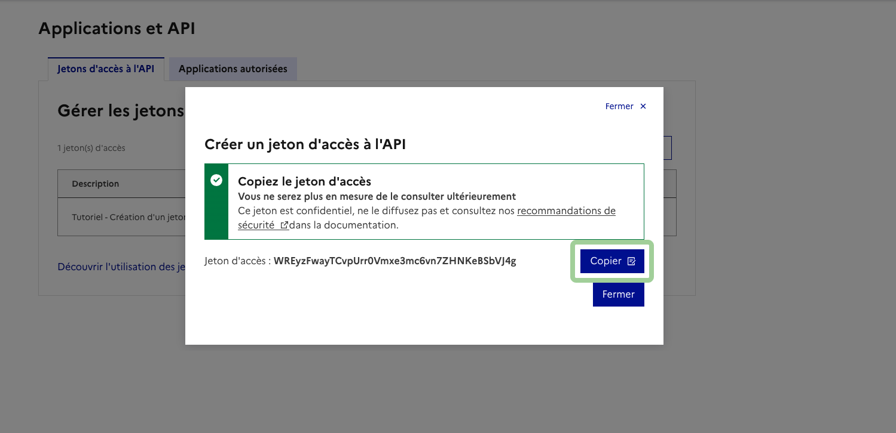
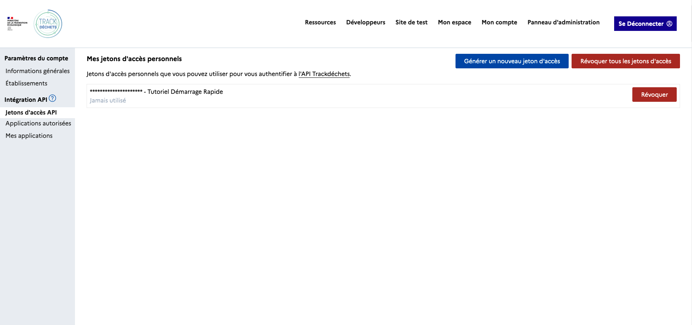

🚨 Les jetons d'api sont des identifiants très sensibles, veillez :
- à ne pas les diffuser, y compris sur nos outils de support, qu'il s'agisse de captures d'écran ou de messages
- à ne pas les commiter dans un dépôt de code
- à ne pas les embarquer dans une application frontend où ils seraient directement accessibles
- à les révoquer en cas de doute sur leur intégrité

Une fois votre compte créé et votre premier établissement rattaché en *sandbox* rendez-vous dans *Mon Compte* > *Intégration API* > *Jeton d'accès API* puis *Générer un nouveau jeton d'accès*

---

Pensez à donner une description à votre jeton d'accès pour vous souvenir de son utilité.

---

Une fois le jeton d'accès généré, pensez à le copier quelque part, vous ne serez plus en mesure de le consulter ultérieurement.

---

Vous pouvez révoquer vos tokens à tout moment depuis le même espace.

