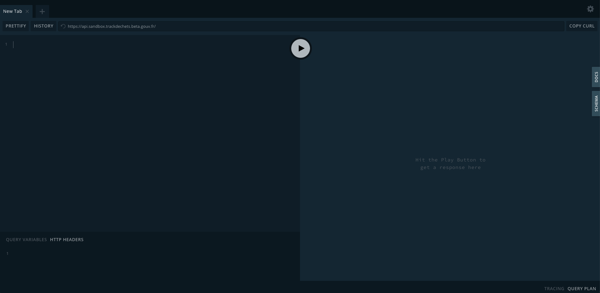

### Connectez vous au playground


Rendez-vous sur le [playground](https://api.sandbox.trackdechets.beta.gouv.fr) GraphQL en *sandbox*. Vous devez voir un écran similaire à celui-ci :



:::note
Le playground GraphQL est un environnement de développement intégré au navigateur web qui permet de facilement tester des requêtes à l'API Trackdéchets.
Il s'affiche par défaut lors d'une connexion à la racine de l'API via un navigateur. Pour rappel :

| Environnement | URL de l'API |
|-------------| -----|
| Sandbox | https://api.sandbox.trackdechets.beta.gouv.fr  |
| Production | https://api.trackdechets.beta.gouv.fr |
:::

### Renseignez votre token

Authentifiez-vous en ajoutant un header d'autorisation dans le bloc en bas à gauche intitulé *HTTP HEADERS*

```json
{
  "Authorization": "Bearer ACCESS_TOKEN"
}
```

où `ACCESS_TOKEN` correspond au token généré à l'étape précédente [Obtenir un jeton d'accès personnel](./access-token)


### Écrire votre première requête

Une fois le header d'autorisation renseigné, vous pouvez commencer à écrire des requêtes dans le cadre de gauche et voir le résultat dans le cadre de droite. Essayez avec la requête suivante qui permet de demander les informations relatives à l'utilisateur connecté :

```graphql
query {
  me {
    name
    email
  }
}
```

puis exécuter la requête à l'aide du bouton "Play" au milieu. Vous devrez recevoir la réponse suivante au format JSON :

```json
{
  "data": {
    "me": {
      "name": "YOUR_NAME"
    }
  }
}
```

Bravo, vous venez d'effectuer votre première requête à l'API Trackdéchets 🎉. En terminologie GraphQL, la requête ci-dessous est une `query`. Ce genre de requête se comporte comme un `GET` dans le standard REST, c'est à dire qu'elle permet de lire des données mais pas d'en modifier. Il existe aussi un autre type de requête appelée `mutation` qui va nous permettre de créer et modifier des ressources à l'instar d'un `POST` / `PUT` / `PATCH` en standard `REST`. C'est ce que nous allons voir à l'étape suivante pour la création de votre premier bordereau.

:::tip
Les arguments et le type de retour de chaque `query` ou `mutation` sont documentés dans la référence de l'API. Exemple avec [la requête que nous venons d'effectuer](../../reference/api-reference/user-company/queries.md#me).
:::


