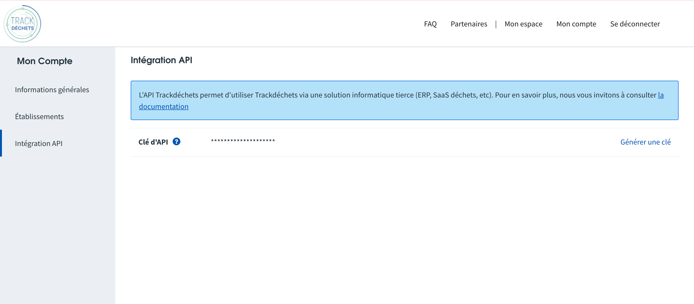

Pour obtenir un token d'authentification à l'API, vous devez vous connecter à votre compte Trackdéchets sur [https://trackdechets.beta.gouv.fr](https://trackdechets.beta.gouv.fr). Rendez-vous ensuite dans *Mon Compte* > *Intégration API* puis *Générer un token*

:::warning
La mutation `login(email, password)` qui permet d'obtenir un token via l'API GraphQL à partir de l'email et mot de passe est désormais dépréciée. Si vous désirez obtenir un token pour le compte d'utilisateurs Trackdéchets dans une application tierce, vous devez implémenter le protocole [OAuth2](oauth2)
:::

:::tip
Les tokens personnels générés depuis votre compte Trackdéchets ont une durée de validité infinie. Il sera bientôt possible de révoquer les tokens depuis votre compte Trackdéchets
:::
