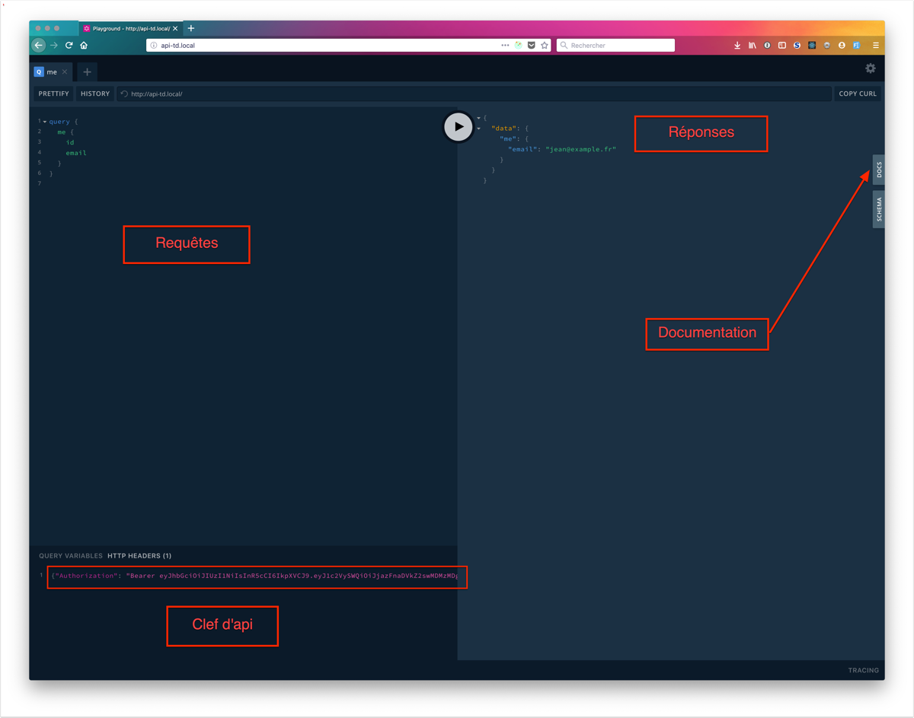

## Accès

Si vous accédez au point de terminaison de l'API GraphQL depuis un navigateur, vous aurez accès à un éditeur interactif de requête GraphQL.


:::note
Les différents points de terminaisons GraphQL en fonction des environnements sont les suivants:

* [https://api.trackdechets.beta.gouv.fr](https://api.trackdechets.beta.gouv.fr) (production)
* [https://api.sandbox.trackdechets.beta.gouv.fr](https://api.sandbox.trackdechets.beta.gouv.fr) (bac à sable)
* [https://api.trackdechets.fr](https://api.trackdechets.fr) (recette)

Voir aussi [la documentation sur les environnements](environments.md)
:::

## Authentification

La plupart des requêtes nécessitant d'être authentifié, vous devrez donc [récupérer un jeton d'accès](access-token.md)

Le token doit être inséré dans le cadre inférieur gauche de l'écran sous la forme d'un header d'autorisation de type "Bearer"

```
{
  "Authorization": "Bearer ACCESS_TOKEN"
}
```

où `ACCESS_TOKEN` représente le token que vous avez récupéré depuis votre compte Trackdéchets (Mon Compte > Intégration API).




## Votre premiere requête


Une fois le token renseigné, vous pourrez écrire `queries` et `mutations` dans le cadre de gauche, et voir le résultat dans celle de droite après avoir cliqué sur le bouton central.

Dans la zone de gauche, copiez cette requête.

```
    query {
      me {
        id
        email
      }
    }
```

En cliquant sur le bouton central, vous verrez la réponse dans la zone de droite.

Notez qu’il est possible d’exporter vos requêtes au format cURL en cliquant sur le bouton situé en haut à droite.

### Documentation

Un onglet docs à droite de la fenêtre vous présente une vue exhaustive des requêtes disponibles.