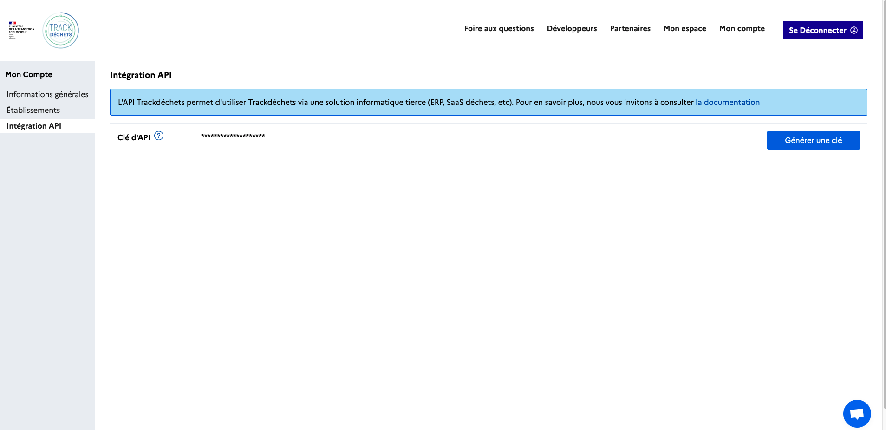

Une fois votre compte crée et votre premier établissement rattaché en *sandbox* rendez-vous dans *Mon Compte* > *Intégration API* puis *Générer une clé*

Notez ce token quelque part, il vous servira pour vous authentifier à l'API.

:::note
Les tokens générés depuis votre compte Trackdéchets ont une durée de validité infinie. Il est prévu à terme de pouvoir révoquer ses tokens depuis son compte Trackdéchets.
:::

