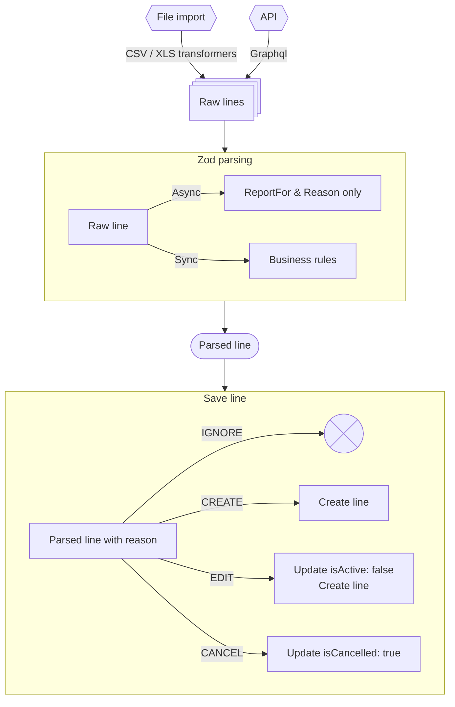
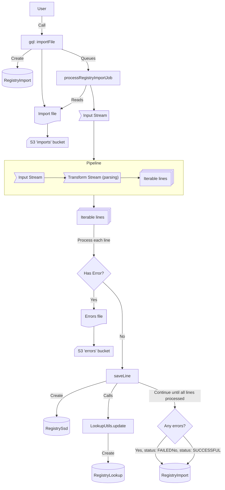
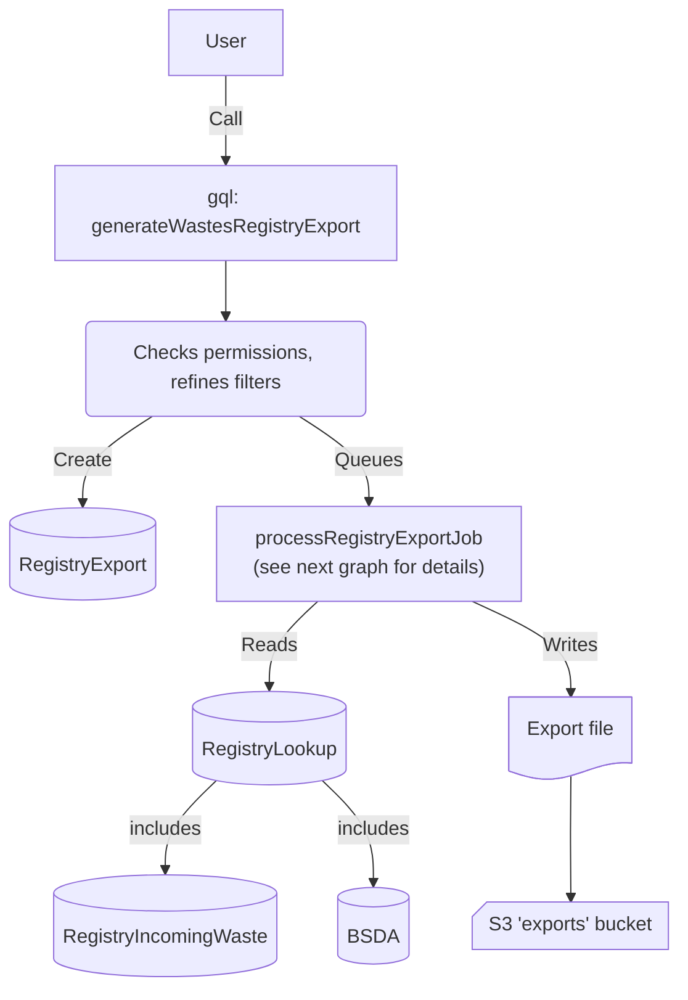

# Registres V2

Documentation du process d'imports/exports de registre V2

## Import

L'import des déclarations de registres peut se faire de 2 manières:

- via l'API (sous forme d'une array d'inputs)
- en important un fichier csv/xlsx

Toute la logique métier est contenue dans 2 blocs, que chaque type d'import doit implémenter:

- un bloc de parsing, chargé de la validation & transformation des données: `safeParseAsync`
- un bloc d'enregistrement des données en DB: `saveLine`

Le parsing est commun entre l'API et l'import de fichier. Il doit donc être suffisamment générique pour être utilisé avec différents types de données. Par exemple pour un tableau, dans un CSV on reçoit une chaine de caractères alors qu'en GraphQL on aura directement un objet tableau.
L'enregistrement se base sur les données parsées, et particulièrement sur la colonne `reason` qui permet de déterminer l'action à réaliser:

- creation de ligne
- modification de ligne: on ajoute une nouvelle ligne et on passe les autres à `isActive: false`
- annulation de ligne: on passe les lignes correspondant à l'identifiant à `isCancelled: true`
- ignorer la ligne: on ne fait rien. C'est le cas si on rencontre une ligne avec un identifiant déjà présent en base mais sans raison spécifiée par l'utilisateur, ou si la ligne est invalide. Ignorer les lignes sans raison permet notamment de réinjecter un fichier plusieurs fois sans déclencher d'erreur. C'est utile lorsqu'on corrige des erreurs dans un fichier par exemple.

Il est important de noter que l'import traite les données ligne par ligne, et que chaque ligne est indépendante. Il n'y a pas de rollback si une ligne échoue, et les lignes suivantes continueront d'être traitées.

Voici un schéma global du processus d'import:

L'import via l'API est relativement simple, puisqu'il s'agit de valider les lignes envoyées via l'API (avec `safeParseAsync`, qui est un parser Zod), et créer les objets associés en DB via `saveLine`.

L'import via un fichier est un peu plus complexe et suit le flow suivant :

Ce processus d'import génère plusieurs objets en DB:

- RegistryImport : l'objet de suivi du processus d'import
- Registry object (RegistrySsd, RegistryIncomingWaste, ...) : contient les infos validées/parsées de l'import
- RegistryLookup : contient un résumé cherchable de la ligne de registre importée, servant à l'export

ainsi que 2 fichiers dans S3 (ou équivalent) :

- un fichier d'erreurs (généré lors du process d'import)
- un fichier d'import (celui que l'utilisateur a envoyé)

## RegistryLookup

La table RegistryLookup sert d'intermédiaire "cherchable" entre les registres importés et les registres exportés. [schéma prisma](../libs/back/prisma/src/schema/registry.prisma)

Cette table rassemble toutes les lignes qui doivent apparaître dans des registres d'exports, que ce soit pour les registres déclarés ou les bordereaux (BSDs). Il y a donc 1 ligne RegistryLookup pour chaque ligne de registre importé (car les registres importés n'apparaissent que dans un seul registre d'export), mais il peut y avoir plusieurs lignes de RegistyLookup pour les BSDs (un BSD peut concerner le registre entrant, sortant, transporté,...).

Elle permet de rechercher rapidement les lignes à exporter, sans avoir à faire de recherche de toute la base à la recherche des BSD/registres concernés par un export. Afin d'arriver à cet objectif de rapidité, cette table possède certaines colonnes et index qui méritent d'être expliqués.

- id

la colonne "id" de RegistryLookup n'est pas, contrairement à la plupart des autres tables, générée automatiquement à la création de l'objet en db. Elle contient en effet l'id de l'objet associé à cette ligne. Celà permet de rapidement retrouver les objets RegistryLookup liés à un objet afin de les modifier/supprimer lorsque le registre/BSD associé est modifié/supprimé.

- readableId

La colonne readableId contient le publicId dans le cas des registres, et le readableId dans le cas des BSD. Cette colonne est surtout utile pour le debug/support, et rend plus "lisible" la table.

- reportAsSiret

Cette colonne contient le délégataire identifié sur la ligne de registre correspondant à l'objet RegistryLookup. Elle permet de retrouver les lignes de registre à exporter chez un délégataire.

- dateId

La colonne dateId est une colonne utilisée uniquement pour la pagination lors de l'export. Afin de traverser efficacement la db à l'export, une pagination par curseur est utilisée. Or pour la pagination par curseur, il faut utiliser comme valeur de curseur une colonne qui est classée dans l'ordre du sort de la query, mais aussi dont les valeurs sont uniques. Les exports se faisant par ordre chronologique décroissant, une colonne classable par date est nécessaire. Cependant, la colonne "date" n'est pas unique, et ne peut donc pas être utilisée comme curseur.

Le choix a donc été fait d'ajouter cette colonne dateId, qui contient un UUIDv7, généré à la création de l'objet dans le serveur. La particularité d'UUIDv7 est qu'il est possible de générer ces ids à partir d'un timestamp (la colonne date dans notre cas), que ces UUID soient classable par ordre chronologique, tout en étant uniques.

- id composé (id + exportRegistryType + siret)

Puisqu'un même BSD peut apparaître sur plusieurs lignes de RegistryLookup, la valeur "id" n'est pas forcément unique, et ne peut donc pas servir d'id à elle seule. On utilise donc un id composé de id + exportRegistryType + siret, car l'id doit n'apparaître qu'une seule fois par type d'export et par siret. En d'autres termes, un même objet (particulièrement les BSDs) peuvent apparaître dans plusieurs types d'export, et parfois pour plusieurs sirets dans un même type d'export (ex: plusieurs transporteurs). Il doit donc y avoir unicité de id + exportRegistryType + siret, d'où l'intérêt d'utiliser cet index composé.

### Mécanisme de synchro de Registre/BSD <> RegistryLookup

La table RegistryLookup doit rester synchronisée lorsque des nouvelles lignes de registres ou BSD sont créés/updatés/supprimés.
Pour les registres, les utilitaires d'ajout à Registrylookup se trouvent dans le fichier registry.ts ([exemple](../libs/back/registry/src/incomingWaste/registry.ts)).
Pour les BSDs, ils se trouvent dans un fichier registryV2.ts ([exemple](../back/src/bsda/registryV2.ts)).

Ces fichiers contiennent, en plus des fonctions de mapping (BSD/Registre -> Registre V2), 3 fonctions:

- update (à appeler à la création/update)
- delete (à appeler lors de la suppression)
- rebuildLookup (utilisée dans le script de rebuild de lookup table, qui recrée la table de zéro)

Pour les registres, les fonctions d'update/delete sont appelées dans le fichier database.ts ([exemple](../libs/back/registry/src/incomingWaste/database.ts))

Pour les bordereaux, ces fonctions sont appelées dans les fonctions de CRUD du repository ([exemple](../back/src/bsda/repository/bsda/create.ts))

## Export

### Vue d'ensemble

### Export processing job (processRegistryExportJob)

