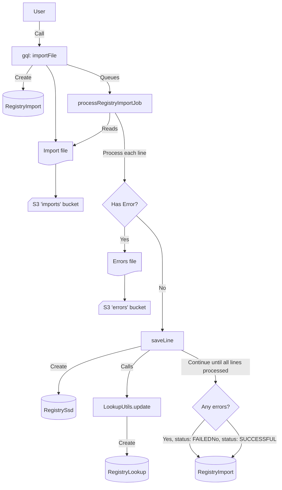
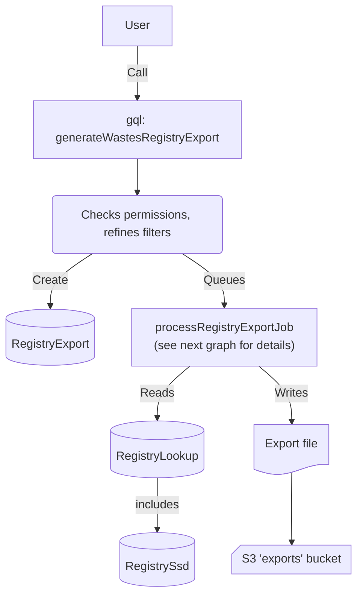
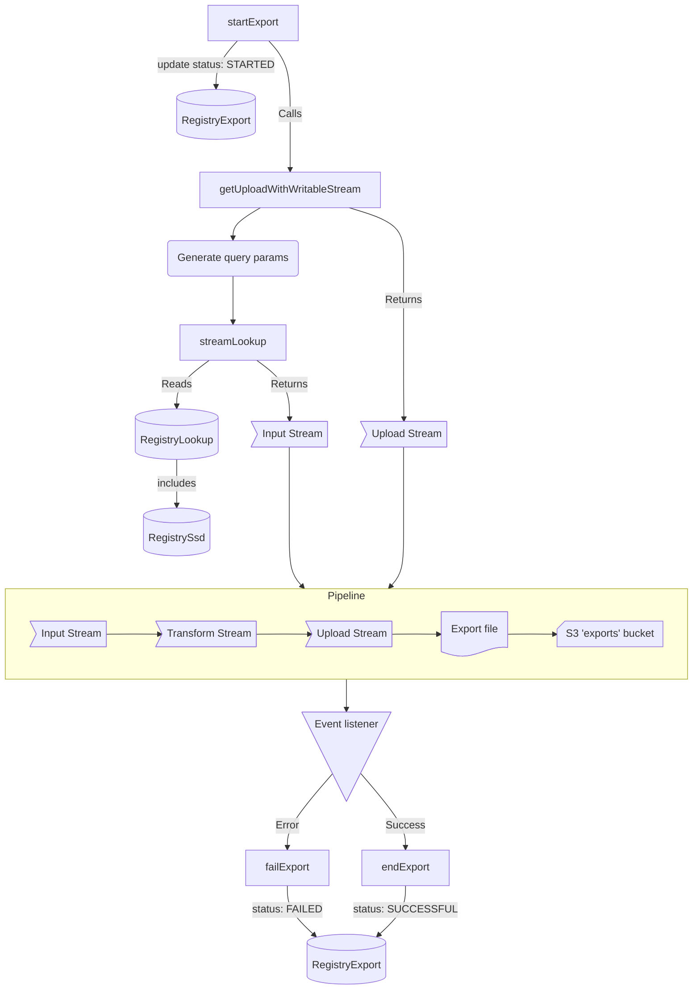

# Registres V2

## Import

```mermaid
flowchart TD
  user[User] -->|Call| importFile[gql: importFile]
  importFile --> file1@{ shape: doc, label: "Import file" }
  file1 --> S3Imports@{ shape: notch-rect, label: "S3 'imports' bucket" }
  importFile -->|Create| registryImport[(RegistryImport)]
  importFile -->|Queues| job[processRegistryImportJob]
  job -->|Reads|file1

  file2 --> S3Errors@{ shape: notch-rect, label: "S3 'errors' bucket" }

  job --->|Process each line| G{Has Error?}
  G -->|Yes| file2@{ shape: doc, label: "Errors file" }

  G ---->|No| I[saveLine]
  I -->|Create| J[(RegistrySsd)]
  I -->|Calls| L[LookupUtils.update]
  L -->|Create| M[(RegistryLookup)]

  I -->|Continue until all lines processed| N{Any errors?}
  N -->|Yes, status: FAILED| registryImport2[(RegistryImport)]
  N -->|No, status: SUCCESSFUL| registryImport2
```

## Export

```mermaid
flowchart TD
  user[User] -->|Call| exportGql[gql: generateWastesRegistryExport]
  exportGql --> resolver(Checks permissions, refines filters)
  resolver --> |Create| registryExport[(RegistryExport)]
  resolver --> |Queues| job["`processRegistryExportJob
  (see next graph for details)`"]
  job --> |Reads| registryLookup[(RegistryLookup)]
  registryLookup --> |includes|RegistryObj[(RegistrySsd)]
  job --> |Writes|file1@{ shape: doc, label: "Export file" }
  file1 --> S3Exports@{ shape: notch-rect, label: "S3 'exports' bucket" }
```

### Export processing job

```mermaid
flowchart TD
startExport[startExport] --> |update status: STARTED|registryExport[(RegistryExport)]
startExport --->|Calls| getUploadStream[getUploadWithWritableStream]
getUploadStream --> |Returns|uploadStream>Upload Stream]
getUploadStream --> genQuery(Generate query params)
genQuery --> lookup[streamLookup]
lookup --> |Reads|registryLookup[(RegistryLookup)]
registryLookup --> |includes|registrySsd[(RegistrySsd)]
lookup --> |Returns|inputStream>Input Stream]
subgraph Pipeline
  direction LR
    inputStream2>Input Stream] --> transformStream>Transform Stream]
    transformStream --> uploadStream2>Upload Stream]
    uploadStream2 --> file@{ shape: doc, label: "Export file" }
    file --> S3Exports@{ shape: notch-rect, label: "S3 'exports' bucket" }
  end
inputStream ---> Pipeline
uploadStream ---> Pipeline
Pipeline --> listener@{ shape: manual-file, label: "Event listener"}
listener --> |Error| failExport[failExport]
listener --> |Success| endExport[endExport]
failExport --> |status: FAILED|registryExport2[(RegistryExport)]
endExport --> |status: SUCCESSFUL|registryExport2[(RegistryExport)]

```
