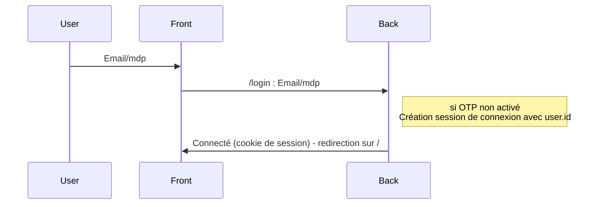
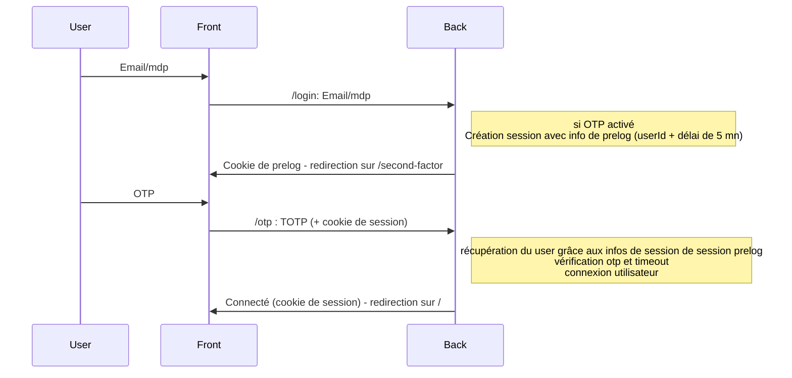

# Second facteur

Documentation de la connexion par second facteur

_En cours d'implémentation_

## Généralités

Trackdéchets permet d'activer une connexion par second facteur via un totp (time-based One-time Password).

Le modèle User comporte 2 champs, `totpSeed` & `totpActive` dont le remplissage force l'utilisation du second facteur.

## Principes techniques

### Login

Le principe de connexion est inchangé
Un POST http email/mdp (+ captcha le cas échéant) est effectué sur la route /login du router qui redirige
sur la route home (/) et renvoie un cookie de session.

### Login avec second facteur

Lors d'un login réussi, si l'utilisateur a les champs `totpSeed` & `totpActive` renseignés, il est préloggué:

- l'utilisateur n'est pas authentifié
- un cookie de session de prelog est renvoyé pour assurer la persistence entre les 2 étapes, associé à une session comportant :
  - son email
  - une durée de vie de 5 minutes
- il est redirigé sur la route /second-factor
- la page de second facteur est également un formulaire html qui POST sur /otp le champ top que l'utilisateur doit renseigner.
- côté back:
  - on récupère l'utilisateur via les données de session de prelog
  - on vérifie que le timeout ne soit pas écoulé
  - on vérifie le top
  - on loggue l'utilisateur et on renvoie le cookie de session de connexion

En cas d'erreur on renvoie un code d'erreur dans la querystring qui est interprétée par le front (même principe que la page de login).

La vérification du totp se fait via la librairie `totp-generator`. Pour gérer les dérives temporelles mineures des devices d'authentification, on
on accepte le totp n-1.

## Connexion par token d'api

Aucun impact à ce jour.

## Administrateur Trackdéchets

Les pages réservées aux administrateurs ne sont désormais accessibles qu'aux utilisateurs connectés via un second facteur.

## Setup des seeds utilisateurs

En attendant une UI adéquate, les seeds sont renseignées par un dev en db et transmises aux utilisateurs de l'équipe TD.
