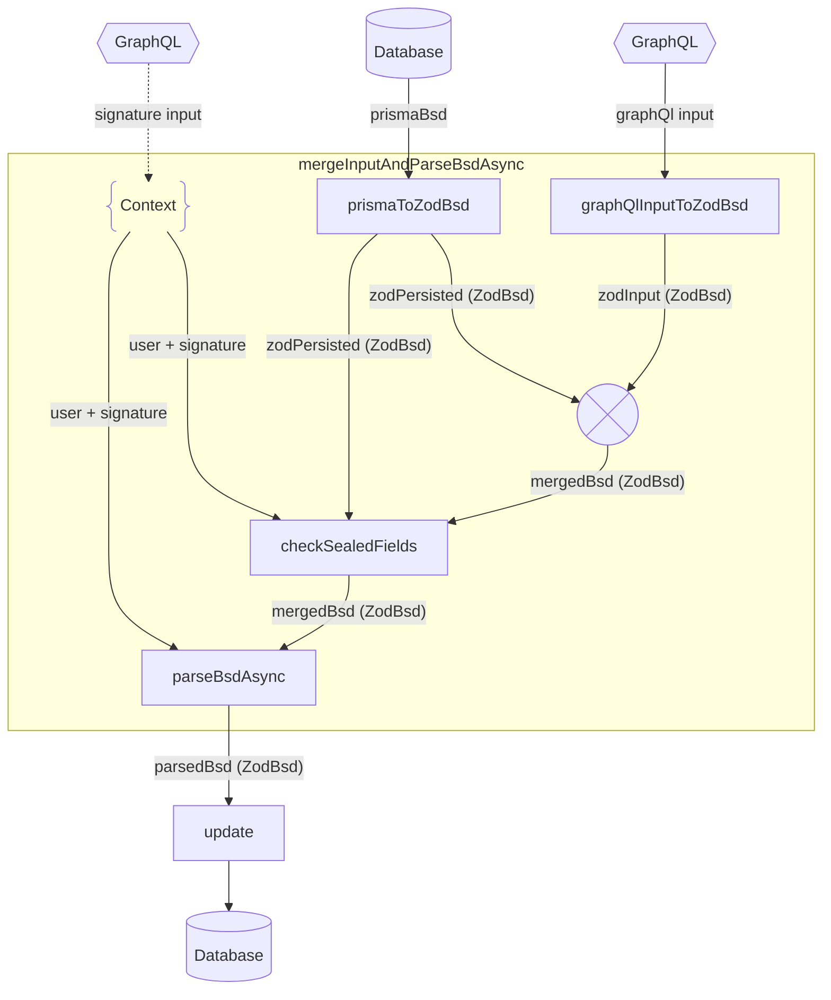
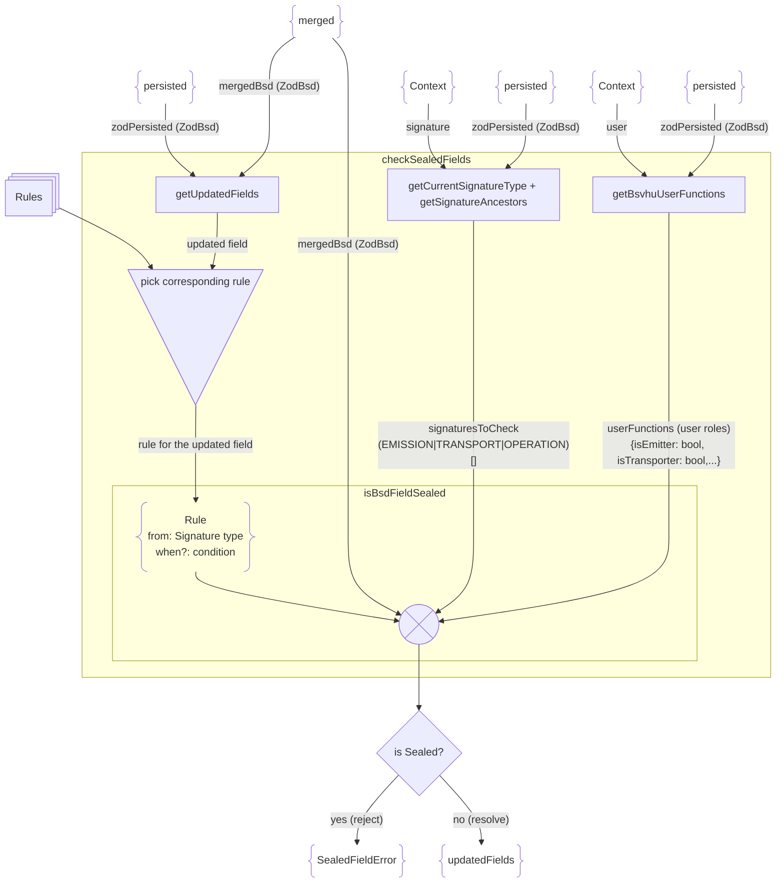

# Validation Zod

Documentation do pipeline de validation Zod

## Vue d'ensemble

```mermaid
flowchart TD
  subgraph mergeInputAndParseBsvhuAsync["mergeInputAndParseBsdAsync"]
        prismaToZodBsd["prismaToZodBsd"]
        graphQlInputToZodBsd["graphQlInputToZodBsd"]
        mergedBsd@{shape: cross-circ}
        checkSealedFields["checkSealedFields"]
        parseBsdAsync["parseBsdAsync"]
        context@{ shape: braces, label: "Context" }
  end
    graphQl@{shape: hex, label: GraphQL} -.->|signature input| context
  context ---->|user + signature| checkSealedFields
  context ----->|user + signature| parseBsdAsync
  db1[(Database)] -->|prismaBsd| prismaToZodBsd
  graphQl2@{shape: hex, label: GraphQL} -->|graphQl input| graphQlInputToZodBsd
  prismaToZodBsd -->|"zodPersisted (ZodBsd)"| mergedBsd
  prismaToZodBsd ---->|"zodPersisted (ZodBsd)"| checkSealedFields
  graphQlInputToZodBsd --->|"zodInput (ZodBsd)"| mergedBsd
  mergedBsd -->|"mergedBsd (ZodBsd)"| checkSealedFields
  checkSealedFields -->|"mergedBsd (ZodBsd)"| parseBsdAsync
  parseBsdAsync -->|"parsedBsd (ZodBsd)"| update
  update --> db2[(Database)]
  click parseBsdAsync ##parsing-zod
  click checkSealedFields ##champs-scellés
```

## Champs scellés

```mermaid
flowchart TD

  subgraph checkSealedFields["checkSealedFields"]
    getUpdatedFields["getUpdatedFields"]
    pickRule@{ shape: flip-tri, label: "pick corresponding rule" }
    getCurrentSignatureType@{shape: rect, label: "getCurrentSignatureType + getSignatureAncestors"}
    getBsvhuUserFunctions@{shape: rect, label: "getBsvhuUserFunctions"}
    subgraph isBsdFieldSealed["isBsdFieldSealed"]
      rule@{ shape: braces, label: "Rule\nfrom: Signature type\nwhen?: condition" }
      check@{shape: cross-circ}
    end
  end
  context@{ shape: braces, label: "Context" } -->|signature| getCurrentSignatureType
  context2@{ shape: braces, label: "Context" } -->|user| getBsvhuUserFunctions
  zodPersisted@{ shape: braces, label: "persisted" } -->|"zodPersisted (ZodBsd)"| getUpdatedFields
  zodPersisted2@{ shape: braces, label: "persisted" } -->|"zodPersisted (ZodBsd)"| getCurrentSignatureType
  zodPersisted3@{ shape: braces, label: "persisted" } -->|"zodPersisted (ZodBsd)"| getBsvhuUserFunctions
  mergedBsd@{ shape: braces, label: "merged" } --->|"mergedBsd (ZodBsd)"| getUpdatedFields
  rules@{ shape: processes, label: "Rules" } --> pickRule
  getUpdatedFields -->|updated field| pickRule
  rule --> check
  mergedBsd@{ shape: braces, label: "merged" } -->|"mergedBsd (ZodBsd)"| check
  getCurrentSignatureType ---->|"signaturesToCheck<br>(EMISSION|TRANSPORT|OPERATION)[]"| check
  getBsvhuUserFunctions ----> |"userFunctions (user roles)<br>{isEmitter: bool, isTransporter: bool,...}"| check
  pickRule -->|rule for the updated field| rule

  check --> G{is Sealed?}
  G -->|"yes (reject)"| errors@{ shape: braces, label: "SealedFieldError" }
  G -->|"no (resolve)"| updatedFields@{ shape: braces, label: "updatedFields" }
```

## Parsing Zod
