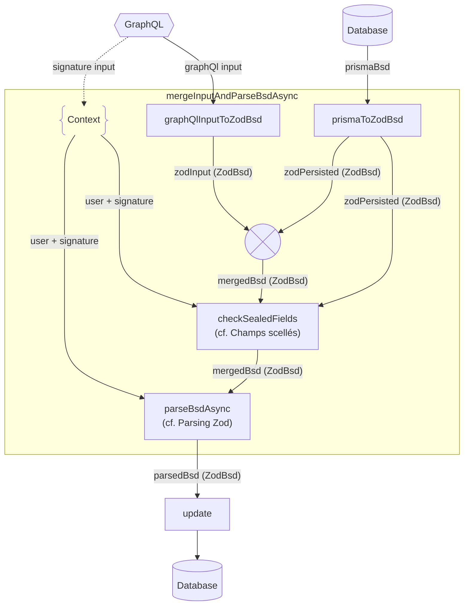
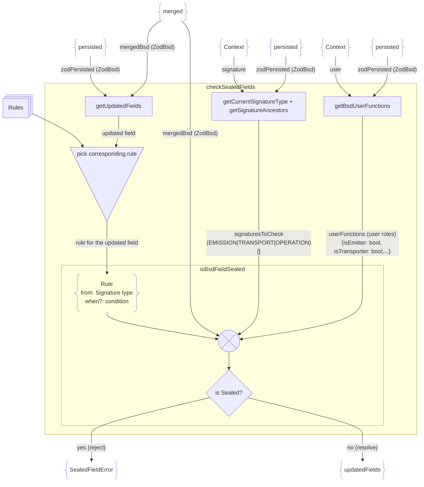
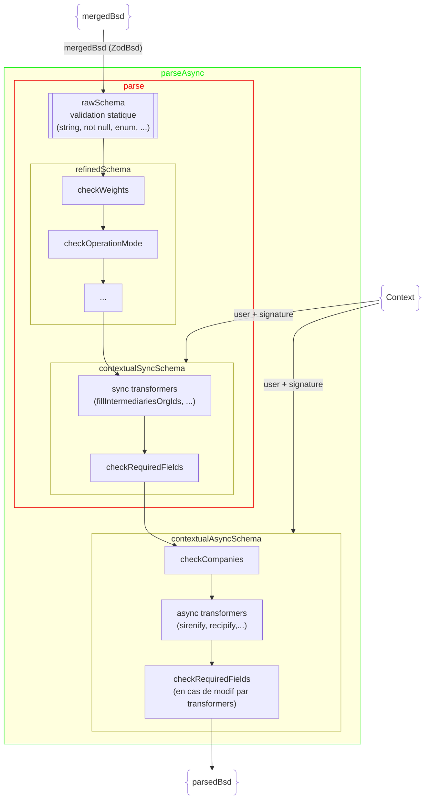

# Validation Zod

Documentation do pipeline de validation Zod

## Vue d'ensemble

Lors d'une création, update ou signature de bordereau, le flow de validation Zod est assez similaire.

Pour un update, le bordereau existant est récupéré de la DB afin de le merger avec l'input et voir quels champs ont été mis à jour.

Pour une signature, la signature est passée dans le process de valiation afin de vérifier les champs scellés/requis pour cette signature, au lieu de la signature actuelle du bordereau.

Le flow général prenant en compte tous ces éléments est le suivant :



Les grandes étapes sont :

- normalisation de l'input et du bordereau déjà existant dans un format à plat compatible avec Zod (ZodBsd). Ce sont les fonctions `prismaToZodBsd` et `graphQlInputToZodBsd`
- merge de l'input (zodInput) et du bordereau existant (zodPersisted)
- vérification qu'aucun champ scellé n'est touché ([checkSealedFields](#champs-scellés-checksealedfields))
- parsing Zod ([parseBsdAsync](#parsing-zod-parsebsdasync))
- enregistrement en DB

## Champs scellés (checkSealedFields)

La vérification des champs scellés se fait dans la fonction `checkSealedFields` (qui peut changer de nom en fonction du bordereau, par exemple `checkBsvhuSealedFields`).

Cette vérification prend en entrée le bordereau existant, le bordereau "mergé" qui contient les changements et le contexte qui contient les infos de l'utilisateur + la signature courante.

Cette vérification se base sur un ensemble de règles stockées dans un objet Rules (le nom peut varier selon les bordereau, par ex. bsvhuEditionRules).

Dans leur forme la plus complexe, ces règles ont cette forme:

```js
fieldName: {
    // At what signature the field is sealed, and under which circumstances
    sealed: EditionRule<T>;
    // At what signature the field is required, and under which circumstances. If absent, field is never required
    required?: EditionRule<T>;
    readableFieldName?: string; // A custom field name for errors
    // a path to return in the errors to help the front display the error in context
    path?: EditionRulePath;
  },

// par exemple
  emitterCompanyCity: {
    sealed: {
      /*
      "from" est une fonction, qui peut utiliser le contexte qui
      lui est fourni pour savoir si cette règle doit être activée ou non
      */
      from: sealedFromEmissionExceptForEmitter
    },
    required: {
      /*
      ici "from" est simplement la signature à partir de laquelle
      cette règle est activée
      */
      from: "EMISSION",
      /*
      une condition pour activer cette règle en fonction d'autres
      champs du bordereau
      */
      when: bsvhu => !bsvhu.emitterCompanyAddress
    },
    // un nom de champ lisible pour les erreurs
    readableFieldName: "L'adresse de l'émetteur",
    // le chemin du champ dans les objets GraphQL
    path: ["emitter", "company", "city"]
  },

```

Les champs `readableFieldName` et `path` des règles permettent de renvoyer des erreurs plus explicites à la front. `readableFieldName` sera affiché à l'utilisateur dans l'erreur, et l'erreur peut être affichée précisément dans l'interface grâce à `path`.

Le flow générale de cette validation est le suivant:



## Parsing Zod (parseBsdAsync)

Le principe de zod est de créer un schéma qui contient des règles de validation/transformation. Ce schéma expose ensuite des fonctions (`schema.parse` et `schema.parseAsync`) auxquelles on passe le bordereau dans son format ZodBsd (voir ci-dessus).
Ces fonctions vont faire passer le bordereau à travers les étapes de validation et transformation, puis renvoyer un ParsedZodBsd. ce bordereau peut ensuite être mis en DB.

En cas d'erreur de validation, une erreur est ajoutée à une liste d'erreurs, qui est renvoyée une fois la validation terminée.

Ces erreurs sont de la forme:

```js
{
  code: z.ZodIssueCode.custom, // custom pour les erreurs renvoyées depuis des fonctions custom, ou plus précis (ex: invalid_type) pour les erreurs créées par des validateurs Zod
  path: ["weight", "value"], // le chemin du champ dans les objets GraphQL
  message: "Le poids doit être supérieur à 0" // un message à afficher en front en cas d'erreur
}
```

Voilà le schéma des différents composants de validation qui sont inclus dans nos schéma Zod :



- **rawScema** est une déclaration de règles de validation simples nativement supportées par Zod (vérification de type, null/not null, enum,...).
- **refinedSchema** vient enrichir le rawScema avec des "refinements", qui permette d'appliquer des règles de validation métier. par exemple `checkOperationMode` va valider que le mode d'opération est compatible avec le code d'opération du bordereau. Ces validations peuvent utiliser plusieurs champs du bordereau à la fois, contrairement aux règles du rawSchema qui ne traitent qu'un champ à la fois.
- **contextualSyncSchema** contient des fonctions de validation et des transformations qui prennent en compte le "contexte", c'est à dire l'utilisateur faisant la modification, ainsi que la signature en cours. C'est dans cette section que se fait la validation des champs requis (`checkRequiredFields`). Celle-ci fonctionne de manière semblable à la validation des champs scellés ([checkSealedFields](#champs-scellés-checksealedfields))
- **contextualAsyncSchema** contient des fonctions de validation et transformation qui demandent de faire des requêtes en DB

  - `sirenify` qui vient compléter les infos d'entreprise
  - `recipify` qui vient compléter les infos de récépissé des acteurs,...)
  - `checkCompanies` qui valide que les établissements désignés sur le bordereau ont bien les autorisations pour agir dessus

  A la fin de ces transformations, on repasse par `checkRequiredFields` pour vérifier que des champs requis n'ont pas disparu.
