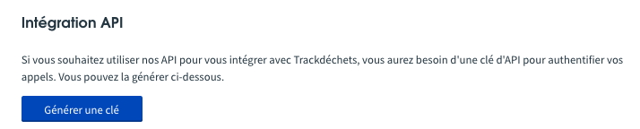
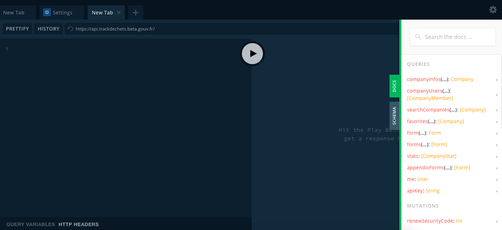
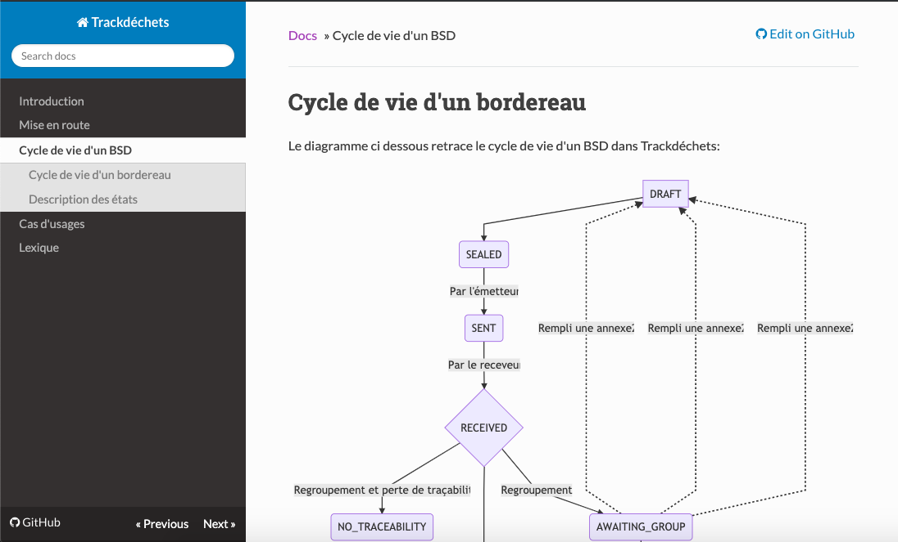

# Information générales sur l'interopérabilité

* * *

Trackdéchets est un outil développé par le Ministère de l’Ecologie et de la transition solidaire, au sein de la Fabrique Numérique, membre du réseau d’incubateurs [beta.gouv.fr](https://beta.gouv.fr/). Il est soutenu par la DGPR (Direction Générale de la Prévention et des Risques).

 Ce n’est plus un produit en test mais un produit pérenne soutenu par le Ministère.

Le produit Trackdéchets peut être :

*   utilisé en “propre” par les différents acteurs de la chaîne pour gérer de manière dématérialisée la traçabilité de leurs déchets dangereux (= edition, transmission BSD, suivi historiques, registre, etc.)
*   il est également prévu qu’il puisse s’interfacer facilement avec des solutions existantes (type SAAS de gestion de la traçabilité, ERP, etc.) par le biais d’une API

À quoi sert une API ?

Une API est une interface de programmation d’application qui permet au logiciel qui la met en place de communiquer avec d’autres outils et de donner accès à ses services.

Quel est l’intérêt de se brancher à l’API de Trackdéchets ?

Le produit Trackdéchets se décompose en 2 parties distinctes :

*   un “moteur de gestion des BSD” (qui peut être appelé via API)
*   une interface graphique qui communique avec ce moteur (le “front de Trackdéchets”)

En se connectant à l’API de Trackdéchets, une solution pourra donc réaliser un certain nombre d’actions liées au moteur de gestion des BSD : éditer des BSD, les signer, suivre leur statut, etc. Cela est possible dans la mesure où l’API de Trackdéchets (API GraphQL) permet 3 types d’actions :

*   query pour requêter des données (ex. récupérer des informations sur les BSD)
*   mutation pour créer, modifier ou supprimer des données (ex. modifier le statut d’un BSD, signer)
*   subscription pour souscrire à des modifications et être automatiquement informé des changements (ex. changement de statut, validation)

Ainsi, si un acteur de la chaîne du déchet dangereux n’a pas de solution il peut décider d’utiliser Trackdéchets au quotidien pour gérer de manière dématérialisée toute la traçabilité. Il n’aura aucune action à mettre en oeuvre pour s'interfacer.

Si vous avez déjà une solution métier qui fonctionne, mais que vous souhaitez... :

*   mener à bien la dématérialisation de la chaîne de traçabilité du déchet dangereux
*   limiter les efforts d’adaptation aux différents prestataires / clients
*   donner la possibilité à vos clients d’avoir un espace personnel avec leurs BSD
*   rassurer sur le parcours de traitement du déchet

\=> Il est intéressant de vous connecter à l’outil Trackdéchets qui jouera un rôle de “plateforme”

Comment ça va fonctionner concrètement ?

Une fois les travaux de développement réalisés pour connecter les outils :

*   VotreSI métier restera celui utilisé par les équipes pour le process classique (préparation des BSD, gestion des stocks, facturation, etc.)
*   Votre SI métier va échanger des données liées aux BSD avec Trackdéchets :

*   que le producteur /détenteur prépare un BSD / signe via Trackdéchets
*   ou que le BSD soit produit à partir de votre outil

*   Vous aurez accès à tout moment aux données vous concernant dans Trackdéchets. Ainsi, si certains clients producteurs le souhaitent, ils pourront accéder à leurs données dans Trackdéchets (rechercher les BSD, les signer, accéder à un registre, etc.). [\[a\]](#cmnt1)[\[b\]](#cmnt2) Inversement, votre SI métier pourra à votre convenance interroger Trackdéchets pour récupérer des données vous concernant et ayant transité par notre plateforme.

L’API tourne “en continu”, permettant une vue en temps réel des données.

Comment se connecter avec Trackdéchets?

1.  Créer un comptesur Trackdéchets : [https://trackdechets.beta.gouv.fr/login](https://trackdechets.beta.gouv.fr/login)
2.  Récupérer la clé d’API: token d’identification dans l’Espace “Mon compte”. Cette clé est en fait un JSON webtokens qui contient les informations permettant de s’identifier et sécuriser les échanges que vous aurez avec Trackdéchets. Le token délivré a une durée de vie de 24h, il faut donc le renouveler chaque jour.

3.  Explorer et jouer avec les différentes possibilités de requêtes sur le playground ([https://api.trackdechets.beta.gouv.fr/](https://api.trackdechets.beta.gouv.fr/))

4.  Concevoir les requêtes et automatiser les interactions
5.  Tester l’interfacage sur le site de recette: [https://recette.trackdechets.fr/](https://recette.trackdechets.fr/). À cette étape, si nous n’avons jamais échangé ensemble, nous vous invitons à nous contacter
6.  Déployer en production

Pour faciliter ces différentes étapes, de nombreux éléments de documentation techniqueet de process sont accessibles sur [https://doc.trackdechets.fr/](https://doc.trackdechets.fr/) :

*   Mise en route
*   Cycle de vie du BSD
*   Cas d’usage
*   Lexique

J’ai déjà créé un compte sur lequel j’ai réalisé un certain nombre de tests, que va-t-il se passer pour ces données test ?

Toutes les données  test identifiées d’ici le 21 juillet seront supprimées afin de permettre de repartir de 0. En revanche il est possible de jouer “à volonté” sur le site de recette.

Si des données test ont été générées après cette période, merci de nous écrire à l’adresse suivante : [emmanuel.flahaut@developpement-durable.gouv.fr](mailto:emmanuel.flahaut@developpement-durable.gouv.fr) en spécifiant le besoin.

Comment  va fonctionner la numérotation dans le process numéro de bordereau

*   La numérotation est créée dès que le BSD est créé dans l'interface en \`brouillon\`. Une propriété du code (id: ID)sert à identifier le bordereau. Ainsi, lorsqu'on fait un saveForm(...) { id }, Trackdéchets renverra l'identifiant du bordereau qu'il vient de créer.
*   Par ailleurs, le CERFA PDF qui peut-être édité par Trackdéchets est identique au CERFA papier. Il a été prévu de laisser l’espace suffisant pour 1 code barre ou numéro supplémentaire afin de faciliter le fonctionnement avec certains outils s’appuyant sur de la reconnaissance via scan de ce code.
*   La numérotation suit la nomenclature suivante:
    * Un préfixe “TD”
    *   L’année sur 2 chiffres
    *  Un incrément annuel sur 3 lettres et 5 chiffres
    *  Exemple: TD-19-AAA00001

Qui a accès aux données de mon compte Trackdéchets ?

*   L'accès aux données personnelles d’inscription est lié au compte de l'utilisateur. Seul l'utilisateur peut consulter ou modifier la donnée
*   L’accès aux données des BSD transmis par une entreprise est accessible par toutes les personnes de l’entreprise.
*   Les autorités publiques pourront avoir accès à l’outil dans des cas de contrôle
*   De la donnée agrégée anonymisée pourrait être utilisée à terme pour faciliter la planification en matière de gestion des déchets
*   Pour aller plus loin, la politique de confidentialité de Trackdéchets est disponible sur le site : [https://trackdechets.beta.gouv.fr/Politique%20de%20confidentialit%C3%A9.pdf](https://trackdechets.beta.gouv.fr/Politique%2520de%2520confidentialit%25C3%25A9.pdf)

Si j’interface mon outil métier avec Trackdéchets, quel est le niveau de protection de mes données ?

*   Les données transmises à Trackdéchets par API ne sont pas accessibles par les autres utilisateurs, elles sont sécurisées par le recours à un token d’authentification.
