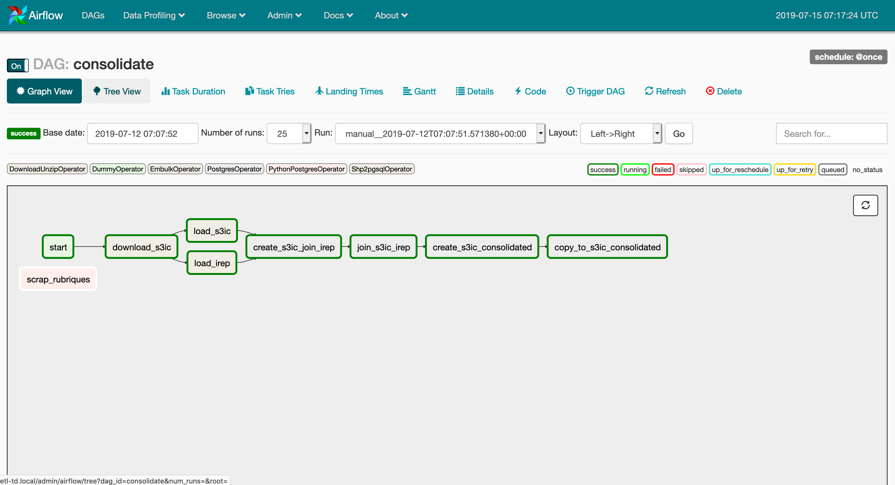

## td-etl

Consolider une base de données des entreprises liées au secteur du déchet

### Pré-requis

Airflow utilise le service `postgres` pour stocker ses métadonnées et les tables
de préparation des données. Par ailleurs l'extension `postgis` est nécessaire
pour traiter des données géographiques. Le script suivant est executé lors de la première
création du container `postgres`. Cependant il est nécessaire de l'exécuter à la main
sur une installation existante (en recette et en prod par exemple)

```bash
psql --username "$POSTGRES_USER" << EOF
  CREATE DATABASE airflow;
  CREATE USER $AIRFLOW_POSTGRES_USER WITH PASSWORD '$AIRFLOW_POSTGRES_PASSWORD';
  GRANT ALL PRIVILEGES ON DATABASE airflow to $AIRFLOW_POSTGRES_USER;
  CREATE DATABASE etl;
EOF

psql --username "$POSTGRES_USER" -d etl << EOF
  CREATE EXTENSION postgis;
  CREATE SCHEMA etl;
EOF
```

### Airflow UI

Airflow permet de visualiser et faire tourner des pipelines de données depuis
une interface web. En recette et en prod, l'accès se fait sur le port 8080
via un tunnel ssh.

```
autossh -M9042 -N -L 8080:127.0.0.1:8080 {user}@{ip-sevreur} -i ~/.ssh/id_rsa
```



### Lancer le pipeline depuis l'UI

Le pipeline est executé une première fois de façon automatique lors du lancement
du service. Il est possible de le ré-exécuter (en cas d'erreur par exemple) depuis
l'UI. `DAGs > consolidate > Trigger DAG`

### Exécuter une tâche en particulier

Il est possible d'exécuter une tâche en particulier en ligne de commande en se plaçant
dans le répértoire `etl`. Exemple pour loader les données s3ic:

```bash
scripts/test.sh consolidate load_s3ic
```

