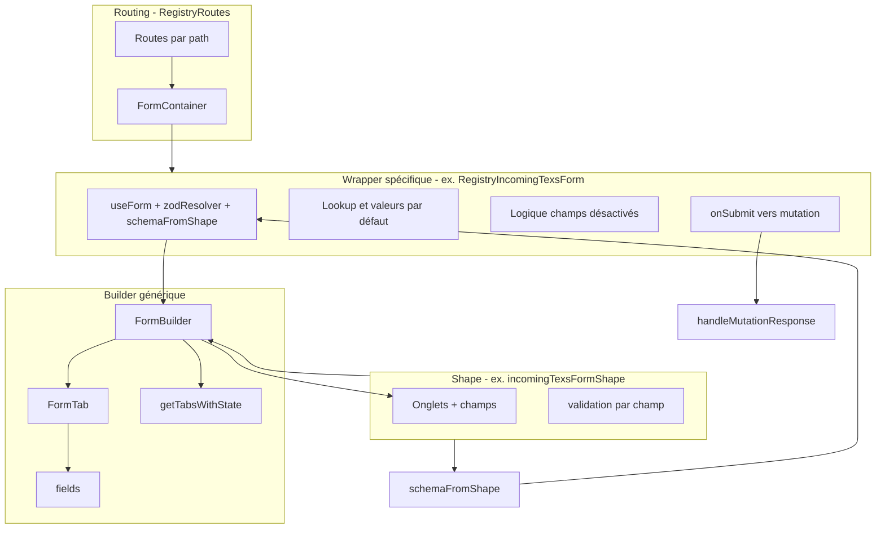
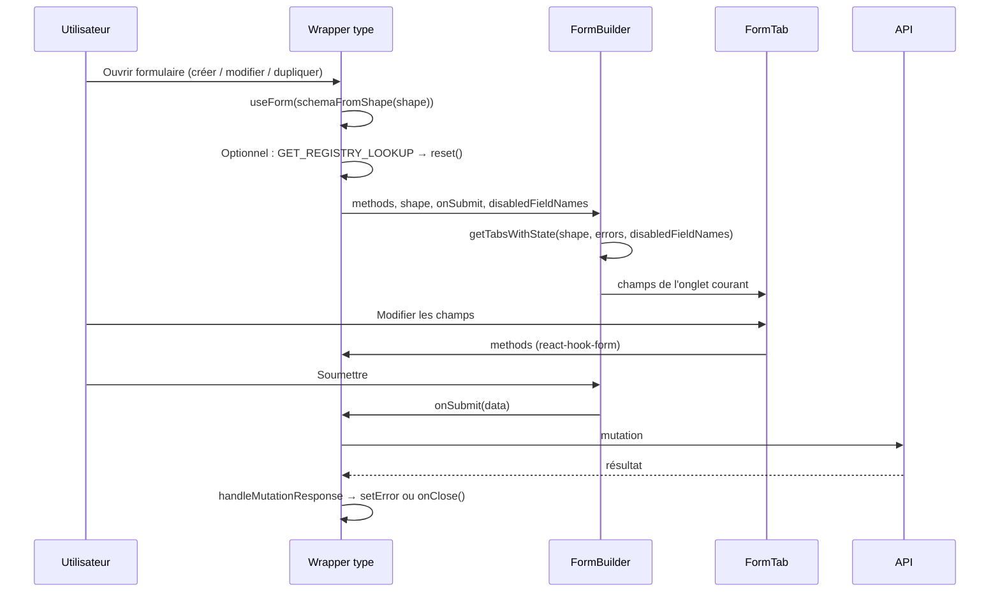
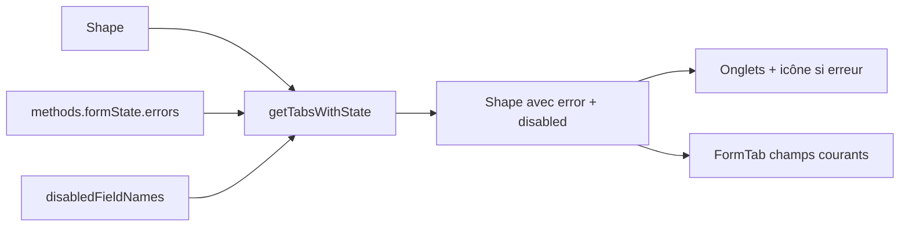
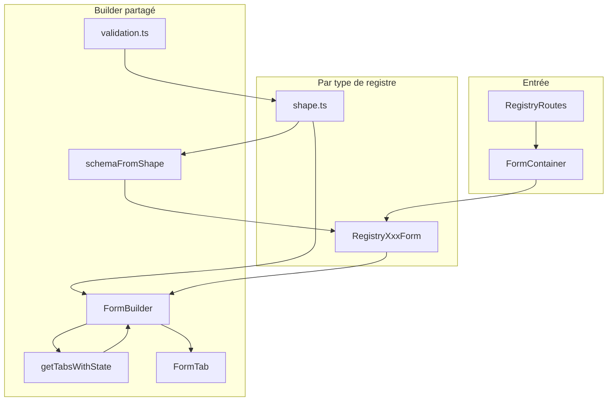

# Formulaire registre – Architecture frontend

Ce document décrit l’architecture du **formulaire registre** utilisé pour créer et modifier les lignes de registre (déclarations) dans le frontend. Le formulaire est commun à plusieurs types de registre (SSD, TEXS entrant/sortant, déchet entrant/sortant, transporté, géré) et est construit à partir d’une configuration **pilotée par un shape** : un **shape** par type de formulaire définit onglets, champs, validation et interface au même endroit.

Pour le flux d’import/export au sens large (import fichier, API, RegistryLookup), voir [RegistryExportV2.md](../../../docs/RegistryExportV2.md).

---

## 1. Vue d’ensemble

Le formulaire registre est un **formulaire modal** ouvert depuis la vue « Mes lignes ». Il est organisé en trois couches :

1. **Routing et conteneur** – Quel type de formulaire est affiché (URL et `RegistryImportType`).
2. **Wrapper spécifique au type** – Un composant React par type de registre : gère l’état du formulaire (react-hook-form), construit le schéma Zod à partir du shape, gère le lookup (édition/duplication), les champs désactivés conditionnellement et la soumission (mutation GraphQL).
3. **Builder générique** – `FormBuilder` et `FormTab` consomment le **shape** pour afficher les onglets et les champs, et pour afficher les erreurs de validation sur les bons onglets.

Le **shape** est la source de vérité unique pour :

- les onglets (ids et titres) ;
- les champs par onglet (champs génériques, composants personnalisés ou groupes de mise en page) ;
- les règles de validation Zod (fusionnées en un seul schéma par formulaire) ;
- les libellés, infobulles, styles et indicateur de champ requis.

---

## 2. Où le formulaire est monté

Le formulaire est rendu dans **RegistryRoutes** lorsqu’il existe une **background location** (ex. utilisateur sur « Mes lignes » avec le formulaire ouvert en modal) ou lorsque l’utilisateur arrive directement sur une route de formulaire. Chaque type de formulaire a sa propre route et utilise le même **FormContainer** avec une prop `type`.

**Fichier :** `front/src/dashboard/registry/RegistryRoutes.tsx`

- Chargement lazy : `const FormContainer = lazy(() => import("./myLines/FormContainer"));`
- Les routes sont sous `routes.registry_new.form.*` (ex. `form.ssd`, `form.incomingTexs`, `form.outgoingTexs`, …).
- Chaque route rend : `<FormContainer onClose={handleClose} type={RegistryImportType.Xxx} />`.

Le **point d’entrée** est donc : **RegistryRoutes** → **FormContainer** (modal) → **composant de formulaire spécifique au type** (ex. `RegistryIncomingTexsForm`).

---

## 3. FormContainer et wrappers spécifiques au type

### 3.1 FormContainer

**Fichier :** `front/src/dashboard/registry/myLines/FormContainer.tsx`

- Reçoit `onClose` et `type: RegistryImportType`.
- Affiche un `TdModal` et, à l’intérieur, le composant de formulaire correspondant au type (ex. `RegistryIncomingTexsForm`, `RegistrySsdForm`, …).
- Aucune logique de formulaire ici ; il se contente d’afficher le bon composant selon le type.

### 3.2 Wrapper spécifique au type (ex. RegistryIncomingTexsForm)

**Fichiers :**  
`front/src/form/registry/incomingTexs/RegistryIncomingTexsForm.tsx` (et équivalents pour ssd, outgoingTexs, incomingWaste, outgoingWaste, transported, managed).

Chaque wrapper est responsable de :

1. **État du formulaire** – `useForm` avec :
   - `defaultValues` (et éventuellement valeurs issues du lookup).
   - `resolver: zodResolver(schemaFromShape(shape))` pour que le **schéma Zod soit dérivé du même shape** qui pilote l’UI.
2. **Lookup (édition / duplication)** – Si l’URL contient `publicId` et `siret`, une requête charge la ligne et remplit le formulaire (avec gestion optionnelle de la duplication).
3. **Champs désactivés conditionnellement** – ex. désactiver « transporter » quand « isDirectSupply » est vrai ; désactiver « destinationParcel… » quand « isUpcycled » est faux. Implémenté avec `watch` + `useEffect` et une liste `disabledFieldNames` passée à `FormBuilder`.
4. **Soumission** – `onSubmit` appelle la mutation GraphQL correspondante (ex. `addToIncomingTexsRegistry`), puis `handleMutationResponse` pour reporter les erreurs backend sur les champs du formulaire et décider de fermer ou non la modal.

Le wrapper **ne** rend **pas** la structure onglets/champs ; il :

- construit le schéma à partir du shape ;
- fournit `methods`, `shape`, `onSubmit`, `loading` et éventuellement `disabledFieldNames` à **FormBuilder**.

---

## 4. Shape : structure et types de champs

Le **shape** est un tableau d’**onglets**. Chaque onglet contient une liste de **champs**. Le même shape sert à :

1. Construire le **schéma Zod** (`schemaFromShape(shape)`).
2. Construire la **liste des onglets** et savoir lequel a des erreurs (`getTabsWithState(shape, errors, disabledFieldNames)`).
3. Rendre le **contenu de l’onglet courant** dans `FormTab` (champs issus du shape).

**Fichier (types) :** `front/src/form/registry/builder/types.ts`  
**Fichier (exemple de shape) :** `front/src/form/registry/incomingTexs/shape.ts`

### 4.1 Structure de haut niveau

- **FormShape** = tableau de **FormShapeItemWithState** (à l’exécution, l’état est enrichi par `getTabsWithState`).
- Chaque élément possède :
  - `tabId` – identifiant unique de l’onglet ;
  - `tabTitle` – libellé affiché dans la barre d’onglets ;
  - `fields` – tableau de **FormShapeField** (generic, custom ou layout).

### 4.2 Types de champs

Chaque champ est de type **generic**, **custom** ou **layout**.

| Shape     | Rôle                                                                                                                                 |
| --------- | ------------------------------------------------------------------------------------------------------------------------------------ |
| `generic` | Contrôles simples : texte, nombre, date, heure, select, checkbox. Composant choisi via `type` ; une seule clé de formulaire `name`.  |
| `custom`  | Composant React personnalisé ; plusieurs clés de formulaire dans `names` ; `Component` et optionnellement `props` viennent du shape. |
| `layout`  | Pas de liaison directe au formulaire ; regroupe uniquement des `fields` (tableau de FormShapeField) pour la mise en page.            |

**Champ generic** (extrait des types) :

- `name`, `shape: "generic"`, `type` (`"text" | "number" | "date" | "time" | "select" | "checkbox"`).
- `label`, `infoLabel`, `required`, `tooltip`, `title` (titre de section optionnel).
- `validation` : `Record<string, z.ZodType>` (clé = nom du champ, valeur = schéma Zod).
- `style` : `{ className?, parentClassName? }`.
- Pour le select : `choices`, `defaultOption`.

**Champ custom** :

- `shape: "custom"`, `Component`, `props` optionnel, `names` (tableau des clés du formulaire mises à jour par le composant).
- `validation` : une entrée par clé dans `names`.
- Optionnel : `style`, `infoText` (chaîne ou fonction des valeurs des champs).

**Champ layout** :

- `shape: "layout"`, `fields: FormShapeField[]`, optionnel `style`, `infoText`.

### 4.3 Validation dans le shape

- Tout champ qui touche aux valeurs du formulaire (generic et custom) a un objet **validation** : les clés sont les mêmes que dans `name` / `names`, les valeurs sont des schémas **Zod** (ex. issus de `builder/validation.ts`).
- Les champs layout ne déclarent pas de validation ; ce sont leurs enfants qui le font.
- Le **required** dans le shape sert uniquement à l’UI (astérisque à côté du libellé et « (optionnel) ») ; le caractère obligatoire réel est imposé par le schéma Zod dans `validation`.

---

## 5. Du shape au schéma Zod : `schemaFromShape`

**Fichier :** `front/src/form/registry/builder/utils.ts`

- **`schemaFromShape(shape)`** parcourt le shape (onglets → champs) et agrège toutes les entrées `validation`.
- Pour les champs **generic** et **custom** on utilise `field.validation` ; pour **layout** on récursive dans `field.fields`.
- Tout est fusionné dans un seul `Record<string, z.ZodType>` et un champ de base `reason` (raison de la ligne de registre) est ajouté.
- Retourne `z.object(validations)`.

Donc : **un shape → un schéma Zod**. Le même shape qui définit l’UI définit aussi la validation côté client. Le backend effectue sa propre validation (voir [RegistryExportV2.md](../../../docs/RegistryExportV2.md)).

---

## 6. Helpers de validation communs

**Fichier :** `front/src/form/registry/builder/validation.ts`

Schémas Zod réutilisables utilisés dans les shapes :

| Helper           | Rôle                                                            |
| ---------------- | --------------------------------------------------------------- |
| `nonEmptyString` | Chaîne requise, longueur min 1.                                 |
| `optionalString` | Chaîne, nullish, normalisée en `null`.                          |
| `nonEmptyNumber` | Nombre requis (string ou number, transformé en number).         |
| `optionalNumber` | Nombre optionnel (string ou number, transformé).                |
| `booleanString`  | `"true"` / `"false"` ou booléen.                                |
| `filteredArray`  | Tableau de chaînes, vide filtré.                                |
| `fieldArray`     | Tableau d’objets `{ value }`, transformé en tableau de valeurs. |

Les shapes importent ces helpers et les utilisent dans l’objet `validation` de chaque champ.

---

## 7. FormBuilder : onglets et erreurs

**Fichier :** `front/src/form/registry/builder/FormBuilder.tsx`

FormBuilder reçoit :

- `registryType`, `shape`, `methods` (react-hook-form), `onSubmit`, `loading`, et optionnellement `disabledFieldNames`.

Il :

1. **État des onglets** – `selectedTabId` initialisé à `shape[0].tabId` ; Précédent/Suivant et clic sur un onglet le mettent à jour.
2. **Shape avec état** – `getTabsWithState(shape, errors, disabledFieldNames)` :
   - Pour chaque onglet, met `error: true` si l’un de ses champs (ou champs layout imbriqués) a une erreur dans `methods.formState.errors`.
   - Pour chaque champ, met `disabled: true` lorsque son `name` ou l’un de ses `names` est dans `disabledFieldNames`.
3. **UI des onglets** – Affiche des `Tabs` avec un onglet par élément du shape ; si un onglet a `error`, une icône d’avertissement est affichée.
4. **Contenu de l’onglet courant** – Affiche un seul **FormTab** avec les **champs de l’onglet courant** (issus de `shapeWithState`).

Donc : le **shape** définit onglets et champs ; **errors** et **disabledFieldNames** ne font qu’ajouter de l’état (indicateur d’erreur sur les onglets, désactivé sur les champs). Pas de définition en double de la structure.

---

## 8. FormTab : rendu des champs à partir du shape

**Fichier :** `front/src/form/registry/builder/FormTab.tsx`

FormTab reçoit les **champs** de l’onglet courant (déjà avec état : `disabled` le cas échéant) et les **methods** (react-hook-form).

Pour chaque champ il appelle **renderField** :

- **custom** – Rend `<Component {...props} methods={methods} />`. Le composant est responsable du binding avec `methods` (ex. `register`, `control`, `setValue`, `watch`) pour les clés dans `names`.
- **generic** – Rend :
  - Texte/nombre/date/heure : `NonScrollableInput` avec `methods.register(field.name)`, `label`, `state` / `stateRelatedMessage` issus des erreurs ou de `infoLabel`.
  - Select : `Select` avec `choices`, `methods.register(field.name)`.
  - Checkbox : `Controller` + `ToggleSwitch` avec `field.name`.
  - Utilise `field.style?.className` pour le div wrapper ; les dates utilisent les min/max globaux des constantes.
- **layout** – Rend `field.fields.map(renderField)` (récursif).

Après le champ, si le shape définit `infoText` (chaîne ou fonction des valeurs courantes du champ), il est affiché dans une Alert d’information. Le **shape** pilote donc entièrement quel composant est utilisé, quelles props et quels noms sont liés, et quelles validation/erreur/libellé/info sont affichés.

---

## 9. Gestion des erreurs et soumission

- **Côté client** : Zod (issu du shape) s’exécute via `zodResolver` ; les erreurs sont dans `methods.formState.errors` et affichées par FormTab (et les icônes d’onglets via `getTabsWithState`).
- **Côté serveur** : Après la mutation, **handleMutationResponse** (builder/handler.ts) mappe les erreurs backend (ex. `errors[0].issues`) vers `methods.setError`, ou définit une `serverError` racine en cas d’échec générique. Elle indique si la modal doit se fermer (ex. fermer en cas de succès, rester ouverte en cas d’erreur de validation).

---

## 10. Carte des fichiers (référence rapide)

| Rôle                                                 | Fichier(s)                                               |
| ---------------------------------------------------- | -------------------------------------------------------- |
| Formulaire monté dans l’app                          | `dashboard/registry/RegistryRoutes.tsx`                  |
| Modal + dispatch par type                            | `dashboard/registry/myLines/FormContainer.tsx`           |
| Formulaire spécifique au type (état, schéma, submit) | `form/registry/{incomingTexs,ssd,…}/RegistryXxxForm.tsx` |
| Shape (onglets + champs + validation)                | `form/registry/{incomingTexs,ssd,…}/shape.ts`            |
| Schéma à partir du shape                             | `form/registry/builder/utils.ts` → `schemaFromShape`     |
| Helpers de validation                                | `form/registry/builder/validation.ts`                    |
| Types (FormShape, FormShapeField, …)                 | `form/registry/builder/types.ts`                         |
| Onglets + état d’erreur à partir du shape            | `form/registry/builder/error.ts` → `getTabsWithState`    |
| UI du formulaire (onglets + footer)                  | `form/registry/builder/FormBuilder.tsx`                  |
| Rendu des champs (generic/custom/layout)             | `form/registry/builder/FormTab.tsx`                      |
| Réponse submit → setError / fermeture                | `form/registry/builder/handler.ts`                       |
| Contexte import/export                               | `docs/RegistryExportV2.md`                               |

---

## 11. Schéma récapitulatif

- **RegistryRoutes** monte **FormContainer** pour chaque route de formulaire ; **FormContainer** affiche le bon **RegistryXxxForm**.
- Chaque type de formulaire a un **shape** et utilise **schemaFromShape(shape)** pour la validation et passe le **shape** à **FormBuilder**.
- **FormBuilder** utilise **getTabsWithState** pour ajouter l’état erreur/désactivé, affiche les onglets et **FormTab** ; **FormTab** affiche les champs à partir du shape (generic, custom ou layout).
- **validation.ts** fournit les helpers Zod utilisés dans les objets `validation` du shape.

On obtient ainsi une vue d’ensemble unique et cohérente des composants, du flux de données et de la façon dont le shape pilote à la fois la validation et la construction du formulaire.
