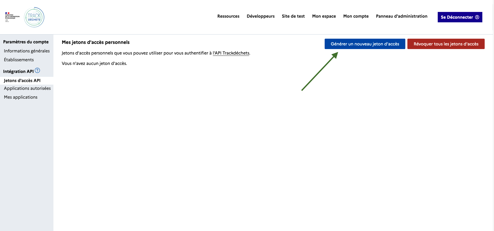
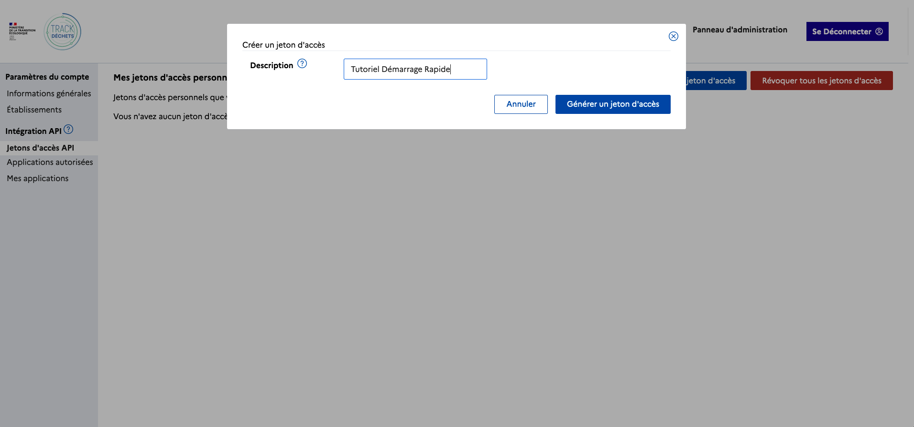
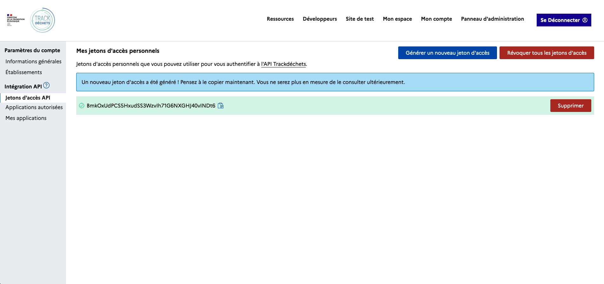
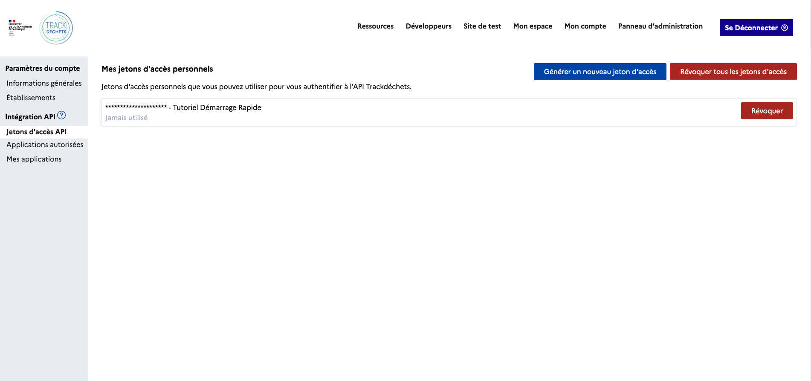

Une fois votre compte crée et votre premier établissement rattaché en _sandbox_ rendez-vous dans _Mon Compte_ > _Intégration API_ > _Jeton d'accès API_ puis _Générer un nouveau jeton d'accès_

---

Pensez à donner une description à votre jeton d'accès pour vous souvenir de son utilité.

---

Une fois le jeton d'accès généré, pensez à le copier quelque part, vous ne serez plus en mesure de le consulter ultérieurement.

---

Vous pouvez révoquer vos tokens à tout moment depuis le même espace.

